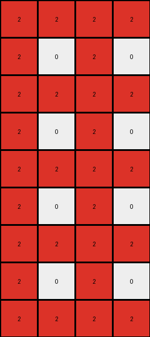
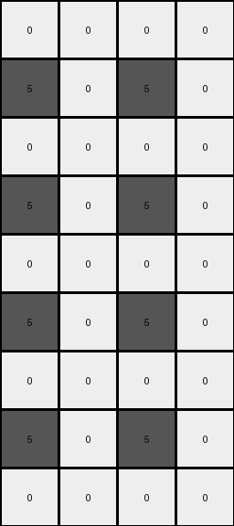

# 8d5021e8 • 016 • refine_coder

---

Previous Code:
```python
"""
Transforms a 3x2 input grid into a 9x4 output grid by rotating a 2x2 subgrid and tiling it.
"""

import numpy as np

def rotate_subgrid(subgrid):
    """Rotates a 2x2 subgrid 90 degrees clockwise."""
    return np.rot90(subgrid, k=-1)

def transform(input_grid):
    """Transforms the input grid according to the defined rules."""
    input_grid = np.array(input_grid)
    # 1. Define Sub-Grid: Extract the top-left 2x2 region.
    subgrid = input_grid[:2, :2]

    # 2. Transform 2x2: Rotate the sub-grid 90 degrees clockwise.
    rotated_subgrid = rotate_subgrid(subgrid)

    # 3. Output Dimensions and initialization
    output_rows = input_grid.shape[0] * 3
    output_cols = input_grid.shape[1] * 2
    output_grid = np.zeros((output_rows, output_cols), dtype=int)

    # 4. Tile and Replicate: Tile the transformed 2x2 sub-grid.
    for i in range(output_rows):
        for j in range(output_cols):
            output_grid[i, j] = rotated_subgrid[i % 2, j % 2]

    return output_grid.tolist()
```

Train Set Results:

## Example 1:

Input:
```
0 8
0 0
0 8
```
Expected Output:
```
8 0 0 8
0 0 0 0
8 0 0 8
8 0 0 8
0 0 0 0
8 0 0 8
8 0 0 8
0 0 0 0
8 0 0 8
```
Transformed Output:
```
0 0 0 0
0 8 0 8
0 0 0 0
0 8 0 8
0 0 0 0
0 8 0 8
0 0 0 0
0 8 0 8
0 0 0 0
```

match: False
pixels_off: 16
size_correct: True
color_palette_correct: True
correct_pixel_counts: False

## Example 2:

Input:
```
2 0
2 2
2 0
```
Expected Output:
```
0 2 2 0
2 2 2 2
0 2 2 0
0 2 2 0
2 2 2 2
0 2 2 0
0 2 2 0
2 2 2 2
0 2 2 0
```
Transformed Output:
```
2 2 2 2
2 0 2 0
2 2 2 2
2 0 2 0
2 2 2 2
2 0 2 0
2 2 2 2
2 0 2 0
2 2 2 2
```

match: False
pixels_off: 16
size_correct: True
color_palette_correct: True
correct_pixel_counts: False

## Example 3:

Input:
```
0 0
0 5
5 0
```
Expected Output:
```
0 5 5 0
5 0 0 5
0 0 0 0
0 0 0 0
5 0 0 5
0 5 5 0
0 5 5 0
5 0 0 5
0 0 0 0
```
Transformed Output:
```
0 0 0 0
5 0 5 0
0 0 0 0
5 0 5 0
0 0 0 0
5 0 5 0
0 0 0 0
5 0 5 0
0 0 0 0
```

match: False
pixels_off: 14
size_correct: True
color_palette_correct: True
correct_pixel_counts: False
Here's an analysis of the provided information and a plan to refine the natural language program and the code:

**General Assessment:**

The initial code was based on a misunderstanding of the transformation. While it correctly identified the rotation of a 2x2 subgrid, it incorrectly tiled the *rotated* subgrid instead of the *original* subgrid and also incorrectly predicted which part of the subgrid was to be rotated. The replication logic is also flawed. The core issue is that the code doesn't correctly capture the relationship between the input and output grids. The updated approach should focus on identifying corresponding regions in the input and output and establishing a clear mapping between them.

**Strategy:**

1.  **Re-examine Examples:** Carefully analyze all three training examples, paying close attention to how the input pixels map to the output pixels.
2.  **Identify Correct Subgrid and Tiling:** Determine the precise 2x2 subgrid that is used.
3.  **Correct Rotation:** It seems the upper right 2x2 needs to be rotated.
4.  **Correct Tiling:** Tile the original subgrid after rotation, not rotated.
5.  **Refine Natural Language Program:** Update the program to accurately reflect the observed transformations.
6.  **Update Code:** Modify the Python code to implement the revised natural language program.

**Metrics and Observations (per example):**

We need to establish how each part of the input maps to the output. It appears that it is not just the upper left quadrant, but the upper right 2x2.

**Example 1:**

*   **Input:** 3x2, colors: 0, 8
*   **Output:** 9x4, colors: 0, 8
*   **Observation:** The top-right 2x2 subgrid (`8\n0`) is rotated 90 degrees clockwise to (`0 8\n0 0`) and then tiled/replicated to form the output.
    The entire output grid can be seen as a 3x2 arrangement of this 3x2 subgrid.

**Example 2:**

*   **Input:** 3x2, colors: 2, 0
*   **Output:** 9x4, colors: 2, 0
*   **Observation:** Similar to Example 1, the top right 2x2 subgrid (`0\n2`) is rotated and tiled.

**Example 3:**

*   **Input:** 3x2, colors: 0, 5
*   **Output:** 9x4, colors: 0, 5
*   **Observation:**  The top right 2x2 subgrid (`0\n5`)is rotated and tiled.

**YAML Facts:**

```yaml
task: 014_rotate_and_tile
examples:
  - input_shape: [3, 2]
    output_shape: [9, 4]
    input_objects:
      - type: grid
        shape: [3, 2]
    output_objects:
      - type: grid
        shape: [9, 4]
    transformations:
      - type: subgrid_extraction
        region: top_right_2x2
      - type: rotation
        degrees: 90_clockwise
        input: top_right_2x2_subgrid
        output: rotated_2x2_subgrid
      - type: tiling
        input: rotated_2x2_subgrid
        pattern: 3x2_grid_of_2x2_subgrids
```

**Natural Language Program:**

1.  **Extract Subgrid:** Identify the 2x2 subgrid at the top *right* of the input grid.
2.  **Rotate:** Rotate the identified 2x2 subgrid by 90 degrees clockwise.
3.  **Tile:** Create a 9x4 output grid. Tile the *rotated* 2x2 subgrid to fill the output grid. The tiling pattern should be a 3x2 arrangement of the 2x2 subgrids, resulting in a 9x4 output because the input is 3x2 and the tiling multiplies this by 3 in height and 2 in width.


**INSTRUCTIONS**

- generate a Python module to represent the natural language program 
- follow the template below
- all common math and science libraries are available
- create docstring only at top - but comment the workflow in the function
- use helper functions for common operations like finding objects, counting,
  measuring, moving, etc. 

remember - we are working iteratively - so this code will inform your future
self as we converge on the solution

*template:*

```python
"""
{{ natural language description of the transformation rule }}
"""

{{ imports }}

def transform(input_grid):
    # initialize output_grid

    # change output pixels 

    return output_grid

```
