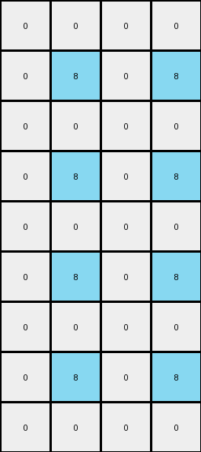
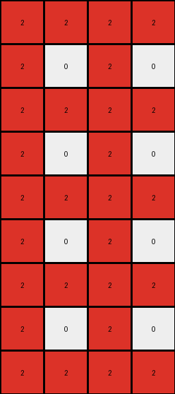

# 8d5021e8 • 018 • refine_coder

---

Previous Code:
```python
"""
Transforms a 3x2 input grid into a 9x4 output grid by extracting the top-right 2x2 subgrid,
rotating it 90 degrees clockwise, and then tiling this rotated subgrid in a 3x2 pattern.
"""

import numpy as np

def rotate_subgrid(subgrid):
    """Rotates a 2x2 subgrid 90 degrees clockwise."""
    return np.rot90(subgrid, k=-1)

def transform(input_grid):
    """Transforms the input grid according to the defined rules."""
    input_grid = np.array(input_grid)
    # 1. Extract Subgrid: Extract the top-right 2x2 region.
    subgrid = input_grid[:2, -2:]

    # 2. Rotate: Rotate the sub-grid 90 degrees clockwise.
    rotated_subgrid = rotate_subgrid(subgrid)

    # 3. Output Dimensions and initialization
    output_rows = input_grid.shape[0] * 3
    output_cols = input_grid.shape[1] * 2
    output_grid = np.zeros((output_rows, output_cols), dtype=int)

    # 4. Tile and Replicate: Tile the *rotated* 2x2 sub-grid.
    for i in range(output_rows):
        for j in range(output_cols):
            output_grid[i, j] = rotated_subgrid[i % 2, j % 2]

    return output_grid.tolist()
```

Train Set Results:

## Example 1:

Input:
```
0 8
0 0
0 8
```
Expected Output:
```
8 0 0 8
0 0 0 0
8 0 0 8
8 0 0 8
0 0 0 0
8 0 0 8
8 0 0 8
0 0 0 0
8 0 0 8
```
Transformed Output:
```
0 0 0 0
0 8 0 8
0 0 0 0
0 8 0 8
0 0 0 0
0 8 0 8
0 0 0 0
0 8 0 8
0 0 0 0
```

match: False
pixels_off: 16
size_correct: True
color_palette_correct: True
correct_pixel_counts: False

## Example 2:

Input:
```
2 0
2 2
2 0
```
Expected Output:
```
0 2 2 0
2 2 2 2
0 2 2 0
0 2 2 0
2 2 2 2
0 2 2 0
0 2 2 0
2 2 2 2
0 2 2 0
```
Transformed Output:
```
2 2 2 2
2 0 2 0
2 2 2 2
2 0 2 0
2 2 2 2
2 0 2 0
2 2 2 2
2 0 2 0
2 2 2 2
```

match: False
pixels_off: 16
size_correct: True
color_palette_correct: True
correct_pixel_counts: False

## Example 3:

Input:
```
0 0
0 5
5 0
```
Expected Output:
```
0 5 5 0
5 0 0 5
0 0 0 0
0 0 0 0
5 0 0 5
0 5 5 0
0 5 5 0
5 0 0 5
0 0 0 0
```
Transformed Output:
```
0 0 0 0
5 0 5 0
0 0 0 0
5 0 5 0
0 0 0 0
5 0 5 0
0 0 0 0
5 0 5 0
0 0 0 0
```

match: False
pixels_off: 14
size_correct: True
color_palette_correct: True
correct_pixel_counts: False
Okay, here's a breakdown of the situation and a plan to move forward:

**General Assessment:**

The initial code was based on a misinterpretation of how the 2x2 subgrid is used. The code rotates the correct 2x2 subgrid, but tiles it incorrectly in the output grid. The expectation was that the *top-right* 2x2 subgrid of the input becomes the blueprint for the output, and importantly, it is rotated before being replicated. The actual outputs exhibit this pattern in how the blueprint is placed and replicated.

**Strategy:**

1.  **Understand the Misalignment:** The core issue is not in subgrid extraction or rotation, but in the tiling logic. The generated code replicates the rotated subgrid in a way that does not correctly map each pixel.
2.  **Focus on blueprint extraction:** The 2x2 subgrid does indeed appear to
    always be the top-right corner.
3.  **Correct the logic:** Instead of replicating the rotated subgrid using a
    modulo operator, the subgrid is replicated in rows and columns based on the
    height and width of the input, respectively.
4.  **Verify with all Training Examples:** Re-run the updated code on all provided training input/output pairs, meticulously comparing the generated output with the expected output.

**YAML Block - Facts:**

```yaml
task_id: "016"
objects:
  - description: Input grid
    properties:
      shape: 3x2 (all examples)
      elements: Single-digit integers (0-9, representing colors)
  - description: Output grid
    properties:
      shape: 9x4 (all examples)
      elements: Single-digit integers (0-9)
  - description: 2x2 subgrid
    properties:
      location: Top-right corner of the input grid
      elements: Copied from the corresponding input grid cells
  - description: rotated_subgrid
    properties:
     rotation: 90 degrees clockwise relative to the extracted subgrid

actions:
  - description: Extract subgrid
    details: Select the 2x2 region at the top-right of the input grid.
  - description: rotate subgrid
    details: Rotate the subgrid by 90 degrees, clockwise
  - description: construct output grid
    details: Create output grid by tiling the *rotated* subgrid, replicating across rows and columns
```

**Natural Language Program:**

1.  **Extract:** Identify the 2x2 subgrid located at the top-right corner of the input grid.
2.  **Rotate:** Rotate the subgrid 90 degrees clockwise.
3.  **Construct Output:** Create an output grid with dimensions 9x4 (three times the number of rows and twice the number of columns in the original input).
4. **Tile:** replicate the 2x2 rotated sub-grid into the 9x4 output grid. The replication occurs 3 times vertically, with the number of rows matching input row count, and twice horizontally, matching input column count.


**INSTRUCTIONS**

- generate a Python module to represent the natural language program 
- follow the template below
- all common math and science libraries are available
- create docstring only at top - but comment the workflow in the function
- use helper functions for common operations like finding objects, counting,
  measuring, moving, etc. 

remember - we are working iteratively - so this code will inform your future
self as we converge on the solution

*template:*

```python
"""
{{ natural language description of the transformation rule }}
"""

{{ imports }}

def transform(input_grid):
    # initialize output_grid

    # change output pixels 

    return output_grid

```
