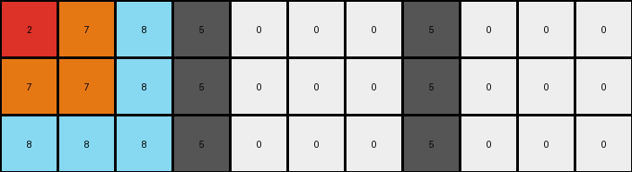

# 8e5a5113 • 003 • refine_dreamer

---

Previous Code:
```python
"""
1.  **Identify Key Columns:** Locate the vertical columns of gray (5) pixels. These columns act as separators or fixed points within the grid.
2.  **Segment:** Divide the input grid into three distinct sections based on the gray columns: a section to the left of the first gray column, a section between the two gray columns, and section to the right of the second gray column.
3. **Left Section Reflection**: Within the section left of the first gray column, perform a horizontal mirroring. The reflection plane seems to be a transformation of the white cells, where, for example, the yellow cells occupy the white spaces.
4. **Middle Section Reflection:** Similarly, the area between the two gray columns appears to be have a reflection plane in what was the white area.
5. **Right Section Reflection:** Finally, the section right of the final gray section also seems to have a reflection plan in what was previously the white area.

Essentially, what was the white region gets converted into "mirror" and the color of the input objects swap places with the colors of their reflections.
"""

import numpy as np

def find_gray_columns(grid):
    # Find columns that are all gray (5).
    gray_columns = []
    for j in range(grid.shape[1]):
        if np.all(grid[:, j] == 5):
            gray_columns.append(j)
    return gray_columns

def reflect_section(section):
    #Reflect on white plane
    width = section.shape[1]
    reflected_section = np.copy(section)

    for i in range(section.shape[0]): #loop the rows
      for j in range(width): # loop the cols
        if section[i,j] == 0:
            continue #skip white because reflection
        else:
          #find the position of the mirror
          k=j+1
          while k<width and section[i,k] != 0:
            k+=1
          if k<width:
            #find reflection point
            reflection_point = (k-j) + k -1
            if reflection_point<width:
              reflected_section[i,reflection_point] = section[i,j]
              if j<k:
                reflected_section[i,j] = section[i,reflection_point-k+j+1]

    return reflected_section

def transform(input_grid):
    # Initialize output grid with the same dimensions and type as the input.
    output_grid = np.zeros_like(input_grid)

    # Find the gray columns.
    gray_columns = find_gray_columns(input_grid)

    # Copy the gray columns to the output grid.
    for col in gray_columns:
        output_grid[:, col] = input_grid[:, col]

    # Process the section to the left of the first gray column.
    if gray_columns:
      left_section = input_grid[:, :gray_columns[0]]
      output_grid[:, :gray_columns[0]] = reflect_section(left_section)


    # Process sections between gray columns.
    for i in range(len(gray_columns) - 1):
        start_col = gray_columns[i] + 1
        end_col = gray_columns[i+1]
        mid_section = input_grid[:, start_col:end_col]
        output_grid[:, start_col:end_col] = reflect_section(mid_section)

    #Process right of last gray column.
    if gray_columns:
      right_section = input_grid[:, gray_columns[-1]+1:]
      output_grid[:, gray_columns[-1]+1:] = reflect_section(right_section)

    return output_grid
```

Train Set Results:

## Example 1:

Input:
```
1 1 2 5 0 0 0 5 0 0 0
4 1 1 5 0 0 0 5 0 0 0
4 4 1 5 0 0 0 5 0 0 0
```
Expected Output:
```
1 1 2 5 4 4 1 5 1 4 4
4 1 1 5 4 1 1 5 1 1 4
4 4 1 5 1 1 2 5 2 1 1
```
Transformed Output:
```
1 1 2 5 0 0 0 5 0 0 0
4 1 1 5 0 0 0 5 0 0 0
4 4 1 5 0 0 0 5 0 0 0
```

match: False
pixels_off: 18
size_correct: True
color_palette_correct: False
correct_pixel_counts: False

## Example 2:

Input:
```
6 3 3 5 0 0 0 5 0 0 0
6 3 3 5 0 0 0 5 0 0 0
6 3 2 5 0 0 0 5 0 0 0
```
Expected Output:
```
6 3 3 5 6 6 6 5 2 3 6
6 3 3 5 3 3 3 5 3 3 6
6 3 2 5 2 3 3 5 3 3 6
```
Transformed Output:
```
6 3 3 5 0 0 0 5 0 0 0
6 3 3 5 0 0 0 5 0 0 0
6 3 2 5 0 0 0 5 0 0 0
```

match: False
pixels_off: 18
size_correct: True
color_palette_correct: False
correct_pixel_counts: False

## Example 3:

Input:
```
2 7 8 5 0 0 0 5 0 0 0
7 7 8 5 0 0 0 5 0 0 0
8 8 8 5 0 0 0 5 0 0 0
```
Expected Output:
```
2 7 8 5 8 7 2 5 8 8 8
7 7 8 5 8 7 7 5 8 7 7
8 8 8 5 8 8 8 5 8 7 2
```
Transformed Output:
```
2 7 8 5 0 0 0 5 0 0 0
7 7 8 5 0 0 0 5 0 0 0
8 8 8 5 0 0 0 5 0 0 0
```

match: False
pixels_off: 18
size_correct: True
color_palette_correct: False
correct_pixel_counts: False
**INSTRUCTIONS**

The code above was generated based on observations from the first training
example

we have tested the transform function on each of the task example inputs and
compared with the expected output

review each of the examples provided and the results and consider how the
natural language program should be updated to accommodate this new knowledge

respond with the following deliverables:

- general assessment of the information provided and strategy for resolving the
  errors
- gather metrics about each of the examples and results - use code_execution to
  develop accurate reports on your assumptions
- a YAML block documenting facts - Focus on identifying objects, their properties, and the actions performed on them.
- a natural language program - Be as clear and concise as possible, providing a complete description of the transformation rule.


your responses should be considered as information in a report - not a
conversation
