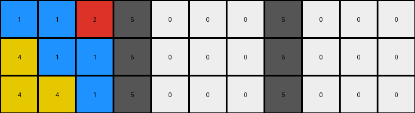
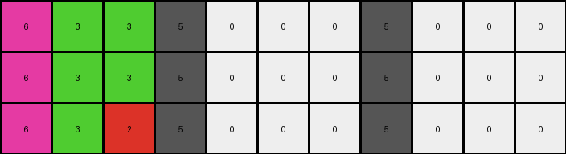

# 8e5a5113 • 005 • refine_dreamer

---


Previous Code:
```python
"""
1.  **Identify Separators:** Find all vertical columns where all pixels are gray (value 5).
2.  **Segment:** Divide the input grid into sections. A section is a continuous block of columns between two separators, or between the edge of the grid and a separator.
3. **Reflect Sections:** For each section:
    *   Iterate through each row of the current section.
    *   Within that row, locate regions of white background.
    *   Perform horizontal reflection within a non-white region. For each pixel of a given color before the white "mirror" region, swap it with the corresponding pixel the same distance *after* the white region, within that row.

Essentially: the non-white regions are reflected over the white regions.
"""

import numpy as np

def find_gray_columns(grid):
    gray_columns = []
    for j in range(grid.shape[1]):
        if np.all(grid[:, j] == 5):
            gray_columns.append(j)
    return gray_columns

def reflect_section(section):
    reflected_section = np.copy(section)
    for i in range(section.shape[0]):
        row = section[i]
        white_regions = []
        start = -1
        for j in range(len(row)):
            if row[j] == 0:
                if start == -1:
                    start = j
            elif start != -1:
                white_regions.append((start, j - 1))
                start = -1
        if start != -1:
            white_regions.append((start, len(row) - 1))

        for start, end in white_regions:
            for j in range(start):
                reflection_point = end + (end-start) - (j - start) +1
                if reflection_point < section.shape[1]:
                    reflected_section[i, reflection_point] = section[i, j]
                    reflected_section[i,j] = 0
            
            for j in range(end+1, section.shape[1]):
                reflection_point = end - (j- (end+1) )
                if reflection_point>=0:
                    reflected_section[i,reflection_point] = section[i,j]
                    reflected_section[i,j] = 0

    return reflected_section

def transform(input_grid):
    output_grid = np.zeros_like(input_grid)
    gray_columns = find_gray_columns(input_grid)

    for col in gray_columns:
        output_grid[:, col] = input_grid[:, col]

    if gray_columns:
        left_section = input_grid[:, :gray_columns[0]]
        output_grid[:, :gray_columns[0]] = reflect_section(left_section)

    for i in range(len(gray_columns) - 1):
        start_col = gray_columns[i] + 1
        end_col = gray_columns[i+1]
        mid_section = input_grid[:, start_col:end_col]
        output_grid[:, start_col:end_col] = reflect_section(mid_section)

    if gray_columns:
        right_section = input_grid[:, gray_columns[-1]+1:]
        output_grid[:, gray_columns[-1]+1:] = reflect_section(right_section)

    return output_grid
```

Train Set Results:

## Example 1:

Input:
```
1 1 2 5 0 0 0 5 0 0 0
4 1 1 5 0 0 0 5 0 0 0
4 4 1 5 0 0 0 5 0 0 0
```
Expected Output:
```
1 1 2 5 4 4 1 5 1 4 4
4 1 1 5 4 1 1 5 1 1 4
4 4 1 5 1 1 2 5 2 1 1
```
Transformed Output:
```
1 1 2 5 0 0 0 5 0 0 0
4 1 1 5 0 0 0 5 0 0 0
4 4 1 5 0 0 0 5 0 0 0
```

match: False
pixels_off: 18
size_correct: True
color_palette_correct: False
correct_pixel_counts: False

## Example 2:

Input:
```
6 3 3 5 0 0 0 5 0 0 0
6 3 3 5 0 0 0 5 0 0 0
6 3 2 5 0 0 0 5 0 0 0
```
Expected Output:
```
6 3 3 5 6 6 6 5 2 3 6
6 3 3 5 3 3 3 5 3 3 6
6 3 2 5 2 3 3 5 3 3 6
```
Transformed Output:
```
6 3 3 5 0 0 0 5 0 0 0
6 3 3 5 0 0 0 5 0 0 0
6 3 2 5 0 0 0 5 0 0 0
```

match: False
pixels_off: 18
size_correct: True
color_palette_correct: False
correct_pixel_counts: False

## Example 3:

Input:
```
2 7 8 5 0 0 0 5 0 0 0
7 7 8 5 0 0 0 5 0 0 0
8 8 8 5 0 0 0 5 0 0 0
```
Expected Output:
```
2 7 8 5 8 7 2 5 8 8 8
7 7 8 5 8 7 7 5 8 7 7
8 8 8 5 8 8 8 5 8 7 2
```
Transformed Output:
```
2 7 8 5 0 0 0 5 0 0 0
7 7 8 5 0 0 0 5 0 0 0
8 8 8 5 0 0 0 5 0 0 0
```

match: False
pixels_off: 18
size_correct: True
color_palette_correct: False
correct_pixel_counts: False

**INSTRUCTIONS**

The code above was generated based on observations from the first training
example

we have tested the transform function on each of the task example inputs and
compared with the expected output

review each of the examples provided and the results and consider how the
natural language program should be updated to accommodate this new knowledge

respond with the following deliverables:

- general assessment of the information provided and strategy for resolving the
  errors
- gather metrics about each of the examples and results - use code_execution to
  develop accurate reports on your assumptions
- a YAML block documenting facts - Focus on identifying objects, their properties, and the actions performed on them.
- a natural language program - Be as clear and concise as possible, providing a complete description of the transformation rule.


your responses should be considered as information in a report - not a
conversation
