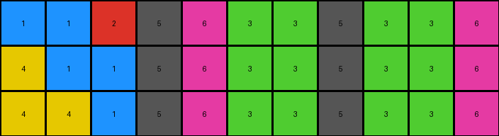
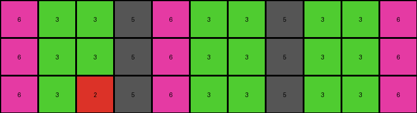
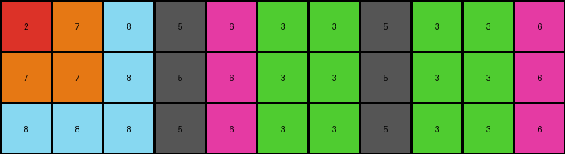

# 8e5a5113 • 009 • refine_dreamer

---

Previous Code:
```python
"""
The input grid is transformed by replacing white (0) pixels with a repeating pattern of magenta (6), green (3), and red (2), starting the pattern based on non-zero values to the left. The dimensions of the grid remain the same.
"""

import numpy as np

def get_left_non_zero_neighbor(grid, row, col):
    """Finds the nearest non-zero pixel to the left in the same row.
       Returns the color, and -1, -1 if there is not a non-zero pixel to the left
    """
    for c in range(col - 1, -1, -1):
        if grid[row, c] != 0:
            return grid[row, c]
    return -1

def transform(input_grid):
    """Transforms the input grid according to the observed rule."""

    output_grid = np.copy(input_grid)
    rows, cols = output_grid.shape

    for r in range(rows):
        for c in range(cols):
            if input_grid[r, c] == 0:
                left_neighbor_color = get_left_non_zero_neighbor(input_grid, r, c)
                if left_neighbor_color == 5:

                  pattern = [6,3,3]
                  if input_grid[r,3] == 2:
                    pattern = [2,3,3]
                  output_grid[r,c] = pattern[(c-4)%len(pattern)]

    return output_grid
```

Train Set Results:

## Example 1:

Input:
```
1 1 2 5 0 0 0 5 0 0 0
4 1 1 5 0 0 0 5 0 0 0
4 4 1 5 0 0 0 5 0 0 0
```
Expected Output:
```
1 1 2 5 4 4 1 5 1 4 4
4 1 1 5 4 1 1 5 1 1 4
4 4 1 5 1 1 2 5 2 1 1
```
Transformed Output:
```
1 1 2 5 6 3 3 5 3 3 6
4 1 1 5 6 3 3 5 3 3 6
4 4 1 5 6 3 3 5 3 3 6
```

match: False
pixels_off: 18
size_correct: True
color_palette_correct: False
correct_pixel_counts: False

## Example 2:

Input:
```
6 3 3 5 0 0 0 5 0 0 0
6 3 3 5 0 0 0 5 0 0 0
6 3 2 5 0 0 0 5 0 0 0
```
Expected Output:
```
6 3 3 5 6 6 6 5 2 3 6
6 3 3 5 3 3 3 5 3 3 6
6 3 2 5 2 3 3 5 3 3 6
```
Transformed Output:
```
6 3 3 5 6 3 3 5 3 3 6
6 3 3 5 6 3 3 5 3 3 6
6 3 2 5 6 3 3 5 3 3 6
```

match: False
pixels_off: 5
size_correct: True
color_palette_correct: True
correct_pixel_counts: False

## Example 3:

Input:
```
2 7 8 5 0 0 0 5 0 0 0
7 7 8 5 0 0 0 5 0 0 0
8 8 8 5 0 0 0 5 0 0 0
```
Expected Output:
```
2 7 8 5 8 7 2 5 8 8 8
7 7 8 5 8 7 7 5 8 7 7
8 8 8 5 8 8 8 5 8 7 2
```
Transformed Output:
```
2 7 8 5 6 3 3 5 3 3 6
7 7 8 5 6 3 3 5 3 3 6
8 8 8 5 6 3 3 5 3 3 6
```

match: False
pixels_off: 18
size_correct: True
color_palette_correct: False
correct_pixel_counts: False
**INSTRUCTIONS**

The code above was generated based on observations from the first training
example

we have tested the transform function on each of the task example inputs and
compared with the expected output

review each of the examples provided and the results and consider how the
natural language program should be updated to accommodate this new knowledge

respond with the following deliverables:

- general assessment of the information provided and strategy for resolving the
  errors
- gather metrics about each of the examples and results - use code_execution to
  develop accurate reports on your assumptions
- a YAML block documenting facts - Focus on identifying objects, their properties, and the actions performed on them.
- a natural language program - Be as clear and concise as possible, providing a complete description of the transformation rule.


your responses should be considered as information in a report - not a
conversation
