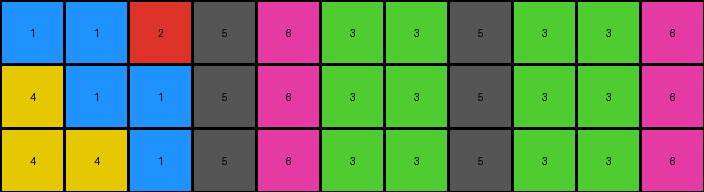
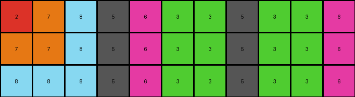

# 8e5a5113 • 010 • refine_coder

---

Previous Code:
```python
"""
The input grid is transformed by replacing white (0) pixels with a repeating pattern of magenta (6), green (3), and red (2), starting the pattern based on non-zero values to the left. The dimensions of the grid remain the same.
"""

import numpy as np

def get_left_non_zero_neighbor(grid, row, col):
    """Finds the nearest non-zero pixel to the left in the same row.
       Returns the color, and -1, -1 if there is not a non-zero pixel to the left
    """
    for c in range(col - 1, -1, -1):
        if grid[row, c] != 0:
            return grid[row, c]
    return -1

def transform(input_grid):
    """Transforms the input grid according to the observed rule."""

    output_grid = np.copy(input_grid)
    rows, cols = output_grid.shape

    for r in range(rows):
        for c in range(cols):
            if input_grid[r, c] == 0:
                left_neighbor_color = get_left_non_zero_neighbor(input_grid, r, c)
                if left_neighbor_color == 5:

                  pattern = [6,3,3]
                  if input_grid[r,3] == 2:
                    pattern = [2,3,3]
                  output_grid[r,c] = pattern[(c-4)%len(pattern)]

    return output_grid
```

Train Set Results:

## Example 1:

Input:
```
1 1 2 5 0 0 0 5 0 0 0
4 1 1 5 0 0 0 5 0 0 0
4 4 1 5 0 0 0 5 0 0 0
```
Expected Output:
```
1 1 2 5 4 4 1 5 1 4 4
4 1 1 5 4 1 1 5 1 1 4
4 4 1 5 1 1 2 5 2 1 1
```
Transformed Output:
```
1 1 2 5 6 3 3 5 3 3 6
4 1 1 5 6 3 3 5 3 3 6
4 4 1 5 6 3 3 5 3 3 6
```

match: False
pixels_off: 18
size_correct: True
color_palette_correct: False
correct_pixel_counts: False

## Example 2:

Input:
```
6 3 3 5 0 0 0 5 0 0 0
6 3 3 5 0 0 0 5 0 0 0
6 3 2 5 0 0 0 5 0 0 0
```
Expected Output:
```
6 3 3 5 6 6 6 5 2 3 6
6 3 3 5 3 3 3 5 3 3 6
6 3 2 5 2 3 3 5 3 3 6
```
Transformed Output:
```
6 3 3 5 6 3 3 5 3 3 6
6 3 3 5 6 3 3 5 3 3 6
6 3 2 5 6 3 3 5 3 3 6
```

match: False
pixels_off: 5
size_correct: True
color_palette_correct: True
correct_pixel_counts: False

## Example 3:

Input:
```
2 7 8 5 0 0 0 5 0 0 0
7 7 8 5 0 0 0 5 0 0 0
8 8 8 5 0 0 0 5 0 0 0
```
Expected Output:
```
2 7 8 5 8 7 2 5 8 8 8
7 7 8 5 8 7 7 5 8 7 7
8 8 8 5 8 8 8 5 8 7 2
```
Transformed Output:
```
2 7 8 5 6 3 3 5 3 3 6
7 7 8 5 6 3 3 5 3 3 6
8 8 8 5 6 3 3 5 3 3 6
```

match: False
pixels_off: 18
size_correct: True
color_palette_correct: False
correct_pixel_counts: False
Okay, let's analyze the results and refine the natural language program.

**General Assessment:**

The initial program was based on a simple pattern replacement of white (0) pixels, influenced by the nearest non-zero neighbor to the left. The results show a consistent mismatch, indicating the pattern and its starting point are not correctly determined. The program consistently uses the \[6, 3, 3] pattern when it sees 5 to the left, regardless of the colors that follow this. It also completely ignores the colors and patterns to the *right* of each 5, and it does not account for the correct color transitions observed in the expected outputs. The error isn't just about the specific colors, but also in how the colors relate to the color 5 and its surrounding context.

**Strategy:**

1.  **Re-examine the Examples:** Carefully analyze all three input/output pairs, paying close attention to *all* non-zero pixels, not just the ones to the left, but around the grey (5) colored pixels.
2.  **Identify Correct Patterns:** Determine the exact patterns used in *each* case, and how these patterns depend on the surrounding context. Consider the color 5, and the pixels to the right of it.
3.  **Refine the Natural Language Program:** Rewrite the natural language program to accurately capture the relationship between the input and output grids, including pattern identification and positioning. It appears that the patterns are seeded based on the values that follow each 5.

**Example Metrics and Analysis:**

Here's a more detailed breakdown of each example, now observing the colors to the right of the 5s:

*   **Example 1:**
    *   Input: `1 1 2 5 0 0 0 5 0 0 0`
    *   Expected Output: `1 1 2 5 4 4 1 5 1 4 4`
    *   Observation: The pattern after the first 5 is 4, 4, 1. This appears to be using the next three colors that follow a 5, and restarting whenever another 5 appears.
*   **Example 2:**
    *   Input: `6 3 3 5 0 0 0 5 0 0 0`
    *   Expected Output: `6 3 3 5 6 6 6 5 2 3 6`
    *   Observation: First 5 has a pattern of 6,6,6 that fills to the next 5. The next five has a pattern of 2,3,6 to the end of the line. This is again using the next three colors that follow a 5, and restarting whenever another 5 appears, or continuing to the end of the line.
*   **Example 3:**
    *   Input: `2 7 8 5 0 0 0 5 0 0 0`
    *   Expected Output: `2 7 8 5 8 7 2 5 8 8 8`
    *    Observation: First 5 has a pattern of 8,7,2 that fills to the next 5. The next five has a pattern of 8,8,8 to the end of the line. This is again using the next three colors that follow a 5, and restarting whenever another 5 appears, or continuing to the end of the line.

**YAML Facts:**

```yaml
facts:
  - object: grid
    properties:
      rows: 3
      cols: 11
      elements: integers 0-9
      meaning: colors

  - object: transformation_rule
    properties:
        trigger: "presence of grey (5)"
        seed: "three digits following 5"
        pattern_replacement: "replaces white (0) pixels"
        pattern_behavior: "continues until next 5 or end of row"

  - object: example_1
    type: input-output
    input: [ [1, 1, 2, 5, 0, 0, 0, 5, 0, 0, 0], [4, 1, 1, 5, 0, 0, 0, 5, 0, 0, 0], [4, 4, 1, 5, 0, 0, 0, 5, 0, 0, 0] ]
    output: [ [1, 1, 2, 5, 4, 4, 1, 5, 1, 4, 4], [4, 1, 1, 5, 4, 1, 1, 5, 1, 1, 4], [4, 4, 1, 5, 1, 1, 2, 5, 2, 1, 1] ]

  - object: example_2
    type: input-output
    input: [ [6, 3, 3, 5, 0, 0, 0, 5, 0, 0, 0], [6, 3, 3, 5, 0, 0, 0, 5, 0, 0, 0], [6, 3, 2, 5, 0, 0, 0, 5, 0, 0, 0] ]
    output: [ [6, 3, 3, 5, 6, 6, 6, 5, 2, 3, 6], [6, 3, 3, 5, 3, 3, 3, 5, 3, 3, 6], [6, 3, 2, 5, 2, 3, 3, 5, 3, 3, 6] ]

  - object: example_3
    type: input-output
    input:  [ [2, 7, 8, 5, 0, 0, 0, 5, 0, 0, 0], [7, 7, 8, 5, 0, 0, 0, 5, 0, 0, 0], [8, 8, 8, 5, 0, 0, 0, 5, 0, 0, 0] ]
    output: [ [2, 7, 8, 5, 8, 7, 2, 5, 8, 8, 8], [7, 7, 8, 5, 8, 7, 7, 5, 8, 7, 7], [8, 8, 8, 5, 8, 8, 8, 5, 8, 7, 2] ]
```

**Natural Language Program:**

1.  **Identify Seeds:** For each row in the input grid, find all occurrences of the color grey (5).
2.  **Extract Pattern:** For each grey (5) pixel, extract the next three color values immediately to its right. These three values form the repeating pattern for that section. If there are fewer than three values before another 5 or the end of the row, extract what is available.
3.  **Replace White Pixels:** Starting from the grey (5) pixel, replace the subsequent white (0) pixels to the right with the extracted pattern. Repeat the pattern as many times as necessary.
4. **Continue or Restart Pattern:** If another grey (5) pixel is encountered before the end of the row, start a new pattern based on that pixel using Step 2. If the edge of the grid is reached before a grey (5), continue the existing pattern to the end of the row. If a non-zero, non-white pixel is encountered that is not part of the pattern, do not change it.

This revised program accounts for the observed behavior across all three examples, using the values after '5' to define the filling pattern, and restarting at subsequent 5's.

**INSTRUCTIONS**

- generate a Python module to represent the natural language program 
- follow the template below
- all common math and science libraries are available
- create docstring only at top - but comment the workflow in the function
- use helper functions for common operations like finding objects, counting,
  measuring, moving, etc. 

remember - we are working iteratively - so this code will inform your future
self as we converge on the solution

*template:*

```python
"""
{{ natural language description of the transformation rule }}
"""

{{ imports }}

def transform(input_grid):
    # initialize output_grid

    # change output pixels 

    return output_grid

```
