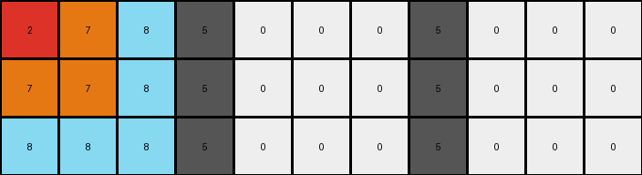

# 8e5a5113 • 011 • refine_dreamer

---


Previous Code:
```python
"""
The input grid is transformed by replacing white (0) pixels following a grey (5) pixel with a repeating pattern. The pattern is seeded by the three colors immediately to the right of the grey (5). If fewer than three colors are available before another 5 or the end of the row, the available colors are used. The pattern repeats until another 5 is encountered, or the end of the row is reached.
"""

import numpy as np

def get_pattern(grid, row, col):
    """Extracts the pattern to the right of a grey (5) pixel."""
    rows, cols = grid.shape
    pattern = []
    for c in range(col + 1, cols):
        if grid[row, c] == 5:
          break;
        pattern.append(grid[row, c])
    return pattern

def transform(input_grid):
    """Transforms the input grid according to the observed rule."""

    output_grid = np.copy(input_grid)
    rows, cols = output_grid.shape

    for r in range(rows):
        pattern = []
        pattern_index = 0
        filling = False  # Flag to indicate if we are in a filling state

        for c in range(cols):
            if input_grid[r, c] == 5:
                pattern = get_pattern(input_grid, r, c)
                pattern_index = 0
                filling = True
                continue # move to the next column after the 5

            if filling:  # we are after 5
                if input_grid[r,c] == 0: # and this pixel needs replacing
                    if pattern: # and the pattern is valid
                        output_grid[r, c] = pattern[pattern_index % len(pattern)]
                        pattern_index += 1
                else:
                  # stop filling if we see any other non-zero color
                  filling = False;
            # else, we are not after a 5, so just continue

    return output_grid
```

Train Set Results:

## Example 1:

Input:
```
1 1 2 5 0 0 0 5 0 0 0
4 1 1 5 0 0 0 5 0 0 0
4 4 1 5 0 0 0 5 0 0 0
```
Expected Output:
```
1 1 2 5 4 4 1 5 1 4 4
4 1 1 5 4 1 1 5 1 1 4
4 4 1 5 1 1 2 5 2 1 1
```
Transformed Output:
```
1 1 2 5 0 0 0 5 0 0 0
4 1 1 5 0 0 0 5 0 0 0
4 4 1 5 0 0 0 5 0 0 0
```

match: False
pixels_off: 18
size_correct: True
color_palette_correct: False
correct_pixel_counts: False

## Example 2:

Input:
```
6 3 3 5 0 0 0 5 0 0 0
6 3 3 5 0 0 0 5 0 0 0
6 3 2 5 0 0 0 5 0 0 0
```
Expected Output:
```
6 3 3 5 6 6 6 5 2 3 6
6 3 3 5 3 3 3 5 3 3 6
6 3 2 5 2 3 3 5 3 3 6
```
Transformed Output:
```
6 3 3 5 0 0 0 5 0 0 0
6 3 3 5 0 0 0 5 0 0 0
6 3 2 5 0 0 0 5 0 0 0
```

match: False
pixels_off: 18
size_correct: True
color_palette_correct: False
correct_pixel_counts: False

## Example 3:

Input:
```
2 7 8 5 0 0 0 5 0 0 0
7 7 8 5 0 0 0 5 0 0 0
8 8 8 5 0 0 0 5 0 0 0
```
Expected Output:
```
2 7 8 5 8 7 2 5 8 8 8
7 7 8 5 8 7 7 5 8 7 7
8 8 8 5 8 8 8 5 8 7 2
```
Transformed Output:
```
2 7 8 5 0 0 0 5 0 0 0
7 7 8 5 0 0 0 5 0 0 0
8 8 8 5 0 0 0 5 0 0 0
```

match: False
pixels_off: 18
size_correct: True
color_palette_correct: False
correct_pixel_counts: False

**INSTRUCTIONS**

The code above was generated based on observations from the first training
example

we have tested the transform function on each of the task example inputs and
compared with the expected output

review each of the examples provided and the results and consider how the
natural language program should be updated to accommodate this new knowledge

respond with the following deliverables:

- general assessment of the information provided and strategy for resolving the
  errors
- gather metrics about each of the examples and results - use code_execution to
  develop accurate reports on your assumptions
- a YAML block documenting facts - Focus on identifying objects, their properties, and the actions performed on them.
- a natural language program - Be as clear and concise as possible, providing a complete description of the transformation rule.


your responses should be considered as information in a report - not a
conversation
