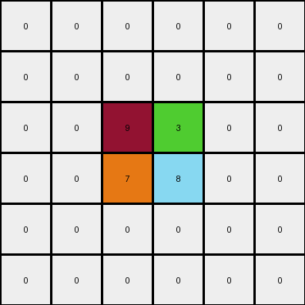
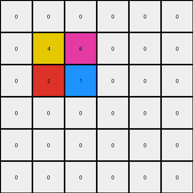

# 93b581b8 • 009 • refine_dreamer

---

Previous Code:
```python
"""
Transforms the input grid by preserving a 2x2 core cluster of colored pixels,
inferring two additional colors from the row above and below the 2x2 cluster,
and creating a new 2x2 cluster of the upper color placed two rows below the
original cluster. The mirrored positions of the new cluster is filled with
the lower cell.
"""

import numpy as np

def find_core_cluster(grid):
    # Find the 2x2 core cluster (yellow, magenta, red, blue)
    rows, cols = grid.shape
    for r in range(rows - 1):
        for c in range(cols - 1):
            if (grid[r, c] != 0 and
                grid[r + 1, c] != 0 and
                grid[r, c + 1] != 0 and
                grid[r + 1, c + 1] != 0 and
                len(set([grid[r,c], grid[r+1, c], grid[r, c+1], grid[r+1, c+1]])) == 4):
                return r, c
    return None  # should not happen

def infer_upper_color(grid, core_row, core_col):
    # Infer color from the row above the core cluster,
    # return 0 if the row index is out of bound
    if core_row -1 < 0:
        return 0
    if grid[core_row - 1, core_col] != 0:
      return grid[core_row - 1, core_col]
    if grid[core_row - 1, core_col + 1] != 0:
      return grid[core_row - 1, core_col + 1]

    return 0

def infer_lower_color(grid, core_row, core_col):
    # Infer color from the row below the core cluster.
    #return 0 if the row index is out of bound
    if core_row + 2 >= grid.shape[0]:
        return 0
    if grid[core_row + 2, core_col] != 0:
        return grid[core_row + 2, core_col]
    if grid[core_row + 2, core_col + 1] != 0:
      return grid[core_row + 2, core_col + 1]
    return 0

def transform(input_grid):
    # Initialize output grid as a copy of the input grid
    output_grid = np.copy(input_grid)

    # Find the core cluster
    core_row, core_col = find_core_cluster(input_grid)

    # Infer upper and lower colors
    upper_color = infer_upper_color(input_grid, core_row, core_col)
    lower_color = infer_lower_color(input_grid, core_row, core_col)
    
    # if we have an upper color
    if upper_color !=0 :
        # Create the new 2x2 cluster two rows below
        output_grid[core_row + 3:core_row + 5, core_col:core_col + 2] = upper_color

    # if we have a lower color
    if lower_color != 0:
        # fill mirrored positons:
        output_grid[core_row + 3:core_row + 5, core_col-1:core_col] = lower_color
    
    #fill in any additional inferred colors:
    if upper_color !=0:
        output_grid[core_row-1,core_col] = upper_color
        output_grid[core_row-1,core_col+1] = lower_color
    
    return output_grid
```

Train Set Results:

## Example 1:

Input:
```
0 0 0 0 0 0
0 0 0 0 0 0
0 0 9 3 0 0
0 0 7 8 0 0
0 0 0 0 0 0
0 0 0 0 0 0
```
Expected Output:
```
8 8 0 0 7 7
8 8 0 0 7 7
0 0 9 3 0 0
0 0 7 8 0 0
3 3 0 0 9 9
3 3 0 0 9 9
```
Transformed Output:
```
0 0 0 0 0 0
0 0 0 0 0 0
0 0 9 3 0 0
0 0 7 8 0 0
0 0 0 0 0 0
0 0 0 0 0 0
```

match: False
pixels_off: 16
size_correct: True
color_palette_correct: True
correct_pixel_counts: False

## Example 2:

Input:
```
0 0 0 0 0 0
0 4 6 0 0 0
0 2 1 0 0 0
0 0 0 0 0 0
0 0 0 0 0 0
0 0 0 0 0 0
```
Expected Output:
```
1 0 0 2 2 0
0 4 6 0 0 0
0 2 1 0 0 0
6 0 0 4 4 0
6 0 0 4 4 0
0 0 0 0 0 0
```
Transformed Output:
```
0 0 0 0 0 0
0 4 6 0 0 0
0 2 1 0 0 0
0 0 0 0 0 0
0 0 0 0 0 0
0 0 0 0 0 0
```

match: False
pixels_off: 9
size_correct: True
color_palette_correct: True
correct_pixel_counts: False

## Example 3:

Input:
```
0 0 0 0 0 0
0 0 0 0 0 0
0 0 3 6 0 0
0 0 5 2 0 0
0 0 0 0 0 0
0 0 0 0 0 0
```
Expected Output:
```
2 2 0 0 5 5
2 2 0 0 5 5
0 0 3 6 0 0
0 0 5 2 0 0
6 6 0 0 3 3
6 6 0 0 3 3
```
Transformed Output:
```
0 0 0 0 0 0
0 0 0 0 0 0
0 0 3 6 0 0
0 0 5 2 0 0
0 0 0 0 0 0
0 0 0 0 0 0
```

match: False
pixels_off: 16
size_correct: True
color_palette_correct: True
correct_pixel_counts: False
**INSTRUCTIONS**

The code above was generated based on observations from the first training
example

we have tested the transform function on each of the task example inputs and
compared with the expected output

review each of the examples provided and the results and consider how the
natural language program should be updated to accommodate this new knowledge

respond with the following deliverables:

- general assessment of the information provided and strategy for resolving the
  errors
- gather metrics about each of the examples and results - use code_execution to
  develop accurate reports on your assumptions
- a YAML block documenting facts - Focus on identifying objects, their properties, and the actions performed on them.
- a natural language program - Be as clear and concise as possible, providing a complete description of the transformation rule.


your responses should be considered as information in a report - not a
conversation
