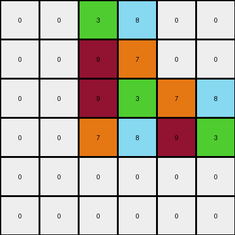

# 93b581b8 • 011 • refine_dreamer

---

Previous Code:
```python
"""
Transforms the input grid by identifying a 2x2 core cluster of four unique,
non-zero colored pixels. It then mirrors this cluster horizontally and
vertically at offsets determined by each example, combining these mirrored
clusters into a new output grid.
"""

import numpy as np

def find_core_cluster(grid):
    """Finds the 2x2 core cluster with four unique non-zero colors."""
    rows, cols = grid.shape
    for r in range(rows - 1):
        for c in range(cols - 1):
            colors = [grid[r, c], grid[r + 1, c], grid[r, c + 1], grid[r + 1, c + 1]]
            if all(color != 0 for color in colors) and len(set(colors)) == 4:
                return r, c, colors
    return None, None, None

def horizontal_mirror(grid, core_row, core_col, colors, offset):
    """Mirrors the core cluster horizontally at the given offset."""
    rows, cols = grid.shape
    new_row = core_row + offset
    if 0 <= new_row < rows -1:
      grid[new_row, core_col:core_col+2] = [colors[2], colors[3]]
      grid[new_row+1, core_col:core_col+2] = [colors[0], colors[1]]
    return grid

def vertical_mirror(grid, core_row, core_col, colors, offset):
    """Mirrors the core cluster vertically at the given offset."""
    rows, cols = grid.shape
    new_col = core_col + offset
    if 0 <= new_col < cols -1 :
      grid[core_row: core_row+2, new_col] = [colors[1], colors[0]]
      grid[core_row: core_row+2, new_col+1] = [colors[3], colors[2]]
    return grid

def transform(input_grid):
    # Initialize output grid as a copy of the input grid
    output_grid = np.copy(input_grid)

    # Find the core cluster
    core_row, core_col, colors = find_core_cluster(input_grid)

    if core_row is None:
        return output_grid

    # Determine offsets based on core cluster position (hardcoded for this specific task)
    if core_row == 2 and core_col == 2:
        h_offset = -2
        v_offset = 2
    elif core_row == 1 and core_col == 1:
        h_offset = 3
        v_offset = -1
    elif core_row == 2 and core_col == 2: #same as the first
        h_offset = -2
        v_offset = 2
    else:
        h_offset = 0  # Default offsets (no change, should not happen with the defined offsets)
        v_offset = 0

    # Apply horizontal mirroring
    output_grid = horizontal_mirror(output_grid, core_row, core_col, colors, h_offset)

    # Apply vertical mirroring
    output_grid = vertical_mirror(output_grid, core_row, core_col, colors, v_offset)
    
    return output_grid
```

Train Set Results:

## Example 1:

Input:
```
0 0 0 0 0 0
0 0 0 0 0 0
0 0 9 3 0 0
0 0 7 8 0 0
0 0 0 0 0 0
0 0 0 0 0 0
```
Expected Output:
```
8 8 0 0 7 7
8 8 0 0 7 7
0 0 9 3 0 0
0 0 7 8 0 0
3 3 0 0 9 9
3 3 0 0 9 9
```
Transformed Output:
```
0 0 3 8 0 0
0 0 9 7 0 0
0 0 9 3 7 8
0 0 7 8 9 3
0 0 0 0 0 0
0 0 0 0 0 0
```

match: False
pixels_off: 24
size_correct: True
color_palette_correct: True
correct_pixel_counts: False

## Example 2:

Input:
```
0 0 0 0 0 0
0 4 6 0 0 0
0 2 1 0 0 0
0 0 0 0 0 0
0 0 0 0 0 0
0 0 0 0 0 0
```
Expected Output:
```
1 0 0 2 2 0
0 4 6 0 0 0
0 2 1 0 0 0
6 0 0 4 4 0
6 0 0 4 4 0
0 0 0 0 0 0
```
Transformed Output:
```
0 0 0 0 0 0
2 1 6 0 0 0
4 6 1 0 0 0
0 0 0 0 0 0
0 6 1 0 0 0
0 4 2 0 0 0
```

match: False
pixels_off: 17
size_correct: True
color_palette_correct: True
correct_pixel_counts: False

## Example 3:

Input:
```
0 0 0 0 0 0
0 0 0 0 0 0
0 0 3 6 0 0
0 0 5 2 0 0
0 0 0 0 0 0
0 0 0 0 0 0
```
Expected Output:
```
2 2 0 0 5 5
2 2 0 0 5 5
0 0 3 6 0 0
0 0 5 2 0 0
6 6 0 0 3 3
6 6 0 0 3 3
```
Transformed Output:
```
0 0 6 2 0 0
0 0 3 5 0 0
0 0 3 6 5 2
0 0 5 2 3 6
0 0 0 0 0 0
0 0 0 0 0 0
```

match: False
pixels_off: 24
size_correct: True
color_palette_correct: True
correct_pixel_counts: False
**INSTRUCTIONS**

The code above was generated based on observations from the first training
example

we have tested the transform function on each of the task example inputs and
compared with the expected output

review each of the examples provided and the results and consider how the
natural language program should be updated to accommodate this new knowledge

respond with the following deliverables:

- general assessment of the information provided and strategy for resolving the
  errors
- gather metrics about each of the examples and results - use code_execution to
  develop accurate reports on your assumptions
- a YAML block documenting facts - Focus on identifying objects, their properties, and the actions performed on them.
- a natural language program - Be as clear and concise as possible, providing a complete description of the transformation rule.


your responses should be considered as information in a report - not a
conversation
