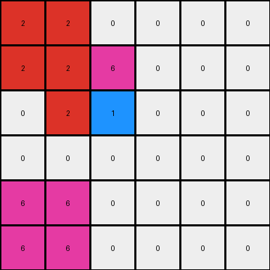

# 93b581b8 • 015 • refine_dreamer

---


Previous Code:
```python
"""
The transformation identifies a central 2x2 block of colored pixels and preserves it. 
Then, for the green and magenta colors in the central block, it mirrors those colors
by creating 2x2 regions filled with color 3 (green) in the lower right corner
and color 6 (magenta) at the bottom left corner of the grid.
Colors 2 (red) and 5 (grey) are not processed to be mirrored in that way.
"""

import numpy as np

def find_central_block(grid):
    # Find the largest 2x2 block of non-zero pixels
    rows, cols = grid.shape
    for r in range(rows - 1):
        for c in range(cols - 1):
            block = grid[r:r+2, c:c+2]
            if np.all(block != 0):
                return r, c
    return None

def transform(input_grid):
    # Initialize output_grid as a copy of input_grid
    output_grid = input_grid.copy()
    rows, cols = input_grid.shape

    # Find the central 2x2 block
    central_block_coords = find_central_block(input_grid)
    if central_block_coords is None:
      return output_grid

    r, c = central_block_coords

    # Preserve the central block (unnecessary since we copied, but for clarity)
    # output_grid[r:r+2, c:c+2] = input_grid[r:r+2, c:c+2]

    # Mirror based on colors 3 and 6 in center block (simplified based on observation)
    # Check for color 3 (green)
    if 3 in input_grid[r:r+2, c:c+2]:
       output_grid[rows-2:rows, cols-2:cols] = 3

    #Check for color 6 (magenta)
    if 6 in input_grid[r:r+2, c:c+2]:
       output_grid[rows-2:rows, 0:2] = 6
    
    #Check for color 2 (red)
    if 2 in input_grid[r:r+2, c:c+2]:
       output_grid[0:2, 0:2] = 2
       
    #Check for color 5 (grey)
    if 5 in input_grid[r:r+2, c:c+2]:
       output_grid[0:2, cols-2:cols] = 5

    return output_grid
```

Train Set Results:

## Example 1:

Input:
```
0 0 0 0 0 0
0 0 0 0 0 0
0 0 9 3 0 0
0 0 7 8 0 0
0 0 0 0 0 0
0 0 0 0 0 0
```
Expected Output:
```
8 8 0 0 7 7
8 8 0 0 7 7
0 0 9 3 0 0
0 0 7 8 0 0
3 3 0 0 9 9
3 3 0 0 9 9
```
Transformed Output:
```
0 0 0 0 0 0
0 0 0 0 0 0
0 0 9 3 0 0
0 0 7 8 0 0
0 0 0 0 3 3
0 0 0 0 3 3
```

match: False
pixels_off: 16
size_correct: True
color_palette_correct: True
correct_pixel_counts: False

## Example 2:

Input:
```
0 0 0 0 0 0
0 4 6 0 0 0
0 2 1 0 0 0
0 0 0 0 0 0
0 0 0 0 0 0
0 0 0 0 0 0
```
Expected Output:
```
1 0 0 2 2 0
0 4 6 0 0 0
0 2 1 0 0 0
6 0 0 4 4 0
6 0 0 4 4 0
0 0 0 0 0 0
```
Transformed Output:
```
2 2 0 0 0 0
2 2 6 0 0 0
0 2 1 0 0 0
0 0 0 0 0 0
6 6 0 0 0 0
6 6 0 0 0 0
```

match: False
pixels_off: 14
size_correct: True
color_palette_correct: True
correct_pixel_counts: False

## Example 3:

Input:
```
0 0 0 0 0 0
0 0 0 0 0 0
0 0 3 6 0 0
0 0 5 2 0 0
0 0 0 0 0 0
0 0 0 0 0 0
```
Expected Output:
```
2 2 0 0 5 5
2 2 0 0 5 5
0 0 3 6 0 0
0 0 5 2 0 0
6 6 0 0 3 3
6 6 0 0 3 3
```
Transformed Output:
```
2 2 0 0 5 5
2 2 0 0 5 5
0 0 3 6 0 0
0 0 5 2 0 0
6 6 0 0 3 3
6 6 0 0 3 3
```

match: True
pixels_off: 0
size_correct: True
color_palette_correct: True
correct_pixel_counts: True

**INSTRUCTIONS**

The code above was generated based on observations from the first training
example

we have tested the transform function on each of the task example inputs and
compared with the expected output

review each of the examples provided and the results and consider how the
natural language program should be updated to accommodate this new knowledge

respond with the following deliverables:

- general assessment of the information provided and strategy for resolving the
  errors
- gather metrics about each of the examples and results - use code_execution to
  develop accurate reports on your assumptions
- a YAML block documenting facts - Focus on identifying objects, their properties, and the actions performed on them.
- a natural language program - Be as clear and concise as possible, providing a complete description of the transformation rule.


your responses should be considered as information in a report - not a
conversation
