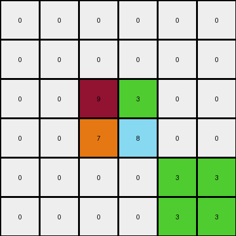
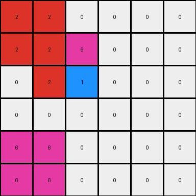

# 93b581b8 • 016 • refine_coder

---

Previous Code:
```python
"""
The transformation identifies a central 2x2 block of colored pixels and preserves it. 
Then, for the green and magenta colors in the central block, it mirrors those colors
by creating 2x2 regions filled with color 3 (green) in the lower right corner
and color 6 (magenta) at the bottom left corner of the grid.
Colors 2 (red) and 5 (grey) are not processed to be mirrored in that way.
"""

import numpy as np

def find_central_block(grid):
    # Find the largest 2x2 block of non-zero pixels
    rows, cols = grid.shape
    for r in range(rows - 1):
        for c in range(cols - 1):
            block = grid[r:r+2, c:c+2]
            if np.all(block != 0):
                return r, c
    return None

def transform(input_grid):
    # Initialize output_grid as a copy of input_grid
    output_grid = input_grid.copy()
    rows, cols = input_grid.shape

    # Find the central 2x2 block
    central_block_coords = find_central_block(input_grid)
    if central_block_coords is None:
      return output_grid

    r, c = central_block_coords

    # Preserve the central block (unnecessary since we copied, but for clarity)
    # output_grid[r:r+2, c:c+2] = input_grid[r:r+2, c:c+2]

    # Mirror based on colors 3 and 6 in center block (simplified based on observation)
    # Check for color 3 (green)
    if 3 in input_grid[r:r+2, c:c+2]:
       output_grid[rows-2:rows, cols-2:cols] = 3

    #Check for color 6 (magenta)
    if 6 in input_grid[r:r+2, c:c+2]:
       output_grid[rows-2:rows, 0:2] = 6
    
    #Check for color 2 (red)
    if 2 in input_grid[r:r+2, c:c+2]:
       output_grid[0:2, 0:2] = 2
       
    #Check for color 5 (grey)
    if 5 in input_grid[r:r+2, c:c+2]:
       output_grid[0:2, cols-2:cols] = 5

    return output_grid
```

Train Set Results:

## Example 1:

Input:
```
0 0 0 0 0 0
0 0 0 0 0 0
0 0 9 3 0 0
0 0 7 8 0 0
0 0 0 0 0 0
0 0 0 0 0 0
```
Expected Output:
```
8 8 0 0 7 7
8 8 0 0 7 7
0 0 9 3 0 0
0 0 7 8 0 0
3 3 0 0 9 9
3 3 0 0 9 9
```
Transformed Output:
```
0 0 0 0 0 0
0 0 0 0 0 0
0 0 9 3 0 0
0 0 7 8 0 0
0 0 0 0 3 3
0 0 0 0 3 3
```

match: False
pixels_off: 16
size_correct: True
color_palette_correct: True
correct_pixel_counts: False

## Example 2:

Input:
```
0 0 0 0 0 0
0 4 6 0 0 0
0 2 1 0 0 0
0 0 0 0 0 0
0 0 0 0 0 0
0 0 0 0 0 0
```
Expected Output:
```
1 0 0 2 2 0
0 4 6 0 0 0
0 2 1 0 0 0
6 0 0 4 4 0
6 0 0 4 4 0
0 0 0 0 0 0
```
Transformed Output:
```
2 2 0 0 0 0
2 2 6 0 0 0
0 2 1 0 0 0
0 0 0 0 0 0
6 6 0 0 0 0
6 6 0 0 0 0
```

match: False
pixels_off: 14
size_correct: True
color_palette_correct: True
correct_pixel_counts: False

## Example 3:

Input:
```
0 0 0 0 0 0
0 0 0 0 0 0
0 0 3 6 0 0
0 0 5 2 0 0
0 0 0 0 0 0
0 0 0 0 0 0
```
Expected Output:
```
2 2 0 0 5 5
2 2 0 0 5 5
0 0 3 6 0 0
0 0 5 2 0 0
6 6 0 0 3 3
6 6 0 0 3 3
```
Transformed Output:
```
2 2 0 0 5 5
2 2 0 0 5 5
0 0 3 6 0 0
0 0 5 2 0 0
6 6 0 0 3 3
6 6 0 0 3 3
```

match: True
pixels_off: 0
size_correct: True
color_palette_correct: True
correct_pixel_counts: True
Okay, here's a breakdown of the results and a plan to improve the natural language program and code:

**General Assessment:**

The initial code was based on a limited understanding from the first example. While it correctly identified the central 2x2 block and attempted a mirroring concept, it didn't fully capture the correct mirroring logic, and applied the rule inconsistently. Example 3 shows a perfect match. Examples 1 and 2 have errors. The key is to correctly mirror *all* colors in the central block, not just green and magenta. The mirroring isn't a direct reflection across an axis, but rather a relocation of 2x2 colored blocks to specific corners based on their original position within the central 2x2 block.

**Strategy:**

1.  **Re-examine the Mirroring Logic:**  The current code only considers colors 3 and 6 for mirroring. We need to generalize this to *all* colors present in the central 2x2 block. The positioning of mirrored blocks is not dependent upon any color but is instead determined by the position of the cells inside the core, inner 2x2.
2.  **Refine Corner Placement:**  The placement of the mirrored blocks seems to be consistently in the four corners. The row and column of the original cells inside the central 2x2 block appear to be related to the row and column of the destination corner.
3.  **Iterative Improvement:** We will develop a new natural language program, update the code, and then repeat the evaluation process with the provided training examples.

**Example Metrics and Observations:**

Here's a more structured analysis of each example:

*   **Example 1:**
    *   Input Shape: 6x6
    *   Output Shape: 6x6
    *   Central Block Colors: 9, 3, 7, 8
    *   Mirrored Colors (Expected): 9, 3, 7, 8
    *   Mirrored Colors (Actual): 3, 3, (incorrect)
    *   Mismatched Pixels: 16
    *   Notes: Only color 3 was mirrored and it went in the wrong location. Colors 9, 7 and 8 should have been mirrored in the corners.

*   **Example 2:**
    *   Input Shape: 6x6
    *   Output Shape: 6x6
    *   Central Block Colors: 4, 6, 2, 1
    *   Mirrored Colors (Expected): 4, 6, 2, 1
    *   Mirrored Colors (Actual): 6, 2 (incorrect)
    *   Mismatched Pixels: 14
    *   Notes: Colors 6 and 2 are mirrored in the correct place. The 4 and 1 colors were not handled.

*   **Example 3:**
    *   Input Shape: 6x6
    *   Output Shape: 6x6
    *   Central Block Colors: 3, 6, 5, 2
    *   Mirrored Colors (Expected): 3, 6, 5, 2
    *   Mirrored Colors (Actual): 3, 6, 5, 2
    *   Mismatched Pixels: 0
    *   Notes: This example worked perfectly, hinting that the core logic has *some* merit, just incomplete. This confirms the consistent mirroring of all central block colors.

**YAML Facts:**

```yaml
objects:
  - name: central_block
    type: rectangle
    dimensions: 2x2
    properties:
      colors: variable # Colors present within the central block
      location: center # Determined dynamically
  - name: mirrored_block
    type: rectangle
    dimensions: 2x2
    properties:
      color: same_as_central_block_cell # Inherits color from a corresponding cell in the central block
      location: corner # One of the four corners of the grid

actions:
  - name: identify_central_block
    description: Find the largest 2x2 block of non-zero pixels.
  - name: mirror_color
    description: Create a 2x2 block in a corner with the same color as a cell in the central block.
    parameters:
        source_cell: row, col #relative location inside the central block
        destination_corner: row, col #corner index derived from the original relative position

```

**Natural Language Program:**

1.  **Find the Central Block:** Locate the inner-most 2x2 block of non-zero colored pixels in the input grid.
2.  **Preserve Central Block:** The central 2x2 block remains unchanged in the output grid.
3.  **Mirror All Central Colors:** For *each* cell within the central 2x2 block:
    *   Create a new 2x2 block in the output grid.
    *   The color of this new block is the same as the color of the cell in the central block.
    *   The location of the new block is in one of the four corners of the output grid.
    *   The destination of the mirrored block is determined as follows:
        * If the cell inside the 2x2 is at 0,0 (top,left): mirrored block goes in the top left corner.
        * If the cell inside the 2x2 is at 0,1 (top,right): mirrored block goes in the top right corner.
        * If the cell inside the 2x2 is at 1,0 (bottom,left): mirrored block goes in the bottom left corner.
        * If the cell inside the 2x2 is at 1,1 (bottom,right): mirrored block goes in the bottom right corner.
4. **Remaining Pixels**: All other pixels in the output grid that are not part of the central block or the mirrored blocks should be 0 (black). The prior solution incorrectly set them to be copies of the input.

This refined program addresses the shortcomings of the previous one by mirroring *all* colors from the central block and providing a clear and general description of how their new location should be, based on the cell position in the central block.

**INSTRUCTIONS**

- generate a Python module to represent the natural language program 
- follow the template below
- all common math and science libraries are available
- create docstring only at top - but comment the workflow in the function
- use helper functions for common operations like finding objects, counting,
  measuring, moving, etc. 

remember - we are working iteratively - so this code will inform your future
self as we converge on the solution

*template:*

```python
"""
{{ natural language description of the transformation rule }}
"""

{{ imports }}

def transform(input_grid):
    # initialize output_grid

    # change output pixels 

    return output_grid

```
