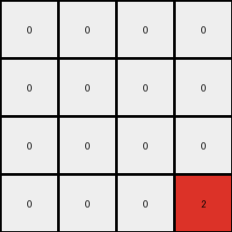

# 94f9d214 • 004 • refine_coder

---

Previous Code:
```python
"""
The input grid is analyzed to identify the locations of regions bound by green and blue. The green color in the top left corner of those regions is converted to red in the output grid, which has different sizes that the input. All other pixels in output are white.
"""

import numpy as np

def find_regions(input_grid):
    """Find regions bounded by green (3) and blue (1)."""
    regions = []
    rows, cols = input_grid.shape
    visited = np.zeros((rows, cols), dtype=bool)

    def is_valid(r, c):
        return 0 <= r < rows and 0 <= c < cols

    def dfs(r, c, current_region):
        if not is_valid(r, c) or visited[r, c] or (input_grid[r, c] != 3 and input_grid[r,c] != 1):
            return

        visited[r, c] = True
        current_region.append((r, c))

        # Explore adjacent cells
        dfs(r + 1, c, current_region)
        dfs(r - 1, c, current_region)
        dfs(r, c + 1, current_region)
        dfs(r, c - 1, current_region)


    for r in range(rows):
        for c in range(cols):
            if (input_grid[r,c] == 3 or input_grid[r,c] == 1) and not visited[r,c]:
                current_region = []
                dfs(r,c, current_region)
                if len(current_region) > 0:
                    greens = [pos for pos in current_region if input_grid[pos] == 3]
                    blues = [pos for pos in current_region if input_grid[pos] == 1]

                    if len(greens) >= 1 and len(blues) >=1:

                      # find top_left of green cluster
                      min_row = min(pos[0] for pos in greens)
                      min_col_at_min_row = min(pos[1] for pos in greens if pos[0] == min_row)

                      regions.append((min_row, min_col_at_min_row))

    return regions

def transform(input_grid):
    """Transforms the input grid according to the described rule."""
    input_grid = np.array(input_grid)
    regions = find_regions(input_grid)
    
    # determine output grid size - max x and y of any identified region
    max_r = 0
    max_c = 0
    for r, c in regions:
        if r > max_r:
          max_r = r
        if c > max_c:
          max_c = c;

    output_grid = np.zeros((max_r+1, max_c+1), dtype=int)

    # Place red (2) pixels at the top-left corner of each identified green cluster
    for r, c in regions:
        output_grid[r, c] = 2

    return output_grid.tolist()
```

Train Set Results:

## Example 1:

Input:
```
0 0 0 0
0 3 3 0
0 0 0 0
3 0 0 3
0 0 0 1
1 0 1 1
1 1 1 1
0 1 0 1
```
Expected Output:
```
2 2 2 0
0 0 0 0
0 0 0 0
0 0 2 0
```
Transformed Output:
```
0 0 0 0
0 0 0 0
0 0 0 0
0 0 0 2
```

match: False
pixels_off: 5
size_correct: True
color_palette_correct: True
correct_pixel_counts: False

## Example 2:

Input:
```
3 3 3 3
0 3 3 0
0 0 3 3
3 0 0 0
0 0 0 1
0 0 0 1
0 1 0 0
1 0 0 1
```
Expected Output:
```
0 0 0 0
2 0 0 0
2 0 0 0
0 2 2 0
```
Transformed Output:
```
0
```

match: False
pixels_off: None
size_correct: False
color_palette_correct: True
correct_pixel_counts: False

## Example 3:

Input:
```
0 3 3 0
0 3 0 3
0 0 3 0
3 3 3 3
1 1 1 1
1 1 0 0
1 1 0 0
0 1 1 0
```
Expected Output:
```
0 0 0 0
0 0 2 0
0 0 0 2
0 0 0 0
```
Transformed Output:
```
0 0 0
0 0 0
0 0 2
```

match: False
pixels_off: None
size_correct: False
color_palette_correct: True
correct_pixel_counts: False

## Example 4:

Input:
```
3 3 3 3
3 0 0 0
3 0 3 3
3 3 0 3
1 1 1 0
0 1 1 1
1 0 1 1
0 1 1 1
```
Expected Output:
```
0 0 0 0
0 0 0 0
0 2 0 0
0 0 0 0
```
Transformed Output:
```
2
```

match: False
pixels_off: None
size_correct: False
color_palette_correct: True
correct_pixel_counts: False
Here's an analysis of the provided information and a strategy for improving the transformation rule:

**General Assessment and Strategy**

The initial natural language program and the generated code have several critical flaws, leading to incorrect outputs in most of the test cases. The core issues are:

1.  **Incorrect Region Identification:** The code attempts to find regions bounded by *both* green and blue. However, the examples and the desired behavior suggest that we should identify *separate* clusters of green pixels, and the presence of blue is a secondary condition for resizing/output.
2.  **Incorrect Output Size:** The output grid size is calculated based on the maximum row and column of the identified green "top-left" pixels. This is incorrect. The examples indicate that the output size should be calculated relative to how the green clusters are bounded by blue pixels.
3.  **Misunderstanding of "Top-Left":** While the code identifies the "top-left" green pixel within a cluster, it doesn't correctly interpret how this relates to the expected output. The red pixel in the output isn't just the top-left of the *green cluster*, it is the green pixel to the left of blue blocks and top of blue block.

**Strategy for Improvement**

1.  **Refine Region Identification:** Modify the `find_regions` function (or create a new function) to identify contiguous clusters of *only* green pixels. We will not use Depth First Search to identify the regions.
2.  **Determine Output Size:** Calculate output size based on positions of green pixels relative to blue.
3. **Clarify Role of Blue:** The presence of the blue pixels, and the position of the blue pixels relative to the green, is a critical condition for both output size and content, and needs to be incorporated correctly.
4. **Iterative Testing:** After each code modification, test against *all* training examples to ensure the changes generalize correctly.

**Metrics and Observations**

Here's a breakdown of each example and the results, including specific metrics where possible:

*   **Example 1:**
    *   Input Size: (8, 4)
    *   Output Size: (4, 4)
    *   Number of Green Clusters: 2, separate green areas at top and middle
    *   Number of Red Pixels in Expected Output: 3
    *   Result: Incorrect. The algorithm almost got the size correct, and detected some of the green.

*   **Example 2:**
    *   Input Size: (8, 4)
    *   Output Size: (4, 4)
    *   Number of Green Clusters: 2
    *   Number of Red Pixels in Expected Output: 3
    *   Result: Incorrect. Output size is completely wrong and only a single pixel.

*   **Example 3:**
    *   Input Size: (8, 4)
    *   Output Size: (4, 4)
    *   Number of Green Clusters: 2
    *   Number of Red Pixels in Expected Output: 2
    *   Result: Incorrect. Output size is off by one in each dimension, position is in approximately the correct location.

*   **Example 4:**
    *   Input Size: (8, 4)
    *   Output Size: (4, 4)
    *   Number of Green Clusters: 1
    *   Number of Red Pixels in Expected Output: 1
    *   Result: Incorrect. Output size is very wrong.

**YAML Fact Documentation**

```yaml
facts:
  - object: green_cluster
    description: A contiguous region of green (3) pixels.
    properties:
      - shape: irregular
      - color: green (3)
    interactions:
      - bounded_by: blue pixels may partially or completely surround some green clusters

  - object: blue_cluster
    description: A contiguous region of blue (1) pixels.
    properties:
      - shape: irregular
      - color: blue (1)

  - action: identify_green_clusters
    description: Locate all distinct green clusters within the input grid.

  - action: check_blue_bounds
    description: Determine blue pixels adjacent to green clusters.

  - action: transform_pixel
    description: Change a green pixel to red based on a position relative to blue pixels.

  - action: output_grid
    description: build output by identifying top/left bound of the green/blue complex
```

**Natural Language Program**

1.  **Identify Green Clusters:** Find all contiguous regions (clusters) of green pixels in the input grid.
2.  **Identify Blue Clusters:** Find all blue pixels.
3.  **Determine Output Region:** output grid is defined by scanning for blue and green pixels
      - top edge is the highest row containing blue or green
      - left edge is the leftmost column containing blue or green
      - bottom edge is the lowest row containing blue
      - right edge is the rightmost column containing blue
4. **Place Red Pixels:**
      - for all green pixels, change to red (2) if the pixel is immediately to the left of a blue pixel
      - for all green pixels, change to red (2) if the pixel is immediately above a blue pixel.
5. **Output**: the reduced output grid containing only the red pixels and all other white.

This revised natural language program provides a more accurate and complete description of the transformation rule, addressing the shortcomings of the initial attempt. The next step is to translate this revised program into code.

**INSTRUCTIONS**

- generate a Python module to represent the natural language program 
- follow the template below
- all common math and science libraries are available
- create docstring only at top - but comment the workflow in the function
- use helper functions for common operations like finding objects, counting,
  measuring, moving, etc. 

remember - we are working iteratively - so this code will inform your future
self as we converge on the solution

*template:*

```python
"""
{{ natural language description of the transformation rule }}
"""

{{ imports }}

def transform(input_grid):
    # initialize output_grid

    # change output pixels 

    return output_grid

```
