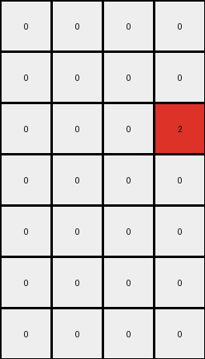
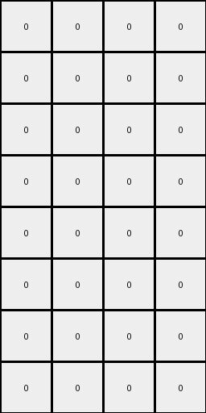
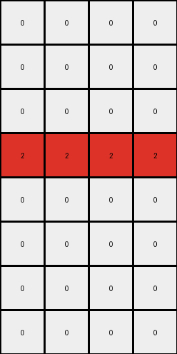
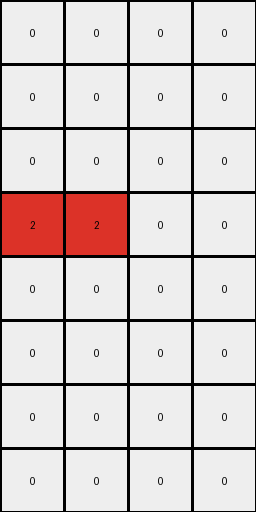

# 94f9d214 • 005 • refine_dreamer

---


Previous Code:
```python
"""
1.  **Identify Green Clusters:** Find all contiguous regions (clusters) of green pixels in the input grid.
2.  **Identify Blue Clusters:** Find all blue pixels.
3.  **Determine Output Region:** output grid is defined by scanning for blue and green pixels
      - top edge is the highest row containing blue or green
      - left edge is the leftmost column containing blue or green
      - bottom edge is the lowest row containing blue
      - right edge is the rightmost column containing blue
4. **Place Red Pixels:**
      - for all green pixels, change to red (2) if the pixel is immediately to the left of a blue pixel
      - for all green pixels, change to red (2) if the pixel is immediately above a blue pixel.
5. **Output**: the reduced output grid containing only the red pixels and all other white.
"""

import numpy as np

def transform(input_grid):
    input_grid = np.array(input_grid)
    rows, cols = input_grid.shape

    # 1. & 2. Identify Green and Blue Pixels
    green_pixels = []
    blue_pixels = []
    for r in range(rows):
        for c in range(cols):
            if input_grid[r, c] == 3:
                green_pixels.append((r, c))
            elif input_grid[r, c] == 1:
                blue_pixels.append((r, c))

    # 3. Determine Output Region
    if not green_pixels and not blue_pixels:
        return [[0]]
      
    top_edge = rows
    left_edge = cols
    bottom_edge = 0
    right_edge = 0

    for r, c in green_pixels + blue_pixels:
        top_edge = min(top_edge, r)
        left_edge = min(left_edge, c)

    for r, c in blue_pixels:
        bottom_edge = max(bottom_edge, r)
        right_edge = max(right_edge, c)
        
    # if there are no blue pixels, use the green pixels for bottom and right edge
    if not blue_pixels:
      for r,c in green_pixels:
        bottom_edge = max(bottom_edge, r)
        right_edge = max(right_edge, c)

    # Initialize output grid with white pixels (0)
    output_rows = bottom_edge - top_edge + 1
    output_cols = right_edge - left_edge + 1
    output_grid = np.zeros((output_rows, output_cols), dtype=int)

    # 4. Place Red Pixels
    for r, c in green_pixels:
        # Check for blue pixel to the right
        if (r, c + 1) in blue_pixels:
            output_grid[r - top_edge, c - left_edge] = 2
        # Check for blue pixel below
        if (r + 1, c) in blue_pixels:
            output_grid[r - top_edge, c - left_edge] = 2

    return output_grid.tolist()
```

Train Set Results:

## Example 1:

Input:
```
0 0 0 0
0 3 3 0
0 0 0 0
3 0 0 3
0 0 0 1
1 0 1 1
1 1 1 1
0 1 0 1
```
Expected Output:
```
2 2 2 0
0 0 0 0
0 0 0 0
0 0 2 0
```
Transformed Output:
```
0 0 0 0
0 0 0 0
0 0 0 2
0 0 0 0
0 0 0 0
0 0 0 0
0 0 0 0
```

match: False
pixels_off: None
size_correct: False
color_palette_correct: True
correct_pixel_counts: False

## Example 2:

Input:
```
3 3 3 3
0 3 3 0
0 0 3 3
3 0 0 0
0 0 0 1
0 0 0 1
0 1 0 0
1 0 0 1
```
Expected Output:
```
0 0 0 0
2 0 0 0
2 0 0 0
0 2 2 0
```
Transformed Output:
```
0 0 0 0
0 0 0 0
0 0 0 0
0 0 0 0
0 0 0 0
0 0 0 0
0 0 0 0
0 0 0 0
```

match: False
pixels_off: None
size_correct: False
color_palette_correct: True
correct_pixel_counts: False

## Example 3:

Input:
```
0 3 3 0
0 3 0 3
0 0 3 0
3 3 3 3
1 1 1 1
1 1 0 0
1 1 0 0
0 1 1 0
```
Expected Output:
```
0 0 0 0
0 0 2 0
0 0 0 2
0 0 0 0
```
Transformed Output:
```
0 0 0 0
0 0 0 0
0 0 0 0
2 2 2 2
0 0 0 0
0 0 0 0
0 0 0 0
0 0 0 0
```

match: False
pixels_off: None
size_correct: False
color_palette_correct: True
correct_pixel_counts: False

## Example 4:

Input:
```
3 3 3 3
3 0 0 0
3 0 3 3
3 3 0 3
1 1 1 0
0 1 1 1
1 0 1 1
0 1 1 1
```
Expected Output:
```
0 0 0 0
0 0 0 0
0 2 0 0
0 0 0 0
```
Transformed Output:
```
0 0 0 0
0 0 0 0
0 0 0 0
2 2 0 0
0 0 0 0
0 0 0 0
0 0 0 0
0 0 0 0
```

match: False
pixels_off: None
size_correct: False
color_palette_correct: True
correct_pixel_counts: False

**INSTRUCTIONS**

The code above was generated based on observations from the first training
example

we have tested the transform function on each of the task example inputs and
compared with the expected output

review each of the examples provided and the results and consider how the
natural language program should be updated to accommodate this new knowledge

respond with the following deliverables:

- general assessment of the information provided and strategy for resolving the
  errors
- gather metrics about each of the examples and results - use code_execution to
  develop accurate reports on your assumptions
- a YAML block documenting facts - Focus on identifying objects, their properties, and the actions performed on them.
- a natural language program - Be as clear and concise as possible, providing a complete description of the transformation rule.


your responses should be considered as information in a report - not a
conversation
