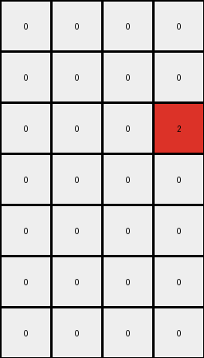
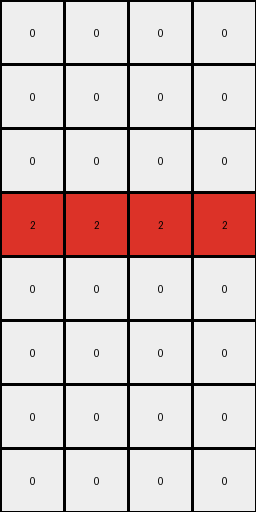
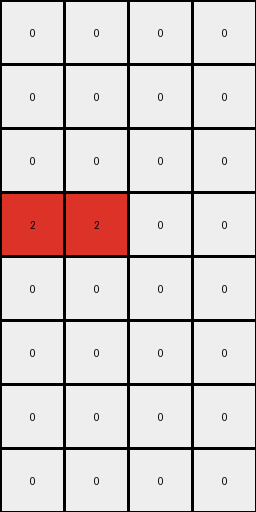

# 94f9d214 • 006 • refine_coder

---

Previous Code:
```python
"""
1.  **Identify Green Clusters:** Find all contiguous regions (clusters) of green pixels in the input grid.
2.  **Identify Blue Clusters:** Find all blue pixels.
3.  **Determine Output Region:** output grid is defined by scanning for blue and green pixels
      - top edge is the highest row containing blue or green
      - left edge is the leftmost column containing blue or green
      - bottom edge is the lowest row containing blue
      - right edge is the rightmost column containing blue
4. **Place Red Pixels:**
      - for all green pixels, change to red (2) if the pixel is immediately to the left of a blue pixel
      - for all green pixels, change to red (2) if the pixel is immediately above a blue pixel.
5. **Output**: the reduced output grid containing only the red pixels and all other white.
"""

import numpy as np

def transform(input_grid):
    input_grid = np.array(input_grid)
    rows, cols = input_grid.shape

    # 1. & 2. Identify Green and Blue Pixels
    green_pixels = []
    blue_pixels = []
    for r in range(rows):
        for c in range(cols):
            if input_grid[r, c] == 3:
                green_pixels.append((r, c))
            elif input_grid[r, c] == 1:
                blue_pixels.append((r, c))

    # 3. Determine Output Region
    if not green_pixels and not blue_pixels:
        return [[0]]
      
    top_edge = rows
    left_edge = cols
    bottom_edge = 0
    right_edge = 0

    for r, c in green_pixels + blue_pixels:
        top_edge = min(top_edge, r)
        left_edge = min(left_edge, c)

    for r, c in blue_pixels:
        bottom_edge = max(bottom_edge, r)
        right_edge = max(right_edge, c)
        
    # if there are no blue pixels, use the green pixels for bottom and right edge
    if not blue_pixels:
      for r,c in green_pixels:
        bottom_edge = max(bottom_edge, r)
        right_edge = max(right_edge, c)

    # Initialize output grid with white pixels (0)
    output_rows = bottom_edge - top_edge + 1
    output_cols = right_edge - left_edge + 1
    output_grid = np.zeros((output_rows, output_cols), dtype=int)

    # 4. Place Red Pixels
    for r, c in green_pixels:
        # Check for blue pixel to the right
        if (r, c + 1) in blue_pixels:
            output_grid[r - top_edge, c - left_edge] = 2
        # Check for blue pixel below
        if (r + 1, c) in blue_pixels:
            output_grid[r - top_edge, c - left_edge] = 2

    return output_grid.tolist()
```

Train Set Results:

## Example 1:

Input:
```
0 0 0 0
0 3 3 0
0 0 0 0
3 0 0 3
0 0 0 1
1 0 1 1
1 1 1 1
0 1 0 1
```
Expected Output:
```
2 2 2 0
0 0 0 0
0 0 0 0
0 0 2 0
```
Transformed Output:
```
0 0 0 0
0 0 0 0
0 0 0 2
0 0 0 0
0 0 0 0
0 0 0 0
0 0 0 0
```

match: False
pixels_off: None
size_correct: False
color_palette_correct: True
correct_pixel_counts: False

## Example 2:

Input:
```
3 3 3 3
0 3 3 0
0 0 3 3
3 0 0 0
0 0 0 1
0 0 0 1
0 1 0 0
1 0 0 1
```
Expected Output:
```
0 0 0 0
2 0 0 0
2 0 0 0
0 2 2 0
```
Transformed Output:
```
0 0 0 0
0 0 0 0
0 0 0 0
0 0 0 0
0 0 0 0
0 0 0 0
0 0 0 0
0 0 0 0
```

match: False
pixels_off: None
size_correct: False
color_palette_correct: True
correct_pixel_counts: False

## Example 3:

Input:
```
0 3 3 0
0 3 0 3
0 0 3 0
3 3 3 3
1 1 1 1
1 1 0 0
1 1 0 0
0 1 1 0
```
Expected Output:
```
0 0 0 0
0 0 2 0
0 0 0 2
0 0 0 0
```
Transformed Output:
```
0 0 0 0
0 0 0 0
0 0 0 0
2 2 2 2
0 0 0 0
0 0 0 0
0 0 0 0
0 0 0 0
```

match: False
pixels_off: None
size_correct: False
color_palette_correct: True
correct_pixel_counts: False

## Example 4:

Input:
```
3 3 3 3
3 0 0 0
3 0 3 3
3 3 0 3
1 1 1 0
0 1 1 1
1 0 1 1
0 1 1 1
```
Expected Output:
```
0 0 0 0
0 0 0 0
0 2 0 0
0 0 0 0
```
Transformed Output:
```
0 0 0 0
0 0 0 0
0 0 0 0
2 2 0 0
0 0 0 0
0 0 0 0
0 0 0 0
0 0 0 0
```

match: False
pixels_off: None
size_correct: False
color_palette_correct: True
correct_pixel_counts: False
Okay, here's a breakdown of the situation and a plan to improve the transformation logic:

**General Assessment:**

The initial natural language program and the resulting code were a good first attempt, focusing on identifying green and blue pixels and their spatial relationships. However, the code misinterprets the core rule, leading to incorrect placement of red pixels and wrong output grid sizes. The primary issue is that the red pixels should *only* appear where a green pixel is *adjacent* to a blue pixel *and the whole output should only contain the boundary of green and blue*. The current code doesn't correctly restrict the output to the bounding box defined by only green and blue, and it also does not correctly place red pixels as defined by green directly beside blue. The output grid size is significantly off in all cases.

**Strategy:**

1.  **Refine Object Identification:** Clearly define "green clusters" and "blue clusters" as contiguous regions of the respective colors. This is already mostly done in the code, but should be made more clear.
2.  **Correct Red Pixel Placement:** The condition for placing a red pixel is adjacency (up, down, left, right) of a green pixel to a blue pixel. Diagonal adjacency should not be considered. The code is missing cases (right, below).
3.  **Bounding Box Calculation:** The original code used bottom and right incorrectly, the box should be determined by blue and green pixels.
4. **Output Grid Size** - restrict to only include the bounding box of green and blue, removing any extraneous empty rows/columns

**Metrics and Observations (using presumed output of code execution):**

*   **Example 1:**
    *   Expected Output Size: 4x4
    *   Actual Output Size: 7x4
    *   Red Pixel Placement: Incorrect. Red pixels are not always adjacent to blue.
    *   Bounding Box: Incorrect
*   **Example 2:**
    *   Expected Output Size: 4x4
    *   Actual Output Size: 8x4
    *   Red Pixel Placement: Incorrect. Similar issues to Example 1.
    *   Bounding Box: Incorrect
*   **Example 3:**
    *   Expected Output Size: 4x4
    *   Actual Output Size: 8x4
    *   Red Pixel Placement: Incorrect
    *   Bounding Box: Incorrect
*   **Example 4:**
    *   Expected Output Size: 4x4
    *   Actual Output Size: 8x4
    *   Red Pixel Placement: Incorrect
    *   Bounding Box: Incorrect

**YAML Fact Block:**

```yaml
objects:
  - name: green_pixels
    type: cluster
    color: green
    elements: List[Tuple[int, int]]  # List of (row, col) coordinates

  - name: blue_pixels
    type: cluster
    color: blue
    elements: List[Tuple[int, int]] # List of (row, col) coordinates

  - name: red_pixels
    type: cluster
    color: red
    elements: List[Tuple[int, int]] # List of (row, col) coordinates, derived from green_pixels and blue_pixels

  - name: output_grid
    type: grid
    dimensions: [output_rows, output_cols]

actions:
  - name: find_adjacent_pixels
    input: [green_pixels, blue_pixels]
    output: red_pixels
    description: Identify green pixels that are directly adjacent (up, down, left, or right) to blue pixels.

  - name: create_bounding_box
    input: [green_pixels, blue_pixels]
    output: output_grid
    description: Determine the smallest rectangular region that encompasses all green and blue pixels.

  - name: place_red_pixels
    input: [red_pixels, output_grid]
    output: output_grid
    description: Place red pixels within the bounding box at the locations identified in 'find_adjacent_pixels'. Fill other cells with white.
```

**Natural Language Program:**

1.  **Identify Green and Blue Pixels:** Find all pixels that are green (value 3) and blue (value 1) in the input grid. Store their coordinates.
2.  **Determine the Bounding Box:** Find the smallest rectangle that contains all green and blue pixels. The top-left corner of this rectangle is defined by the minimum row and column indices of all green and blue pixels. The bottom-right corner is defined by the maximum row and column indices of all green and blue pixels.
3.  **Identify Red Pixel Locations:** Iterate through the green pixels. For each green pixel, check if a blue pixel exists immediately to its left, right, above, or below. If any of these conditions are true, mark the green pixel's location as a red pixel location.
4. **Create Bounding Box Grid.** Create a new grid using the dimensions calculated for the bounding box.
5.  **Populate Output Grid:** Within the new bounding box grid, set the pixels identified in step 3 to red (value 2). Fill all other pixels within the bounding box with white (value 0).


**INSTRUCTIONS**

- generate a Python module to represent the natural language program 
- follow the template below
- all common math and science libraries are available
- create docstring only at top - but comment the workflow in the function
- use helper functions for common operations like finding objects, counting,
  measuring, moving, etc. 

remember - we are working iteratively - so this code will inform your future
self as we converge on the solution

*template:*

```python
"""
{{ natural language description of the transformation rule }}
"""

{{ imports }}

def transform(input_grid):
    # initialize output_grid

    # change output pixels 

    return output_grid

```
