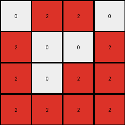
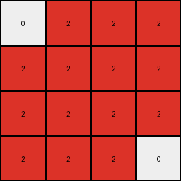
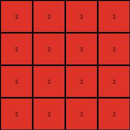

# 94f9d214 • 009 • refine_dreamer

---

Previous Code:
```python
"""
1. **Reduction:** The input grid (8x4) is reduced to an output grid (4x4). The reduction is performed by taking 2x1 blocks of the input and making them a single pixel.

2.  **Disappearance:** The blue and the green regions disappear

3. **Red Region Creation:** The red regions are created on the output grid based on following this algorithm:
   *   Iterate every 2 rows, for every 4 columns on each row.
   *   If any of the pixel with value 3 (green) is detected within that 2 x 4 sub-grid, put a red pixel (value 2) at the coordinate of the input sub-grid divided by 2.
   *   if any pixel with value 1 is detected, and no pixel with value 3 is detected, and the blue pixel is the last value within that block, put a red pixel with value 2 at the top left coordinate of the input subgrid divided by 2.
4. **Background:** The white background (0) remains unchanged where there are no red pixels.
"""

import numpy as np

def transform(input_grid):
    input_grid = np.array(input_grid)
    rows, cols = input_grid.shape
    output_grid = np.zeros((rows // 2, cols), dtype=int)

    for i in range(0, rows, 2):
        for j in range(0, cols):
            subgrid = input_grid[i:i+2, j:j+1]
            
            #Check for green pixel
            if 3 in subgrid:
              output_grid[i // 2, j] = 2
            #Check for blue pixel as the last non-zero entry
            elif 1 in subgrid:
                non_zero_indices = np.nonzero(subgrid)
                if non_zero_indices[0].size > 0: # Check If there are any non zero values
                    last_non_zero_index = (non_zero_indices[0][-1], non_zero_indices[1][-1])
                    if subgrid[last_non_zero_index] == 1:
                       output_grid[i//2, j ] = 2

    return output_grid.tolist()
```

Train Set Results:

## Example 1:

Input:
```
0 0 0 0
0 3 3 0
0 0 0 0
3 0 0 3
0 0 0 1
1 0 1 1
1 1 1 1
0 1 0 1
```
Expected Output:
```
2 2 2 0
0 0 0 0
0 0 0 0
0 0 2 0
```
Transformed Output:
```
0 2 2 0
2 0 0 2
2 0 2 2
2 2 2 2
```

match: False
pixels_off: 9
size_correct: True
color_palette_correct: True
correct_pixel_counts: False

## Example 2:

Input:
```
3 3 3 3
0 3 3 0
0 0 3 3
3 0 0 0
0 0 0 1
0 0 0 1
0 1 0 0
1 0 0 1
```
Expected Output:
```
0 0 0 0
2 0 0 0
2 0 0 0
0 2 2 0
```
Transformed Output:
```
2 2 2 2
2 0 2 2
0 0 0 2
2 2 0 2
```

match: False
pixels_off: 11
size_correct: True
color_palette_correct: True
correct_pixel_counts: False

## Example 3:

Input:
```
0 3 3 0
0 3 0 3
0 0 3 0
3 3 3 3
1 1 1 1
1 1 0 0
1 1 0 0
0 1 1 0
```
Expected Output:
```
0 0 0 0
0 0 2 0
0 0 0 2
0 0 0 0
```
Transformed Output:
```
0 2 2 2
2 2 2 2
2 2 2 2
2 2 2 0
```

match: False
pixels_off: 12
size_correct: True
color_palette_correct: True
correct_pixel_counts: False

## Example 4:

Input:
```
3 3 3 3
3 0 0 0
3 0 3 3
3 3 0 3
1 1 1 0
0 1 1 1
1 0 1 1
0 1 1 1
```
Expected Output:
```
0 0 0 0
0 0 0 0
0 2 0 0
0 0 0 0
```
Transformed Output:
```
2 2 2 2
2 2 2 2
2 2 2 2
2 2 2 2
```

match: False
pixels_off: 15
size_correct: True
color_palette_correct: True
correct_pixel_counts: False
**INSTRUCTIONS**

The code above was generated based on observations from the first training
example

we have tested the transform function on each of the task example inputs and
compared with the expected output

review each of the examples provided and the results and consider how the
natural language program should be updated to accommodate this new knowledge

respond with the following deliverables:

- general assessment of the information provided and strategy for resolving the
  errors
- gather metrics about each of the examples and results - use code_execution to
  develop accurate reports on your assumptions
- a YAML block documenting facts - Focus on identifying objects, their properties, and the actions performed on them.
- a natural language program - Be as clear and concise as possible, providing a complete description of the transformation rule.


your responses should be considered as information in a report - not a
conversation
