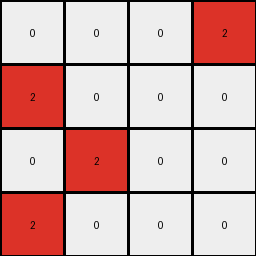

# 94f9d214 • 023 • refine_dreamer

---

Previous Code:
```python
"""
1. **Identify Input Sections:** Divide the input grid into two sections. The first section goes from the top of the grid until the last row that starts with a non-zero and non-one number. The second section is all rows below.
2.  **Determine Output Size:** The output grid has the same dimensions as the first identified section of the input.
3. **Locate Critical Input Cell in Section 1** Find the `0` in first section of input grid.
4.  **Check Corresponding Cell in Section 2**: Find all `0`s in the second section.
5.  **Create Output Grid:** Initialize an output grid of the determined size, filled with 0s.
6. **Populate output based on section 2**: for each `0` cell in section 2. if the row and col are within the dimensions of section 1, change value to `2`
7.  **Return:** The output grid.
"""

import numpy as np

def get_sections(grid):
    # split the grid into two sections based on row starting value
    rows = len(grid)
    section1_end_row = 0

    # Section 1 ends at last row before a row starts with 0 or 1.
    for r in range(rows):
      if grid[r][0] == 0 or grid[r][0] == 1:
        section1_end_row = r
        break

    section1 = grid[:section1_end_row]
    section2 = grid[section1_end_row:]

    return np.array(section1), np.array(section2)

def transform(input_grid):
    # get sections
    section1, section2 = get_sections(input_grid)
    
    # initialize the output_grid with zeros and size of section1
    output_grid = np.zeros_like(section1)

    rows1, cols1 = section1.shape
    rows2, cols2 = section2.shape

    # iterate through section 2
    for r in range(rows2):
        for c in range(cols2):
            # if a cell in section2 is 0
            if section2[r][c] == 0:
                # and those coordinates are within section1
                if r < rows1 and c < cols1:
                  # set section 1 cell to 2
                  output_grid[r][c] = 2

    return output_grid
```

Train Set Results:

## Example 1:

Input:
```
0 0 0 0
0 3 3 0
0 0 0 0
3 0 0 3
0 0 0 1
1 0 1 1
1 1 1 1
0 1 0 1
```
Expected Output:
```
2 2 2 0
0 0 0 0
0 0 0 0
0 0 2 0
```
Transformed Output:
```

```

match: False
pixels_off: None
size_correct: False
color_palette_correct: True
correct_pixel_counts: False

## Example 2:

Input:
```
3 3 3 3
0 3 3 0
0 0 3 3
3 0 0 0
0 0 0 1
0 0 0 1
0 1 0 0
1 0 0 1
```
Expected Output:
```
0 0 0 0
2 0 0 0
2 0 0 0
0 2 2 0
```
Transformed Output:
```
2 0 0 2
```

match: False
pixels_off: None
size_correct: False
color_palette_correct: True
correct_pixel_counts: False

## Example 3:

Input:
```
0 3 3 0
0 3 0 3
0 0 3 0
3 3 3 3
1 1 1 1
1 1 0 0
1 1 0 0
0 1 1 0
```
Expected Output:
```
0 0 0 0
0 0 2 0
0 0 0 2
0 0 0 0
```
Transformed Output:
```

```

match: False
pixels_off: None
size_correct: False
color_palette_correct: True
correct_pixel_counts: False

## Example 4:

Input:
```
3 3 3 3
3 0 0 0
3 0 3 3
3 3 0 3
1 1 1 0
0 1 1 1
1 0 1 1
0 1 1 1
```
Expected Output:
```
0 0 0 0
0 0 0 0
0 2 0 0
0 0 0 0
```
Transformed Output:
```
0 0 0 2
2 0 0 0
0 2 0 0
2 0 0 0
```

match: False
pixels_off: 3
size_correct: True
color_palette_correct: True
correct_pixel_counts: False
**INSTRUCTIONS**

The code above was generated based on observations from the first training
example

we have tested the transform function on each of the task example inputs and
compared with the expected output

review each of the examples provided and the results and consider how the
natural language program should be updated to accommodate this new knowledge

respond with the following deliverables:

- general assessment of the information provided and strategy for resolving the
  errors
- gather metrics about each of the examples and results - use code_execution to
  develop accurate reports on your assumptions
- a YAML block documenting facts - Focus on identifying objects, their properties, and the actions performed on them.
- a natural language program - Be as clear and concise as possible, providing a complete description of the transformation rule.


your responses should be considered as information in a report - not a
conversation
