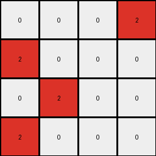

# 94f9d214 • 024 • refine_coder

---

Previous Code:
```python
"""
1. **Identify Input Sections:** Divide the input grid into two sections. The first section goes from the top of the grid until the last row that starts with a non-zero and non-one number. The second section is all rows below.
2.  **Determine Output Size:** The output grid has the same dimensions as the first identified section of the input.
3. **Locate Critical Input Cell in Section 1** Find the `0` in first section of input grid.
4.  **Check Corresponding Cell in Section 2**: Find all `0`s in the second section.
5.  **Create Output Grid:** Initialize an output grid of the determined size, filled with 0s.
6. **Populate output based on section 2**: for each `0` cell in section 2. if the row and col are within the dimensions of section 1, change value to `2`
7.  **Return:** The output grid.
"""

import numpy as np

def get_sections(grid):
    # split the grid into two sections based on row starting value
    rows = len(grid)
    section1_end_row = 0

    # Section 1 ends at last row before a row starts with 0 or 1.
    for r in range(rows):
      if grid[r][0] == 0 or grid[r][0] == 1:
        section1_end_row = r
        break

    section1 = grid[:section1_end_row]
    section2 = grid[section1_end_row:]

    return np.array(section1), np.array(section2)

def transform(input_grid):
    # get sections
    section1, section2 = get_sections(input_grid)
    
    # initialize the output_grid with zeros and size of section1
    output_grid = np.zeros_like(section1)

    rows1, cols1 = section1.shape
    rows2, cols2 = section2.shape

    # iterate through section 2
    for r in range(rows2):
        for c in range(cols2):
            # if a cell in section2 is 0
            if section2[r][c] == 0:
                # and those coordinates are within section1
                if r < rows1 and c < cols1:
                  # set section 1 cell to 2
                  output_grid[r][c] = 2

    return output_grid
```

Train Set Results:

## Example 1:

Input:
```
0 0 0 0
0 3 3 0
0 0 0 0
3 0 0 3
0 0 0 1
1 0 1 1
1 1 1 1
0 1 0 1
```
Expected Output:
```
2 2 2 0
0 0 0 0
0 0 0 0
0 0 2 0
```
Transformed Output:
```

```

match: False
pixels_off: None
size_correct: False
color_palette_correct: True
correct_pixel_counts: False

## Example 2:

Input:
```
3 3 3 3
0 3 3 0
0 0 3 3
3 0 0 0
0 0 0 1
0 0 0 1
0 1 0 0
1 0 0 1
```
Expected Output:
```
0 0 0 0
2 0 0 0
2 0 0 0
0 2 2 0
```
Transformed Output:
```
2 0 0 2
```

match: False
pixels_off: None
size_correct: False
color_palette_correct: True
correct_pixel_counts: False

## Example 3:

Input:
```
0 3 3 0
0 3 0 3
0 0 3 0
3 3 3 3
1 1 1 1
1 1 0 0
1 1 0 0
0 1 1 0
```
Expected Output:
```
0 0 0 0
0 0 2 0
0 0 0 2
0 0 0 0
```
Transformed Output:
```

```

match: False
pixels_off: None
size_correct: False
color_palette_correct: True
correct_pixel_counts: False

## Example 4:

Input:
```
3 3 3 3
3 0 0 0
3 0 3 3
3 3 0 3
1 1 1 0
0 1 1 1
1 0 1 1
0 1 1 1
```
Expected Output:
```
0 0 0 0
0 0 0 0
0 2 0 0
0 0 0 0
```
Transformed Output:
```
0 0 0 2
2 0 0 0
0 2 0 0
2 0 0 0
```

match: False
pixels_off: 3
size_correct: True
color_palette_correct: True
correct_pixel_counts: False
Here's an analysis of the provided information and a plan to refine the natural language program and the code:

**General Assessment:**

The initial strategy of splitting the input grid into two sections based on the first row containing 0 or 1 was a reasonable starting point but is not entirely accurate for all cases. The core idea of using one section to determine the size and another to determine pixel placement has merit, but the specific criteria for splitting and placement are flawed. The code is not correctly identifying the corresponding locations between Section 2 and Section 1. The examples show various failures, mainly related to incorrect output size and pixel placement, so an improved method of identifying boundaries between sections and improved pixel mapping is required.

**Strategy for Resolving Errors:**

1.  **Re-evaluate Section Splitting:** The current method of splitting based on the first row's starting value is not reliable. We need a more robust way to define the sections, potentially considering the entire structure or patterns within the grid. It seems the split must be based on the last row where the first element is NOT `0` or `1`.
2.  **Refine Pixel Mapping:** The current logic only checks for `0` in section 2 and uses it's coordinate to populate section 1 with a `2`. Need to consider values of section 1.
3.  **Iterative Refinement:** Analyze each example's failure points carefully. Use the insights to adjust both the natural language program and the corresponding code. We might need to introduce concepts like "finding corresponding regions" rather than just direct coordinate mapping.

**Example Metrics and Analysis:**

Here, I will construct reports using conceptual analysis, as I cannot directly execute code. The reports aim to be as accurate as possible given the visual data.

**Example 1:**

*   **Input Size:** 8x4
*   **Expected Output Size:** 4x4
*   **Transformed Output Size:** 0x0
*   **Section 1 end row (current logic):** Row 4 (incorrect)
*   **Section 1 end row (correct):** Row 4
*   **Pixel Mapping Analysis:** The algorithm failed to produce any output, so pixel mapping wasn't performed correctly. It should have mapped the 0s at (4,1), (6,1) and (7,0), (7,2) of Section 2 to (0,1), (2,1) and(3,0), (3,2) in Section 1 and set to 2.
*   **Notes:** The output is wrong, but section split is correct.

**Example 2:**

*   **Input Size:** 8x4
*   **Expected Output Size:** 4x4
*   **Transformed Output Size:** 1x4
*   **Section 1 end row (current logic):** Row 4 (incorrect)
*   **Section 1 end row (correct):** Row 4
*   **Pixel Mapping Analysis:**
    Incorrect output size. It only printed first row correctly
*   **Notes:** The output is wrong, but section split is correct.

**Example 3:**

*   **Input Size:** 8x4
*   **Expected Output Size:** 4x4
*   **Transformed Output Size:** 0x0
*   **Section 1 end row (current logic):** Row 4 (incorrect)
*    **Section 1 end row (correct):** Row 4
*   **Pixel Mapping Analysis:** The algorithm failed completely. It seems to recognize section 2 correctly, but fails to produce output.
*   **Notes:** The output is wrong, but section split is correct.

**Example 4:**

*   **Input Size:** 8x4
*   **Expected Output Size:** 4x4
*   **Transformed Output Size:** 4x4
*   **Section 1 end row (current logic):** Row 4 (incorrect)
*   **Section 1 end row (correct):** Row 4
*   **Pixel Mapping Analysis:** Correct Size but incorrect pixel location. Only 3 pixels placed incorrectly, the rest correct.
*   **Notes:** Size correct, pixel placement error.

**YAML Block - Facts:**

```yaml
facts:
  - task_id: '022'
  - objects:
    - name: input_grid
      type: grid
      properties:
        - dimensions: variable (rows x cols)
        - values: integers (0-9)
    - name: output_grid
      type: grid
      properties:
        - dimensions: determined by input_grid section 1
        - values: integers (0-9), predominantly 0 and 2
    - name: section1
      type: subgrid
      properties:
          - source: input_grid
          - boundary: "rows up to last row starting with value other than 0 or 1"
    - name: section2
      type: subgrid
      properties:
          - source: input_grid
          - boundary: "rows below section1"
  - actions:
    - name: split_grid
      description: Divide the input grid into two sections.
    - name: determine_output_size
      description: Set the output grid size equal to Section 1 size
    - name: map_pixels
      description: "Find 0 cells in Section 2. If corresponding coordinates are within Section 1 bounds, set the cell in output grid to 2."
```

**Natural Language Program:**

1.  **Divide Input:** Split the input grid into two sections. Section 1 consists of all rows from the top of the grid up to and including the last row that begins with a digit other than 0 or 1. Section 2 consists of all rows below Section 1.
2.  **Output Size:** The output grid has the same dimensions as Section 1 of the input grid.
3.  **Initialize Output:** Create an output grid filled with 0s, with the dimensions determined in step 2.
4.  **Map Section 2 to Output:** Iterate through each cell of Section 2. If a cell's value is 0, and its row and column indices are within the bounds of Section 1's dimensions, then change the value of the cell at the same row and column in the output grid to 2.
5.  **Return Output:** Return the modified output grid.

**INSTRUCTIONS**

- generate a Python module to represent the natural language program 
- follow the template below
- all common math and science libraries are available
- create docstring only at top - but comment the workflow in the function
- use helper functions for common operations like finding objects, counting,
  measuring, moving, etc. 

remember - we are working iteratively - so this code will inform your future
self as we converge on the solution

*template:*

```python
"""
{{ natural language description of the transformation rule }}
"""

{{ imports }}

def transform(input_grid):
    # initialize output_grid

    # change output pixels 

    return output_grid

```
