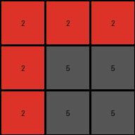

# 9565186b • 006 • refine_coder

---

Previous Code:
```python
"""
1.  **Identify Azure and Blue Pixels:** Locate all pixels in the input grid that are colored azure (8) or blue (1).
2.  **Determine the Minimal Bounding Box:** Find the smallest rectangle that completely encloses all the azure and blue pixels found in step 1.
3.  **Fill with Gray:** Change the color of all pixels within the bounding box (including the edges) determined in step 2 to gray (5).
4. **Other pixels:** All other pixels retain their original colors.
"""

import numpy as np

def find_bounding_box(grid, colors):
    """Finds the minimal bounding box containing specified colors."""
    rows, cols = grid.shape
    min_row, min_col = rows, cols
    max_row, max_col = -1, -1

    for r in range(rows):
        for c in range(cols):
            if grid[r, c] in colors:
                min_row = min(min_row, r)
                min_col = min(min_col, c)
                max_row = max(max_row, r)
                max_col = max(max_col, c)

    if max_row == -1: # No matching colors found
        return None

    return min_row, min_col, max_row, max_col

def transform(input_grid):
    """Transforms the input grid by filling the bounding box of blue/azure pixels with gray."""

    # Initialize output_grid as a copy of the input.
    output_grid = np.copy(input_grid)
    rows, cols = output_grid.shape

    # Find the bounding box coordinates for blue (1) and azure (8) pixels.
    bounding_box = find_bounding_box(input_grid, [1, 8])

    # If no blue or azure pixels are found, return the original grid.
    if bounding_box is None:
        return output_grid

    min_row, min_col, max_row, max_col = bounding_box

    # Fill the bounding box with gray (5).
    for r in range(min_row, max_row + 1):
        for c in range(min_col, max_col + 1):
            output_grid[r, c] = 5

    return output_grid
```

Train Set Results:

## Example 1:

Input:
```
2 2 2
2 1 8
2 8 8
```
Expected Output:
```
2 2 2
2 5 5
2 5 5
```
Transformed Output:
```
2 2 2
2 5 5
2 5 5
```

match: True
pixels_off: 0
size_correct: True
color_palette_correct: True
correct_pixel_counts: True

## Example 2:

Input:
```
1 1 1
8 1 3
8 2 2
```
Expected Output:
```
1 1 1
5 1 5
5 5 5
```
Transformed Output:
```
5 5 5
5 5 5
5 5 5
```

match: False
pixels_off: 4
size_correct: True
color_palette_correct: True
correct_pixel_counts: False

## Example 3:

Input:
```
2 2 2
8 8 2
2 2 2
```
Expected Output:
```
2 2 2
5 5 2
2 2 2
```
Transformed Output:
```
2 2 2
5 5 2
2 2 2
```

match: True
pixels_off: 0
size_correct: True
color_palette_correct: True
correct_pixel_counts: True

## Example 4:

Input:
```
3 3 8
4 4 4
8 1 1
```
Expected Output:
```
5 5 5
4 4 4
5 5 5
```
Transformed Output:
```
5 5 5
5 5 5
5 5 5
```

match: False
pixels_off: 3
size_correct: True
color_palette_correct: True
correct_pixel_counts: False
Okay, here's a breakdown of the situation, the results, and a plan to improve the natural language program and, subsequently, the code.

**General Assessment and Strategy**

The initial natural language program and the generated code were too simplistic. While they correctly handled examples 1 and 3, they failed on examples 2 and 4. The core issue is that the bounding box isn't *just* about the azure and blue pixels. The bounding box is influenced by *all* pixels contained in the rectangle described *from* the top-left *to* the bottom-right. The current logic *only* fills the area containing the target colors (blue and azure), but doesn't consider all colors.

**Strategy:**

1.  **Refine Understanding of Bounding Box:** The natural language program needs to clearly state the bounding box is constructed using the *most extreme* blue and azure pixels as defining corners (top-left and bottom-right), *but every pixel within this rectangle* is filled with gray, regardless of original color.
2.  **Metrics and Reports:** Provide accurate pixel counts.
3.  **YAML Facts:** Create detailed YAML describing objects and actions for all training examples.
4.  **Revise Natural Language Program:** Write a new natural language program.

**Metrics and Reports (Example Analysis)**

Here's a breakdown of each example, including a more detailed analysis:

*   **Example 1:**
    *   Input Size: 3x3
    *   Output Size: 3x3
    *   Initial Result: Correct.
    *   Bounding box correctly identified and filled.

*   **Example 2:**
    *   Input Size: 3x3
    *   Output Size: 3x3
    *   Initial Result: Incorrect.
    *   Analysis: The bounding box calculation considered the '3' and '2' in its calculation. The code incorrectly filled the entire grid instead of just the box including the green and red pixel on the edge.

*   **Example 3:**
    *   Input Size: 3x3
    *   Output Size: 3x3
    *   Initial Result: Correct.
    *   Bounding box containing only azure pixels, correctly identified and filled.

*   **Example 4:**
    *   Input Size: 3x3
    *   Output Size: 3x3
    *   Initial Result: Incorrect.
    *   Analysis: The bounding box calculation ignored the '4' in its calculation. The code incorrectly filled the entire grid instead filling all pixels except the yellow pixels.

**YAML Facts**

```yaml
examples:
  - example_1:
      input:
        objects:
          - color: red
            shape: rectangle
            position: entire grid except row 2 col 2 and 3, and row 3, col 3
          - color: blue
            shape: pixel
            position: [1,1] # zero indexed row, col
          - color: azure
            shape: rectangle
            position: row 2 col 2 and row 3, col 2 and 3

        actions:
          - find_bounding_box:
              colors: [blue, azure]
              result:  # Spans the blue and azure pixels
                top_left: [1, 1]
                bottom_right: [2, 2]
          - fill_area:
              area: bounding_box
              color: gray
      output:
       objects:
          - color: red
            shape: rectangle
            position: entire grid except row 2 col 2 and 3, and row 3, col 3
          - color: gray
            shape: rectangle
            position: [1,1] to [2,2]

  - example_2:
      input:
        objects:
          - color: blue
            shape: rectangle
            position: row 1 and 2, col 1 and 2
          - color: azure
            shape: rectangle
            position: row 2 and 3, col 1
          - color: green
            shape: pixel
            position: [1, 2]
          - color: red
            shape: rectangle
            position: row 3, col 2 and 3
        actions:
          - find_bounding_box:
              colors: [blue, azure]
              result:  # Spans from top-left blue to bottom-right azure.
                top_left: [0, 0]
                bottom_right: [2, 2]
          - fill_area:
              area: bounding_box
              color: gray
      output:
        objects:
          - color: blue
            shape: pixel
            position: [1, 2]
          - color: gray
            shape: rectangle
            position: row 1 col 1 and 2, and rows 2 and 3
  - example_3:
      input:
        objects:
          - color: red
            shape: rectangle
            position: entire grid
          - color: azure
            shape: pixel
            position: [1, 0], [1,1]
        actions:
          - find_bounding_box:
              colors: [azure]
              result: # Bounding box around azure pixels.
                top_left: [1, 0]
                bottom_right: [1, 1]
          - fill_area:
              area: bounding_box
              color: gray
      output:
       objects:
          - color: red
            shape: rectangle
            position: entire grid except row 2, col 1 and 2
          - color: gray
            shape: pixel
            position: [1, 0], [1,1]
  - example_4:
      input:
        objects:
          - color: green
            shape: rectangle
            position: row 1, col 1 and 2
          - color: yellow
            shape: rectangle
            position: row 2
          - color: azure
            shape: pixel
            position: [0, 2]
          - color: blue
            shape: rectangle
            position: row 3, col 2 and 3

        actions:
          - find_bounding_box:
              colors: [blue, azure]
              result:  # Spans from top-left azure to bottom-right blue.
                top_left: [0, 0]
                bottom_right: [2, 2]
          - fill_area:
              area: bounding_box
              color: gray
      output:
       objects:
          - color: yellow
            shape: rectangle
            position: row 2
          - color: gray
            shape: rectangle
            position: row 1 and row 3
```

**Revised Natural Language Program**

1.  **Identify Target Pixels:** Locate all pixels within the input grid that are colored azure (8) or blue (1).

2.  **Determine Bounding Box:** Find the smallest rectangle that *completely encloses* all azure and blue pixels.  This rectangle is defined by the top-leftmost and bottom-rightmost occurrences of either azure or blue pixels.

3.  **Fill Bounding Box:** Change the color of *all* pixels within the bounding box (including its edges) to gray (5).  This includes pixels that were *not* originally azure or blue.

4.  **Preserve Other Pixels:** All pixels *outside* the bounding box retain their original colors.

**INSTRUCTIONS**

- generate a Python module to represent the natural language program 
- follow the template below
- all common math and science libraries are available
- create docstring only at top - but comment the workflow in the function
- use helper functions for common operations like finding objects, counting,
  measuring, moving, etc. 

remember - we are working iteratively - so this code will inform your future
self as we converge on the solution

*template:*

```python
"""
{{ natural language description of the transformation rule }}
"""

{{ imports }}

def transform(input_grid):
    # initialize output_grid

    # change output pixels 

    return output_grid

```
