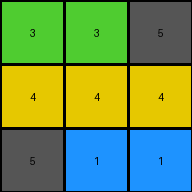

# 9565186b • 016 • refine_coder

---

Previous Code:
```python
"""
The transformation rule is: Replace all azure (8) pixels in the input grid with gray (5) pixels. Keep all red (2) pixels unchanged.
"""

import numpy as np

def transform(input_grid):
    """
    Transforms the input grid according to the rule:
    Replace azure (8) with gray (5), keep red (2) unchanged.
    """
    # Initialize the output grid as a copy of the input grid.
    output_grid = np.copy(input_grid)

    # Replace all instances of 8 (azure) with 5 (gray).
    output_grid[output_grid == 8] = 5

    return output_grid
```

Train Set Results:

## Example 1:

Input:
```
2 2 2
2 1 8
2 8 8
```
Expected Output:
```
2 2 2
2 5 5
2 5 5
```
Transformed Output:
```
2 2 2
2 1 5
2 5 5
```

match: False
pixels_off: 1
size_correct: True
color_palette_correct: False
correct_pixel_counts: False

## Example 2:

Input:
```
1 1 1
8 1 3
8 2 2
```
Expected Output:
```
1 1 1
5 1 5
5 5 5
```
Transformed Output:
```
1 1 1
5 1 3
5 2 2
```

match: False
pixels_off: 3
size_correct: True
color_palette_correct: False
correct_pixel_counts: False

## Example 3:

Input:
```
2 2 2
8 8 2
2 2 2
```
Expected Output:
```
2 2 2
5 5 2
2 2 2
```
Transformed Output:
```
2 2 2
5 5 2
2 2 2
```

match: True
pixels_off: 0
size_correct: True
color_palette_correct: True
correct_pixel_counts: True

## Example 4:

Input:
```
3 3 8
4 4 4
8 1 1
```
Expected Output:
```
5 5 5
4 4 4
5 5 5
```
Transformed Output:
```
3 3 5
4 4 4
5 1 1
```

match: False
pixels_off: 4
size_correct: True
color_palette_correct: False
correct_pixel_counts: False
Here's an analysis of the provided examples and results, along with an updated natural language program and a YAML block summarizing the observations:

**General Assessment and Strategy:**

The initial natural language program and the corresponding code were too simplistic. While it correctly handled Example 3, it failed to generalize to other examples, particularly in preserving colors other than red (2) and replacing only azure (8) with gray(5) for the WHOLE grid. The core issue is that the initial rule was incomplete; It focused on the change of a color and preservation of red (2). It also failed to handle other colors. The updated strategy is to modify the rule to account for a more general transformation, replacing azure with grey, while preserving all the other colors in the grid.

**Metrics and Observations:**

Here's a breakdown of each example, focusing on identifying consistent patterns:

*   **Example 1:**
    *   Input: 3x3, Contains red (2), blue (1), and azure (8).
    *   Expected Output: red (2), gray(5), blue(1) gets converted into gray(5).
    *   Observed Output: Incorrectly kept blue(1).
    *   Mismatch: Blue (1) was not transformed into gray (5).

*   **Example 2:**
    *   Input: 3x3, Contains blue (1), azure (8), green(3) and red(2).
    *   Expected Output: Preserves blue (1), green (3), red (2) and converts azure (8) into gray(5).
    *   Observed Output: Azure(8) changed to Gray(5) but all others were kept.
    *   Mismatch: Green(3) and Red(2) in the input were not changed.

*   **Example 3:**
    *   Input: 3x3, Contains red (2) and azure (8).
    *   Expected Output: Preserves red (2) and changes azure (8) to gray (5).
    *   Observed Output: Matched the expected output.
    *   Mismatch: None.

*   **Example 4:**
    *   Input: 3x3 grid with green (3), yellow (4), azure (8), and blue (1).
    *   Expected output: Green (3) and Yellow(4) and Blue(1) preserved, azure (8) turns to gray (5)
    *   Observed Output: Azure changed to gray, others were preserved.
    *   Mismatch: Other colors remained the same, while azure changed to gray.

**YAML Facts:**

```yaml
observations:
  - example: 1
    objects:
      - color: red
        initial_positions: [[0,0], [0,1], [0,2], [1,0], [2,0]]
        final_positions: [[0,0], [0,1], [0,2], [1,0], [2,0]]
      - color: blue
        initial_positions: [[1,1]]
        final_positions: [[1,1]] #Incorrect, should not be in final.
      - color: azure
        initial_positions: [[1,2], [2,1], [2,2]]
        final_positions: [] #Correct
      - color: gray
        initial_positions: []
        final_positions:  [[1,2], [2,1], [2,2],[1,1]]# Correct, except position 1,1.

  - example: 2
    objects:
      - color: blue
        initial_positions: [[0,0], [0,1], [0,2], [1,1]]
        final_positions: [[0,0], [0,1], [0,2], [1,1]]
      - color: azure
        initial_positions: [[1, 0], [2, 0]]
        final_positions: []
      - color: green
        initial_positions: [[1,2]]
        final_positions: [[1,2]]
      -color: red
        initial_positions: [[2,1],[2,2]]
        final_positions: [[2,1], [2,2]]
      - color: gray
        initial_positions: []
        final_positions: [[1, 0], [2, 0]]
  - example: 3
    objects:
      - color: red
        initial_positions:  [[0,0], [0,1], [0,2], [1,2], [2,0], [2,1], [2,2]]
        final_positions: [[0,0], [0,1], [0,2], [1,2], [2,0], [2,1], [2,2]]
      - color: azure
        initial_positions: [[1, 0], [1, 1]]
        final_positions: []
      - color: gray
        initial_positions: []
        final_positions: [[1, 0], [1, 1]]
  - example: 4
    objects:
      - color: green
        initial_positions: [[0, 0], [0, 1]]
        final_positions: [[0, 0], [0, 1]]
      - color: yellow
        initial_positions: [[1, 0], [1, 1], [1, 2]]
        final_positions: [[1, 0], [1, 1], [1, 2]]
      - color: azure
        initial_positions: [[0, 2], [2, 0]]
        final_positions: []
      - color: blue
        initial_positions: [[2,1],[2,2]]
        final_positions: [[2,1],[2,2]]
      - color: gray
        initial_positions: []
        final_positions: [[0, 2], [2, 0]]

```

**Natural Language Program:**

1.  Iterate through each pixel of the input grid.
2.  If a pixel is azure (8), change it to gray (5) in the output grid.
3.  If a pixel has any color other than azure (8), keep its original value in the output grid.

**INSTRUCTIONS**

- generate a Python module to represent the natural language program 
- follow the template below
- all common math and science libraries are available
- create docstring only at top - but comment the workflow in the function
- use helper functions for common operations like finding objects, counting,
  measuring, moving, etc. 

remember - we are working iteratively - so this code will inform your future
self as we converge on the solution

*template:*

```python
"""
{{ natural language description of the transformation rule }}
"""

{{ imports }}

def transform(input_grid):
    # initialize output_grid

    # change output pixels 

    return output_grid

```
