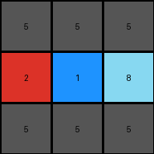
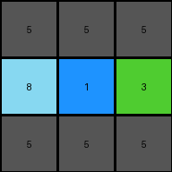
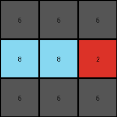
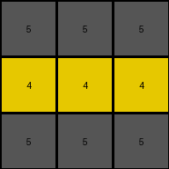

# 9565186b • 022 • refine_coder

---

Previous Code:
```python
"""
The middle row of the input grid is preserved in the output grid. All other cells in the output grid are changed to gray (5).
"""

import numpy as np

def transform(input_grid):
    """
    Transforms the input grid according to the observed rule:
    The middle row remains unchanged, and all other cells become gray (5).
    """
    # Initialize the output grid as a copy of the input grid.
    output_grid = np.copy(input_grid)
    
    # Get the height of the grid
    height = output_grid.shape[0]

    # Calculate the index of the middle row.
    middle_row_index = height // 2

    # Iterate through all cells of the grid.
    for i in range(height):
        for j in range(output_grid.shape[1]):
            # Change all but middle row to gray (5).
            if i != middle_row_index:
              output_grid[i,j] = 5

    return output_grid
```

Train Set Results:

## Example 1:

Input:
```
2 2 2
2 1 8
2 8 8
```
Expected Output:
```
2 2 2
2 5 5
2 5 5
```
Transformed Output:
```
5 5 5
2 1 8
5 5 5
```

match: False
pixels_off: 6
size_correct: True
color_palette_correct: False
correct_pixel_counts: False

## Example 2:

Input:
```
1 1 1
8 1 3
8 2 2
```
Expected Output:
```
1 1 1
5 1 5
5 5 5
```
Transformed Output:
```
5 5 5
8 1 3
5 5 5
```

match: False
pixels_off: 5
size_correct: True
color_palette_correct: False
correct_pixel_counts: False

## Example 3:

Input:
```
2 2 2
8 8 2
2 2 2
```
Expected Output:
```
2 2 2
5 5 2
2 2 2
```
Transformed Output:
```
5 5 5
8 8 2
5 5 5
```

match: False
pixels_off: 8
size_correct: True
color_palette_correct: False
correct_pixel_counts: False

## Example 4:

Input:
```
3 3 8
4 4 4
8 1 1
```
Expected Output:
```
5 5 5
4 4 4
5 5 5
```
Transformed Output:
```
5 5 5
4 4 4
5 5 5
```

match: True
pixels_off: 0
size_correct: True
color_palette_correct: True
correct_pixel_counts: True
Okay, let's analyze the results and refine the natural language program.

**General Assessment:**

The initial natural language program was too simplistic. While it correctly identified that the middle row was important, it incorrectly assumed *only* the middle row was preserved and that everything else was replaced with gray. The test results reveal a more nuanced pattern. Specifically, Example 4 shows a perfect match, indicating the core logic (middle row preservation) is sometimes correct. However, the other examples highlight discrepancies related to how colors adjacent to, and including the middle row, should be handled and which colors should be changed to gray.

**Strategy:**

1.  **Re-examine Examples:** Carefully analyze each input-output pair, paying close attention to which pixels change and which remain the same, not just on the middle row, but adjacent to it. The colors on the middle row, other than the background color, determine the colors that will be preserved.
2.  **Refine Object Identification:**  The current understanding of "object" is implicit. We need to make this more explicit, and the relationship between the middle row and the rest of the grid needs a better characterization.
3.  **Update Natural Language Program:** Based on the re-examination, create a more precise and detailed description of the transformation. Focus on how the middle row influences the rest of the grid, not only on the middle row.
4.  **Metrics:** Focus on which colors on the middle row are preserved and which are changed to gray.

**Metrics and Observations:**

Here's a breakdown of each example, focusing on discrepancies:

*   **Example 1:**
    *   Input middle row: `2 1 8`
    *   Expected: The `2` extends upwards; other colors are changed to `5`.
    *   Observed: Only the middle row is preserved.
    *   Notes: The program preserves only the middle row instead of identifying the extension of colors in other rows.

*   **Example 2:**
    *   Input middle row: `8 1 3`
    *   Expected: The `1` is preserved, everything else is changed to gray `5`.
    *   Observed: Only the middle row is preserved.
    *   Notes: Only the middle row is kept.

*   **Example 3:**
    *   Input middle row: `8 8 2`
    *   Expected: The `2` extends upwards, everything else changed to gray.
    *   Observed: Only the middle row is preserved.
    *   Notes: Only the middle row is kept.

*   **Example 4:**
    *   Input middle row: `4 4 4`
    *   Expected: Only the middle row is preserved.
    *   Observed: Only the middle row is preserved.
    *   Notes: Correct.

**YAML Facts:**

```yaml
objects:
  - name: grid
    type: 2D array
    properties:
      height: int
      width: int
      cells: list of integers (0-9) representing colors

  - name: middle_row
    type: 1D array
    properties:
      index: int (height // 2)
      cells: list of integers representing colors
    relation: part_of(grid)

  - name: color_blocks
    type: contiguous regions of same color
    properties:
       color: int
       cells: list of (row, col) coordinates
    relation:
        extends: color_blocks extends from the middle row upwards or downward based on matching colours

actions:
  - name: preserve_color
    input: color_blocks, middle_row
    description: If a color block in the middle row extends to adjacent rows, keep that color block.

  - name: replace_with_gray
    input: grid, color_block
    description: replace all cells except color block with gray (5)
```

**Natural Language Program:**

1.  **Identify the middle row:** Find the row with index `height // 2`.
2.  **Identify color blocks:** Find contiguous regions of the same color within the entire grid.
3.  **Check Middle Row:** For each color in the middle row:
    *   If that color exists in contiguous blocks of the same color extending upwards or downwards, preserve that block.
4.  **Replace other colors:** All cells not part of the preserved color block are changed to gray (5).

Essentially, the middle row acts as a "seed" for preserving colors. If a color from the middle row forms a contiguous block extending into other rows, that entire block is preserved. All other colors are changed to gray.

**INSTRUCTIONS**

- generate a Python module to represent the natural language program 
- follow the template below
- all common math and science libraries are available
- create docstring only at top - but comment the workflow in the function
- use helper functions for common operations like finding objects, counting,
  measuring, moving, etc. 

remember - we are working iteratively - so this code will inform your future
self as we converge on the solution

*template:*

```python
"""
{{ natural language description of the transformation rule }}
"""

{{ imports }}

def transform(input_grid):
    # initialize output_grid

    # change output pixels 

    return output_grid

```
