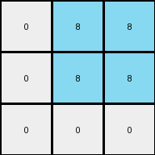
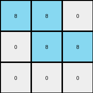

# 995c5fa3 • 003 • refine_dreamer

---

Previous Code:
```python
"""
The input is a grid of pixels, primarily gray (5) with some white (0) pixels.
The output is a 3x3 grid with colors determined by the lengths of vertical
"stripes" of white pixels in the input grid.

1.  **Identify White Stripes:** Locate vertical columns in the input grid
    that contain white (0) pixels. A "stripe" is defined as one or more
    adjacent white pixels in a column.
2.  **Measure Stripe Lengths:** For each identified white stripe, determine
    its length (the number of continuous white pixels).
3.  **Create Output Grid:** Create a 3x3 output grid.
4.   **Fill the Output Grid:**
    *   Iterate through the first three white stripe lengths identified in step 1
and 2
    * Assign colors to each cell in the output grid from top to bottom, left to right:
        *   If the length is 1, assign Red (2).
        *   If the length is 2, assign Azure (8).
        *   If the length is 3, assign Green (3).
        *   If the length is 4, assign ? (unknown)
"""

import numpy as np

def get_white_stripes(grid):
    # Find vertical stripes of white pixels
    white_stripes = []
    height, width = grid.shape
    for x in range(width):
        stripe_length = 0
        for y in range(height):
            if grid[y, x] == 0:
                stripe_length += 1
            elif stripe_length > 0:
                white_stripes.append(stripe_length)
                stripe_length = 0
        if stripe_length > 0: # Catch stripes that end at the bottom
            white_stripes.append(stripe_length)
    return white_stripes

def transform(input_grid):
    # initialize output_grid
    output_grid = np.zeros((3, 3), dtype=int)

    # Find and measure white stripes
    white_stripes = get_white_stripes(np.array(input_grid))
    
    # Map stripe lengths to colors
    color_map = {
        1: 2,
        2: 8,
        3: 3
    }

    # Fill the output grid
    stripe_index = 0
    for row in range(3):
      for col in range(3):
        if stripe_index < len(white_stripes):
            length = white_stripes[stripe_index]
            if length in color_map:
               output_grid[row,col] = color_map[length]
            stripe_index+=1

    return output_grid
```

Train Set Results:

## Example 1:

Input:
```
5 5 5 5 0 5 5 5 5 0 5 5 5 5
5 5 5 5 0 5 0 0 5 0 0 5 5 0
5 5 5 5 0 5 0 0 5 0 0 5 5 0
5 5 5 5 0 5 5 5 5 0 5 5 5 5
```
Expected Output:
```
2 2 2
8 8 8
3 3 3
```
Transformed Output:
```
0 8 8
0 8 8
0 0 0
```

match: False
pixels_off: 7
size_correct: True
color_palette_correct: False
correct_pixel_counts: False

## Example 2:

Input:
```
5 5 5 5 0 5 5 5 5 0 5 5 5 5
0 5 5 0 0 5 5 5 5 0 5 5 5 5
0 5 5 0 0 5 0 0 5 0 5 5 5 5
5 5 5 5 0 5 0 0 5 0 5 5 5 5
```
Expected Output:
```
3 3 3
4 4 4
2 2 2
```
Transformed Output:
```
8 8 0
8 8 0
0 0 0
```

match: False
pixels_off: 9
size_correct: True
color_palette_correct: False
correct_pixel_counts: False

## Example 3:

Input:
```
5 5 5 5 0 5 5 5 5 0 5 5 5 5
5 0 0 5 0 5 5 5 5 0 5 5 5 5
5 0 0 5 0 5 5 5 5 0 5 0 0 5
5 5 5 5 0 5 5 5 5 0 5 0 0 5
```
Expected Output:
```
8 8 8
2 2 2
4 4 4
```
Transformed Output:
```
8 8 0
0 8 8
0 0 0
```

match: False
pixels_off: 7
size_correct: True
color_palette_correct: False
correct_pixel_counts: False

## Example 4:

Input:
```
5 5 5 5 0 5 5 5 5 0 5 5 5 5
5 5 5 5 0 5 5 5 5 0 5 5 5 5
5 5 5 5 0 5 0 0 5 0 5 5 5 5
5 5 5 5 0 5 0 0 5 0 5 5 5 5
```
Expected Output:
```
2 2 2
4 4 4
2 2 2
```
Transformed Output:
```
0 8 8
0 0 0
0 0 0
```

match: False
pixels_off: 9
size_correct: True
color_palette_correct: False
correct_pixel_counts: False
**INSTRUCTIONS**

The code above was generated based on observations from the first training
example

we have tested the transform function on each of the task example inputs and
compared with the expected output

review each of the examples provided and the results and consider how the
natural language program should be updated to accommodate this new knowledge

respond with the following deliverables:

- general assessment of the information provided and strategy for resolving the
  errors
- gather metrics about each of the examples and results - use code_execution to
  develop accurate reports on your assumptions
- a YAML block documenting facts - Focus on identifying objects, their properties, and the actions performed on them.
- a natural language program - Be as clear and concise as possible, providing a complete description of the transformation rule.


your responses should be considered as information in a report - not a
conversation
