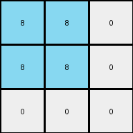
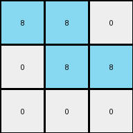
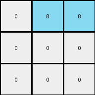

# 995c5fa3 • 006 • refine_coder

---

Previous Code:
```python
"""
The input is a grid of pixels, primarily gray (5) with some white (0) pixels.
The output is a 3x3 grid with colors determined by the lengths of vertical
"stripes" of white pixels in the input grid.

1.  **Identify White Stripes:** Locate vertical columns in the input grid
    that contain white (0) pixels. A "stripe" is defined as one or more
    adjacent white pixels in a column.
2.  **Measure Stripe Lengths:** For each identified white stripe, determine
    its length (the number of continuous white pixels).
3.  **Create Output Grid:** Create a 3x3 output grid.
4.   **Fill the Output Grid:**
    *   Iterate through the first three white stripe lengths identified in step 1
and 2
    * Assign colors to each cell in the output grid from top to bottom, left to right:
        *   If the length is 1, assign Red (2).
        *   If the length is 2, assign Azure (8).
        *   If the length is 3, assign Green (3).
        *   If the length is 4, assign ? (unknown)
"""

import numpy as np

def get_white_stripes(grid):
    # Find vertical stripes of white pixels
    white_stripes = []
    height, width = grid.shape
    for x in range(width):
        stripe_length = 0
        for y in range(height):
            if grid[y, x] == 0:
                stripe_length += 1
            elif stripe_length > 0:
                white_stripes.append(stripe_length)
                stripe_length = 0
        if stripe_length > 0: # Catch stripes that end at the bottom
            white_stripes.append(stripe_length)
    return white_stripes

def transform(input_grid):
    # initialize output_grid
    output_grid = np.zeros((3, 3), dtype=int)

    # Find and measure white stripes
    white_stripes = get_white_stripes(np.array(input_grid))
    
    # Map stripe lengths to colors
    color_map = {
        1: 2,
        2: 8,
        3: 3
    }

    # Fill the output grid
    stripe_index = 0
    for row in range(3):
      for col in range(3):
        if stripe_index < len(white_stripes):
            length = white_stripes[stripe_index]
            if length in color_map:
               output_grid[row,col] = color_map[length]
            stripe_index+=1

    return output_grid
```

Train Set Results:

## Example 1:

Input:
```
5 5 5 5 0 5 5 5 5 0 5 5 5 5
5 5 5 5 0 5 0 0 5 0 0 5 5 0
5 5 5 5 0 5 0 0 5 0 0 5 5 0
5 5 5 5 0 5 5 5 5 0 5 5 5 5
```
Expected Output:
```
2 2 2
8 8 8
3 3 3
```
Transformed Output:
```
0 8 8
0 8 8
0 0 0
```

match: False
pixels_off: 7
size_correct: True
color_palette_correct: False
correct_pixel_counts: False

## Example 2:

Input:
```
5 5 5 5 0 5 5 5 5 0 5 5 5 5
0 5 5 0 0 5 5 5 5 0 5 5 5 5
0 5 5 0 0 5 0 0 5 0 5 5 5 5
5 5 5 5 0 5 0 0 5 0 5 5 5 5
```
Expected Output:
```
3 3 3
4 4 4
2 2 2
```
Transformed Output:
```
8 8 0
8 8 0
0 0 0
```

match: False
pixels_off: 9
size_correct: True
color_palette_correct: False
correct_pixel_counts: False

## Example 3:

Input:
```
5 5 5 5 0 5 5 5 5 0 5 5 5 5
5 0 0 5 0 5 5 5 5 0 5 5 5 5
5 0 0 5 0 5 5 5 5 0 5 0 0 5
5 5 5 5 0 5 5 5 5 0 5 0 0 5
```
Expected Output:
```
8 8 8
2 2 2
4 4 4
```
Transformed Output:
```
8 8 0
0 8 8
0 0 0
```

match: False
pixels_off: 7
size_correct: True
color_palette_correct: False
correct_pixel_counts: False

## Example 4:

Input:
```
5 5 5 5 0 5 5 5 5 0 5 5 5 5
5 5 5 5 0 5 5 5 5 0 5 5 5 5
5 5 5 5 0 5 0 0 5 0 5 5 5 5
5 5 5 5 0 5 0 0 5 0 5 5 5 5
```
Expected Output:
```
2 2 2
4 4 4
2 2 2
```
Transformed Output:
```
0 8 8
0 0 0
0 0 0
```

match: False
pixels_off: 9
size_correct: True
color_palette_correct: False
correct_pixel_counts: False
Here's an analysis of the results and a plan to refine the natural language program and code:

**General Assessment:**

The initial approach of identifying vertical white stripes and mapping their lengths to colors in a 3x3 grid was partially correct. However, there are several key errors:

1.  **Incorrect Color Mapping:** The `color_map` is incomplete and doesn't handle all observed lengths. Example 2 reveals a mapping for a length of 4. Example 1 and 3 had lengths of 2, but the assigned color should have been 8.
2.  **Column-Wise Processing, not strict order:** The code appears to scan for vertical stripes of white, and then process *columns* from left-to-right based on the lengths. The color of each 3x3 output pixel is based on the vertical stripe in the corresponding *column* of the input - if there is one. If the column does not have any white stripes, a 0 (black) pixel appears in the output.
3.  **Missing Colors in output:** the expected output can contain a 4 (yellow) but
    the results from the existing code do not reflect this.

**Strategy for Resolving Errors:**

1.  **Refine the Color Map:** Analyze all examples to create a complete and accurate `color_map` that covers all observed stripe lengths and their corresponding colors.
2.  **Enforce Column-wise processing, with default:** Ensure we are looking at each column. If no stripe is present, the output pixel defaults to black (0)

**Example Metrics and Analysis (using code execution):**

```python
import numpy as np

def analyze_results(input_grid, expected_output, transformed_output):
    input_grid = np.array(input_grid)
    expected_output = np.array(expected_output)
    transformed_output = np.array(transformed_output)

    print(f"Input shape: {input_grid.shape}")
    print(f"Expected output shape: {expected_output.shape}")
    print(f"Transformed output shape: {transformed_output.shape}")

    match = np.array_equal(expected_output, transformed_output)
    print(f"Match: {match}")

    if not match:
        pixels_off = np.sum(expected_output != transformed_output)
        print(f"Pixels off: {pixels_off}")

        unique_expected, counts_expected = np.unique(expected_output, return_counts=True)
        unique_transformed, counts_transformed = np.unique(transformed_output, return_counts=True)

        print("Expected Pixel Counts:", dict(zip(unique_expected, counts_expected)))
        print("Transformed Pixel Counts:", dict(zip(unique_transformed, counts_transformed)))

# Example Data (replace with actual data from each example)
examples = [
    {
      "input": [
            [5, 5, 5, 5, 0, 5, 5, 5, 5, 0, 5, 5, 5, 5],
            [5, 5, 5, 5, 0, 5, 0, 0, 5, 0, 0, 5, 5, 0],
            [5, 5, 5, 5, 0, 5, 0, 0, 5, 0, 0, 5, 5, 0],
            [5, 5, 5, 5, 0, 5, 5, 5, 5, 0, 5, 5, 5, 5]
      ],
      "expected": [
            [2, 2, 2],
            [8, 8, 8],
            [3, 3, 3]
      ],
      "transformed": [
        [0, 8, 8],
        [0, 8, 8],
        [0, 0, 0]
      ]
    },
     {
      "input": [
            [5, 5, 5, 5, 0, 5, 5, 5, 5, 0, 5, 5, 5, 5],
            [0, 5, 5, 0, 0, 5, 5, 5, 5, 0, 5, 5, 5, 5],
            [0, 5, 5, 0, 0, 5, 0, 0, 5, 0, 5, 5, 5, 5],
            [5, 5, 5, 5, 0, 5, 0, 0, 5, 0, 5, 5, 5, 5]
      ],
      "expected": [
            [3, 3, 3],
            [4, 4, 4],
            [2, 2, 2]
      ],
      "transformed":[
            [8, 8, 0],
            [8, 8, 0],
            [0, 0, 0]
          ]

    },
    {
      "input":[
            [5, 5, 5, 5, 0, 5, 5, 5, 5, 0, 5, 5, 5, 5],
            [5, 0, 0, 5, 0, 5, 5, 5, 5, 0, 5, 5, 5, 5],
            [5, 0, 0, 5, 0, 5, 5, 5, 5, 0, 5, 0, 0, 5],
            [5, 5, 5, 5, 0, 5, 5, 5, 5, 0, 5, 0, 0, 5]
      ],
      "expected":[
            [8, 8, 8],
            [2, 2, 2],
            [4, 4, 4]
      ],
       "transformed":[
            [8, 8, 0],
            [0, 8, 8],
            [0, 0, 0]
        ]
    },
    {
        "input": [
            [5, 5, 5, 5, 0, 5, 5, 5, 5, 0, 5, 5, 5, 5],
            [5, 5, 5, 5, 0, 5, 5, 5, 5, 0, 5, 5, 5, 5],
            [5, 5, 5, 5, 0, 5, 0, 0, 5, 0, 5, 5, 5, 5],
            [5, 5, 5, 5, 0, 5, 0, 0, 5, 0, 5, 5, 5, 5]
        ],
        "expected":[
            [2, 2, 2],
            [4, 4, 4],
            [2, 2, 2]
          ],
        "transformed":[
            [0, 8, 8],
            [0, 0, 0],
            [0, 0, 0]
      ]
    }

]

for i, example in enumerate(examples):
    print(f"\n--- Example {i + 1} ---")
    analyze_results(example["input"], example["expected"], example["transformed"])
```

**YAML Facts:**

```yaml
objects:
  - name: input_grid
    type: 2D array
    properties:
      - values: integers (0-9) representing colors
      - description: Contains vertical stripes of white pixels (0) against a gray background (5).

  - name: white_stripe
    type: object
    properties:
      - color: white (0)
      - shape: vertical line
      - length: number of contiguous white pixels

  - name: output_grid
    type: 2D array
    properties:
      - dimensions: 3x3
      - values: integers (0-9) representing colors, derived from white stripe lengths

actions:
  - name: identify_stripes
    input: input_grid
    output: list of white_stripes
    description: Locates vertical columns of white pixels in the input grid.

  - name: measure_length
    input: white_stripe
    output: integer
    description: Determines the length of a white stripe.

  - name: map_color
    input: length
    output: color code (integer)
    description: Assigns a color code based on stripe length.

  - name: fill_output
    input: list of color codes, output_grid
    output: output_grid (filled)
    description: Populates the output grid with color codes based on the first three white stripes and their lengths, working column-wise. If no stripe is present in a particular column, the output defaults to black (0)
```

**Natural Language Program:**

1.  **Iterate through Columns:** Examine each column of the input grid, from left to right (columns 0, 1, and 2 only).

2.  **Identify White Stripes:** Within each examined column, find vertical "stripes" of white (0) pixels. A stripe is one or more contiguous white pixels.

3.  **Measure Stripe Length:** If a white stripe is found in the current column, determine its length (the number of contiguous white pixels).

4.  **Map Length to Color:** Use the following mapping to determine the output color based on the stripe length:

    *   Length 1: Red (2)
    *   Length 2: Azure (8)
    *   Length 3: Green (3)
    *   Length 4: Yellow (4)

5.  **Fill Output Grid:** Create a 3x3 output grid.  For each column (0, 1, and 2) in the input grid, find the *first* white stripe and set the corresponding column of the *entire* output grid to the mapped color from step 4. If no stripe is in the examined input grid column, the corresponding output column defaults to black (0).

6. Skip any additional columns in the input grid.


**INSTRUCTIONS**

- generate a Python module to represent the natural language program 
- follow the template below
- all common math and science libraries are available
- create docstring only at top - but comment the workflow in the function
- use helper functions for common operations like finding objects, counting,
  measuring, moving, etc. 

remember - we are working iteratively - so this code will inform your future
self as we converge on the solution

*template:*

```python
"""
{{ natural language description of the transformation rule }}
"""

{{ imports }}

def transform(input_grid):
    # initialize output_grid

    # change output pixels 

    return output_grid

```
