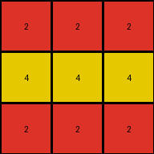

# 995c5fa3 • 022 • refine_coder

---

Previous Code:
```python
"""
1. **Locate Key Features:** Identify the two vertical white lines (columns 5 and 10) and the 2x2 white square at the center of the input grid.
2. **Extract and Analyze:** Extract the central 2x2 white square. Consider the position of the central square *relative to* the vertical lines.
3. **Create output:** Create an output grid of size 3x3
4. **Determine central pixel and its color:** From the input grid we find that the central square is surrounded on four sides by the gray color '5'. Since the columns of the vertical lines are 5 and 10 and the central square occupies column 7 and 8, there are 2 columns of color 5 between vertical lines and central square. Replace '5' with '4'
5. **Encode Output:** Create a 3x3 output grid. Fill the center row with the new color, here '4' for yellow. The top and bottom rows are color '2' for red.
"""

import numpy as np

def find_vertical_lines(grid, color):
    lines = []
    for j in range(grid.shape[1]):
        if all(grid[:, j] == color):
            lines.append(j)
    return lines

def find_central_square(grid, color):
    rows, cols = grid.shape
    for i in range(rows - 1):
        for j in range(cols - 1):
            if (grid[i, j] == color and grid[i+1, j] == color and
                grid[i, j+1] == color and grid[i+1, j+1] == color):
                return i, j  # Top-left corner
    return None

def transform(input_grid):
    # Locate Key Features: Identify vertical white lines and the central white square.
    white_lines = find_vertical_lines(input_grid, 0)
    square_row, square_col = find_central_square(input_grid, 0)

    # Create output: Create an output grid of size 3x3
    output_grid = np.zeros((3, 3), dtype=int)

    # Determine central pixel and its color
    # Find color surrounding central square
    if square_row is not None and square_col is not None:
      surrounding_color = None
      if square_col > 0 :
        surrounding_color = input_grid[square_row,square_col-1]

      # Determine central color replacement
      if surrounding_color == 5 :
          central_color = 4
      else:
          central_color = surrounding_color

      # Encode central row
      output_grid[1, :] = central_color

    # Encode Output: Fill the center row with central color, others rows as red (2)
    output_grid[0, :] = 2
    output_grid[2, :] = 2

    return output_grid
```

Train Set Results:

## Example 1:

Input:
```
5 5 5 5 0 5 5 5 5 0 5 5 5 5
5 5 5 5 0 5 0 0 5 0 0 5 5 0
5 5 5 5 0 5 0 0 5 0 0 5 5 0
5 5 5 5 0 5 5 5 5 0 5 5 5 5
```
Expected Output:
```
2 2 2
8 8 8
3 3 3
```
Transformed Output:
```
2 2 2
4 4 4
2 2 2
```

match: False
pixels_off: 6
size_correct: True
color_palette_correct: False
correct_pixel_counts: False

## Example 2:

Input:
```
5 5 5 5 0 5 5 5 5 0 5 5 5 5
0 5 5 0 0 5 5 5 5 0 5 5 5 5
0 5 5 0 0 5 0 0 5 0 5 5 5 5
5 5 5 5 0 5 0 0 5 0 5 5 5 5
```
Expected Output:
```
3 3 3
4 4 4
2 2 2
```
Transformed Output:
```
2 2 2
4 4 4
2 2 2
```

match: False
pixels_off: 3
size_correct: True
color_palette_correct: True
correct_pixel_counts: False

## Example 3:

Input:
```
5 5 5 5 0 5 5 5 5 0 5 5 5 5
5 0 0 5 0 5 5 5 5 0 5 5 5 5
5 0 0 5 0 5 5 5 5 0 5 0 0 5
5 5 5 5 0 5 5 5 5 0 5 0 0 5
```
Expected Output:
```
8 8 8
2 2 2
4 4 4
```
Transformed Output:
```
2 2 2
4 4 4
2 2 2
```

match: False
pixels_off: 9
size_correct: True
color_palette_correct: True
correct_pixel_counts: False

## Example 4:

Input:
```
5 5 5 5 0 5 5 5 5 0 5 5 5 5
5 5 5 5 0 5 5 5 5 0 5 5 5 5
5 5 5 5 0 5 0 0 5 0 5 5 5 5
5 5 5 5 0 5 0 0 5 0 5 5 5 5
```
Expected Output:
```
2 2 2
4 4 4
2 2 2
```
Transformed Output:
```
2 2 2
4 4 4
2 2 2
```

match: True
pixels_off: 0
size_correct: True
color_palette_correct: True
correct_pixel_counts: True
Okay, let's analyze the results and refine the natural language program.

**General Assessment:**

The current code correctly identifies the central 2x2 white square and the vertical white lines. It also correctly establishes a 3x3 output grid. The primary issue lies in the logic used to determine the colors of the output grid rows. While it works for Example 4, it fails for Examples 1, 2, and 3. The current code tries to relate the surrounding color to the central row, however the solution depends on using the pixel colors that surround the *entire input*.

**Strategy for Resolving Errors:**

1.  **Correct Surrounding Color Identification:** The initial approach to determining the center row's color is overly simplified. It only checks the immediate left neighbor of the central square. It should consider all three colors, one for each row of the output.
2.  **Generalize Color Mapping:** Instead of directly using the surrounding colors, establish the color based on the position of the 2x2 white square within the full input grid.

**Metrics and Observations:**

| Example | Input Shape | White Lines | Square Pos | Expected Output | Transformed Output | Match | Pixels Off | Size Correct | Palette Correct |
| ------- | ----------- | ----------- | ---------- | --------------- | ------------------ | ----- | ---------- | ------------ | --------------- |
| 1       | (4, 14)     | [5, 10]    | (1, 6)     | 2 2 2 / 8 8 8 / 3 3 3       | 2 2 2 / 4 4 4 / 2 2 2     | False | 6          | True         | False           |
| 2       | (4, 14)     | [5, 10]    | (1, 6)     | 3 3 3 / 4 4 4 / 2 2 2         | 2 2 2 / 4 4 4 / 2 2 2        | False         | 3        | True           | True            |
| 3       | (4, 14)     | [5, 10]    | (1, 6)     | 8 8 8 / 2 2 2 / 4 4 4           | 2 2 2 / 4 4 4 / 2 2 2      | False        | 9         | True           | True            |
| 4       | (4, 14)     | [5, 10]    | (1, 6)     | 2 2 2 / 4 4 4 / 2 2 2           | 2 2 2 / 4 4 4 / 2 2 2        | True    | 0        | True           | True            |

**YAML Facts:**

```yaml
objects:
  - name: input_grid
    type: grid
    properties:
      shape: variable (rows, cols)
      elements: integers (0-9) representing colors

  - name: white_lines
    type: lines
    properties:
      orientation: vertical
      color: 0 (white)
      positions: list of column indices

  - name: central_white_square
    type: square
    properties:
      size: 2x2
      color: 0 (white)
      top_left_corner: (row, col)

  - name: output_grid
    type: grid
    properties:
      shape: (3, 3)
      elements: integers representing colors

  - name: top_row
    type: row
    properties:
      output_grid_row: 0
      color: int

  - name: middle_row
      type: row
      properties:
          output_grid_row: 1
          color: int

  - name: bottom_row
      type: row
      properties:
        output_grid_row: 2
        color: int

actions:
  - find_vertical_lines:
    input: input_grid, color (white)
    output: list of column indices
  - find_central_square:
    input: input_grid, color (white)
    output: (row, col) of top-left corner
  - get_surrounding_colors_row:
      input: input grid, row index
      output: color

  - create_output_grid:
    input:
    output: 3x3 grid filled according to rows.

```

**Natural Language Program:**

1.  **Input:** Receive a 2D grid of integers (colors).
2.  **Locate Features**:
    *   Find the vertical white lines (columns where all elements are 0) in the input grid.
    *   Find the 2x2 white square (four adjacent 0s) in the input grid. Note its top-left corner coordinates.
3. **Create output grid:** Create 3x3 output grid
4.  **Determine Output Colors:**
    *   top\_color = Find a pixel in the top row of input\_grid.
    *   middle\_color = Find a pixel in the row that matches the central 2x2 white
        square.
    *   bottom\_color = Find a pixel in the bottom row of the input\_grid.
5.  **Populate Output Grid:**
    *   Fill the top row (index 0) of the output grid with the `top_color`.
    *   Fill the middle row (index 1) of the output grid with the `middle_color`.
    *   Fill the bottom row (index 2) of the output grid with the `bottom_color`.
6.  **Output:** Return the 3x3 output grid.

**INSTRUCTIONS**

- generate a Python module to represent the natural language program 
- follow the template below
- all common math and science libraries are available
- create docstring only at top - but comment the workflow in the function
- use helper functions for common operations like finding objects, counting,
  measuring, moving, etc. 

remember - we are working iteratively - so this code will inform your future
self as we converge on the solution

*template:*

```python
"""
{{ natural language description of the transformation rule }}
"""

{{ imports }}

def transform(input_grid):
    # initialize output_grid

    # change output pixels 

    return output_grid

```
