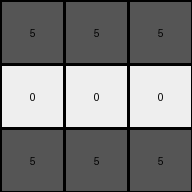

# 995c5fa3 • 023 • refine_dreamer

---


Previous Code:
```python
"""
1.  **Input:** Receive a 2D grid of integers (colors).
2.  **Locate Features**:
    *   Find the vertical white lines (columns where all elements are 0) in the input grid.
    *   Find the 2x2 white square (four adjacent 0s) in the input grid. Note its top-left corner coordinates.
3.  **Create output grid:** Create 3x3 output grid
4.  **Determine Output Colors:**
    *   top_color = Find a pixel in the top row of input_grid.
    *   middle_color = Find a pixel in the row that matches the central 2x2 white
        square.
    *   bottom_color = Find a pixel in the bottom row of the input_grid.
5.  **Populate Output Grid:**
    *   Fill the top row (index 0) of the output grid with the `top_color`.
    *   Fill the middle row (index 1) of the output grid with the `middle_color`.
    *   Fill the bottom row (index 2) of the output grid with the `bottom_color`.
6.  **Output:** Return the 3x3 output grid.
"""

import numpy as np

def find_vertical_lines(grid, color):
    lines = []
    for j in range(grid.shape[1]):
        if all(grid[:, j] == color):
            lines.append(j)
    return lines

def find_central_square(grid, color):
    rows, cols = grid.shape
    for i in range(rows - 1):
        for j in range(cols - 1):
            if (grid[i, j] == color and grid[i+1, j] == color and
                grid[i, j+1] == color and grid[i+1, j+1] == color):
                return i, j  # Top-left corner
    return None

def get_surrounding_colors_row(input_grid, row_index):
    # handles edge cases, defaults to first element.
    if 0 <= row_index < input_grid.shape[0]:
        return input_grid[row_index,0]
    elif row_index < 0:
        return input_grid[0,0]
    else:
        return input_grid[input_grid.shape[0]-1]

def transform(input_grid):
    # Locate Features: Identify vertical white lines and the central white square.
    white_lines = find_vertical_lines(input_grid, 0)
    square_row, square_col = find_central_square(input_grid, 0)

    # Create output grid: Create a 3x3 output grid.
    output_grid = np.zeros((3, 3), dtype=int)

    # Determine Output Colors:
    top_color = get_surrounding_colors_row(input_grid,0)

    if square_row is not None:
        middle_color = get_surrounding_colors_row(input_grid, square_row)
    else:
        middle_color = get_surrounding_colors_row(input_grid,1)
    bottom_color = get_surrounding_colors_row(input_grid,input_grid.shape[0]-1)
    

    # Populate Output Grid:
    output_grid[0, :] = top_color
    output_grid[1, :] = middle_color
    output_grid[2, :] = bottom_color

    return output_grid
```

Train Set Results:

## Example 1:

Input:
```
5 5 5 5 0 5 5 5 5 0 5 5 5 5
5 5 5 5 0 5 0 0 5 0 0 5 5 0
5 5 5 5 0 5 0 0 5 0 0 5 5 0
5 5 5 5 0 5 5 5 5 0 5 5 5 5
```
Expected Output:
```
2 2 2
8 8 8
3 3 3
```
Transformed Output:
```
5 5 5
5 5 5
5 5 5
```

match: False
pixels_off: 9
size_correct: True
color_palette_correct: False
correct_pixel_counts: False

## Example 2:

Input:
```
5 5 5 5 0 5 5 5 5 0 5 5 5 5
0 5 5 0 0 5 5 5 5 0 5 5 5 5
0 5 5 0 0 5 0 0 5 0 5 5 5 5
5 5 5 5 0 5 0 0 5 0 5 5 5 5
```
Expected Output:
```
3 3 3
4 4 4
2 2 2
```
Transformed Output:
```
5 5 5
0 0 0
5 5 5
```

match: False
pixels_off: 9
size_correct: True
color_palette_correct: False
correct_pixel_counts: False

## Example 3:

Input:
```
5 5 5 5 0 5 5 5 5 0 5 5 5 5
5 0 0 5 0 5 5 5 5 0 5 5 5 5
5 0 0 5 0 5 5 5 5 0 5 0 0 5
5 5 5 5 0 5 5 5 5 0 5 0 0 5
```
Expected Output:
```
8 8 8
2 2 2
4 4 4
```
Transformed Output:
```
5 5 5
5 5 5
5 5 5
```

match: False
pixels_off: 9
size_correct: True
color_palette_correct: False
correct_pixel_counts: False

## Example 4:

Input:
```
5 5 5 5 0 5 5 5 5 0 5 5 5 5
5 5 5 5 0 5 5 5 5 0 5 5 5 5
5 5 5 5 0 5 0 0 5 0 5 5 5 5
5 5 5 5 0 5 0 0 5 0 5 5 5 5
```
Expected Output:
```
2 2 2
4 4 4
2 2 2
```
Transformed Output:
```
5 5 5
5 5 5
5 5 5
```

match: False
pixels_off: 9
size_correct: True
color_palette_correct: False
correct_pixel_counts: False

**INSTRUCTIONS**

The code above was generated based on observations from the first training
example

we have tested the transform function on each of the task example inputs and
compared with the expected output

review each of the examples provided and the results and consider how the
natural language program should be updated to accommodate this new knowledge

respond with the following deliverables:

- general assessment of the information provided and strategy for resolving the
  errors
- gather metrics about each of the examples and results - use code_execution to
  develop accurate reports on your assumptions
- a YAML block documenting facts - Focus on identifying objects, their properties, and the actions performed on them.
- a natural language program - Be as clear and concise as possible, providing a complete description of the transformation rule.


your responses should be considered as information in a report - not a
conversation
