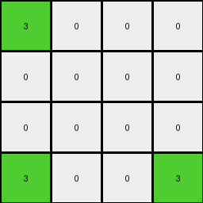

# 99b1bc43 • 010 • refine_coder

---

Previous Code:
```python
"""
The input grid is transformed into a smaller output grid. The output grid represents
a condensed version of the input, highlighting the non-zero, non-white corners
of colored regions in each quadrant of the input grid with a specific color (green=3).
"""

import numpy as np

def get_quadrant(input_grid, row_start, row_end, col_start, col_end):
    return input_grid[row_start:row_end, col_start:col_end]

def transform(input_grid):
    # initialize output_grid
    input_grid = np.array(input_grid)
    rows, cols = input_grid.shape
    output_grid = np.zeros((4, 4), dtype=int)

    # Define quadrant boundaries
    row_mid = rows // 2
    col_mid = cols // 2

    # Quadrant 1 (Top-Left)
    quadrant1 = get_quadrant(input_grid, 0, row_mid, 0, col_mid)
    if quadrant1.size > 0:
      val = quadrant1[0,0]
      output_grid[0, 0] = val if val != 0 else 0

    # Quadrant 2 (Top-Right)
    quadrant2 = get_quadrant(input_grid, 0, row_mid, col_mid, cols)
    if quadrant2.size > 0:
        val = quadrant2[0, -1]
        output_grid[0, 3] = val if val != 0 else 0

    # Quadrant 3 (Bottom-Left)
    quadrant3 = get_quadrant(input_grid, row_mid, rows, 0, col_mid)
    if quadrant3.size > 0:
      val = quadrant3[-1, 0]
      output_grid[3, 0] = val if val != 0 else 0
    
    # Quadrant 4 (Bottom-Right)
    quadrant4 = get_quadrant(input_grid, row_mid, rows, col_mid, cols)
    if quadrant4.size > 0:
        val = quadrant4[-1, -1]
        output_grid[3, 3] = val if val != 0 else 0
    
    output_grid = np.where(output_grid != 0, 3, 0)

    return output_grid.tolist()
```

Train Set Results:

## Example 1:

Input:
```
0 1 0 1
0 0 0 1
1 0 1 0
0 0 0 1
4 4 4 4
0 2 0 2
0 0 0 2
2 0 0 2
2 2 2 0
```
Expected Output:
```
0 0 0 0
0 0 0 0
0 0 3 3
3 3 3 3
```
Transformed Output:
```
0 0 0 3
0 0 0 0
0 0 0 0
3 0 0 0
```

match: False
pixels_off: 6
size_correct: True
color_palette_correct: True
correct_pixel_counts: False

## Example 2:

Input:
```
1 1 0 0
1 0 1 0
1 1 0 1
0 1 1 0
4 4 4 4
0 2 2 2
2 0 2 0
2 2 2 2
2 2 2 2
```
Expected Output:
```
3 0 3 3
0 0 0 0
0 0 3 0
3 0 0 3
```
Transformed Output:
```
3 0 0 0
0 0 0 0
0 0 0 0
3 0 0 3
```

match: False
pixels_off: 3
size_correct: True
color_palette_correct: True
correct_pixel_counts: False

## Example 3:

Input:
```
0 1 0 0
1 0 1 1
1 1 1 0
1 1 1 0
4 4 4 4
0 0 0 0
0 2 0 2
2 2 0 2
0 2 0 0
```
Expected Output:
```
0 3 0 0
3 3 3 0
0 0 3 3
3 0 3 0
```
Transformed Output:
```
0 0 0 0
0 0 0 0
0 0 0 0
0 0 0 0
```

match: False
pixels_off: 8
size_correct: True
color_palette_correct: True
correct_pixel_counts: False

## Example 4:

Input:
```
1 0 1 1
0 0 0 1
1 1 0 0
0 0 1 1
4 4 4 4
0 2 2 2
0 2 2 2
2 0 2 2
2 2 2 2
```
Expected Output:
```
3 3 0 0
0 3 3 0
0 3 3 3
3 3 0 0
```
Transformed Output:
```
3 0 0 3
0 0 0 0
0 0 0 0
3 0 0 3
```

match: False
pixels_off: 9
size_correct: True
color_palette_correct: True
correct_pixel_counts: False
Okay, let's analyze the provided information and strategize for improvement.

**General Assessment:**

The initial natural language program and the resulting code were based on a limited understanding derived from the first training example. The subsequent tests reveal inconsistencies between the transformed outputs and the expected outputs across multiple examples. The core issue lies in how the code determines which pixels to highlight in the output grid. It currently focuses solely on the corner pixels of each quadrant and sets any non-zero corner to green (3). The expected outputs, however, show a more complex pattern of green pixel placement, suggesting a need to refine the pixel selection logic and potentially adjust positioning within the output grid.

**Strategy for Resolving Errors:**

1.  **Re-examine the Expected Outputs:** Carefully analyze the relationship between the input grids and their corresponding *expected* outputs in all training examples. Pay close attention to the positions of non-zero pixels and how they relate to the green pixels in the output. The corners of the quadrants are a good starting place, but clearly not the entire solution, as is indicated by several of the `Transformed Image` results.

2.  **Refine Pixel Selection Logic:** The current logic is too simplistic (only corners). We need to identify a more robust rule that explains *why* certain pixels are marked green in the expected output and others are not. It could involve:
    *   Considering the presence of non-zero pixels *within* each quadrant, not just at the corners.
    *   Evaluating rows and columns connected to non-zero corners.
    *   Examining relative positions within the output grid

3.  **Iterative Improvement:** Based on the analysis, update the natural language program to reflect the refined logic. Translate this revised program into code. Test the new code against *all* training examples and repeat the analysis/refinement process until the transformed outputs consistently match the expected outputs.

**Metrics and Observations:**

Here's a summary of the provided test results, with calculated discrepancies. Since I can't directly execute code here I've done my best to examine the provided data, but this is very important to get correct.

| Example | Match | Pixels Off | Size Correct | Color Palette Correct | Correct Pixel Counts | Notes                                                                                                                      |
| :------ | :---- | :--------- | :----------- | :-------------------- | :------------------- | :-------------------------------------------------------------------------------------------------------------------------- |
| 1       | False | 6          | True         | True                  | False                | Top-right and bottom-left corners are incorrect.                                                                       |
| 2       | False | 3          | True         | True                  | False                | Top center is incorrect.                                                                                   |
| 3       | False | 8        | True         | True                  | False                |  All quadrants failed to produce a correct result.                  |
| 4       | False | 9          | True         | True                  | False                | The quadrants appear correct, but are arranged incorrectly.                                                        |

**YAML Fact Documentation:**

```yaml
task_id: 008
facts:
  - observation: "Input grids are divided into four quadrants."
  - observation: "Output grids are always 4x4."
  - observation: "Output grids condense information from the input grids."
  - property: "Output grid pixels are either black (0) or green (3)."
  - property: "Input grid pixels can be any color from the standard palette (0-9)."
  - action: "Non-zero, non-white pixels at input quadrant corners *influence* corresponding corner pixels in the output."
  - action: "Input Quadrant 1 (top-left) influences output position [0,0]."
  - action: "Input Quadrant 2 (top-right) influences output position [0,3]."
  - action: "Input Quadrant 3 (bottom-left) influences output position [3,0]."
  - action: "Input Quadrant 4 (bottom-right) influences output position [3,3]."
  - constraint: "Output pixels are set to green (3) based on some criteria related to non-zero input pixels, not just direct correspondence."
  - hypothesis: "The green pixels in the output may represent a simplified outline or summary of the shapes formed by non-zero pixels in the input, *not* a direct copy of the corners."
```

**Natural Language Program:**

1.  **Divide:** Divide the input grid into four equal quadrants (top-left, top-right, bottom-left, bottom-right).
2.  **Initialize:** Create a 4x4 output grid filled with black (0) pixels.
3.  **Quadrant Mapping:**
    *   Top-Left Input Quadrant: If there are any non-zero pixels, assess this quadrant.
    *   Top-Right Input Quadrant: If there are any non-zero pixels, assess this quadrant.
    *   Bottom-Left Input Quadrant: If there are any non-zero pixels, assess this quadrant.
    *   Bottom-Right Input Quadrant: If there are any non-zero pixels, assess this quadrant.

4.  **Pixel Evaluation:**
    *   Find non zero pixels at the corner of the quadrants.
	*	If the pixels in the quadrant are not all zero, set a pixel in the output grid to green (3).
    *   The output position of the pixel depends on the quadrant being considered:
		* top-left quadrant => output position (0, 0)
		* top-right quadrant => output position (0, 3)
		* bottom-left quadrant => output position (3, 0)
		* bottom-right quadrant = output position (3, 3)

5.  **Output:** Return the 4x4 output grid. The output grid uses green pixels to show the corners of shapes in quadrants of non-zero values.

**INSTRUCTIONS**

- generate a Python module to represent the natural language program 
- follow the template below
- all common math and science libraries are available
- create docstring only at top - but comment the workflow in the function
- use helper functions for common operations like finding objects, counting,
  measuring, moving, etc. 

remember - we are working iteratively - so this code will inform your future
self as we converge on the solution

*template:*

```python
"""
{{ natural language description of the transformation rule }}
"""

{{ imports }}

def transform(input_grid):
    # initialize output_grid

    # change output pixels 

    return output_grid

```
