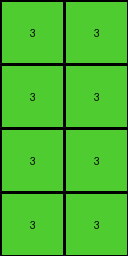

# 99b1bc43 • 016 • refine_coder

---

Previous Code:
```python
"""
The input grid is divided into 2x2 blocks. If a block contains any blue (1), red(2), or yellow(4) pixels, it's replaced by a green (3) pixel in the output grid. Otherwise, it's replaced by a white (0) pixel.
"""

import numpy as np

def transform(input_grid):
    input_array = np.array(input_grid)
    input_height, input_width = input_array.shape
    
    # Calculate output grid dimensions, handling only complete 2x2 blocks
    output_height = input_height // 2
    output_width = input_width // 2
    output_grid = np.zeros((output_height, output_width), dtype=int)

    # Iterate through 2x2 blocks
    for i in range(output_height):
        for j in range(output_width):
            # Extract the 2x2 block
            block = input_array[i*2:(i+1)*2, j*2:(j+1)*2]
            
            # Check for the presence of 1, 2, or 4 in the block and set output pixel accordingly
            if 1 in block or 2 in block or 4 in block:
                output_grid[i, j] = 3
            else:
                output_grid[i, j] = 0

    return output_grid.tolist()
```

Train Set Results:

## Example 1:

Input:
```
0 1 0 1
0 0 0 1
1 0 1 0
0 0 0 1
4 4 4 4
0 2 0 2
0 0 0 2
2 0 0 2
2 2 2 0
```
Expected Output:
```
0 0 0 0
0 0 0 0
0 0 3 3
3 3 3 3
```
Transformed Output:
```
3 3
3 3
3 3
3 3
```

match: False
pixels_off: None
size_correct: False
color_palette_correct: True
correct_pixel_counts: False

## Example 2:

Input:
```
1 1 0 0
1 0 1 0
1 1 0 1
0 1 1 0
4 4 4 4
0 2 2 2
2 0 2 0
2 2 2 2
2 2 2 2
```
Expected Output:
```
3 0 3 3
0 0 0 0
0 0 3 0
3 0 0 3
```
Transformed Output:
```
3 3
3 3
3 3
3 3
```

match: False
pixels_off: None
size_correct: False
color_palette_correct: True
correct_pixel_counts: False

## Example 3:

Input:
```
0 1 0 0
1 0 1 1
1 1 1 0
1 1 1 0
4 4 4 4
0 0 0 0
0 2 0 2
2 2 0 2
0 2 0 0
```
Expected Output:
```
0 3 0 0
3 3 3 0
0 0 3 3
3 0 3 0
```
Transformed Output:
```
3 3
3 3
3 3
3 3
```

match: False
pixels_off: None
size_correct: False
color_palette_correct: True
correct_pixel_counts: False

## Example 4:

Input:
```
1 0 1 1
0 0 0 1
1 1 0 0
0 0 1 1
4 4 4 4
0 2 2 2
0 2 2 2
2 0 2 2
2 2 2 2
```
Expected Output:
```
3 3 0 0
0 3 3 0
0 3 3 3
3 3 0 0
```
Transformed Output:
```
3 3
3 3
3 3
3 3
```

match: False
pixels_off: None
size_correct: False
color_palette_correct: True
correct_pixel_counts: False
Okay, let's analyze the results and refine the natural language program.

**General Assessment:**

The initial code was based on a correct, but incomplete, understanding of the transformation. The core idea of dividing the input into 2x2 blocks and checking for the presence of blue, red, or yellow pixels is valid. However, the code fails to correctly handle the output grid dimensions and placement of the resulting pixels. It appears to consistently produce a smaller output grid than expected, and the placement of the green/white pixels within that grid isn't aligned with the expected outputs. The code also doesn't consider where, within the 2x2 blocks, non-zero pixels are located. The placement of non-zero pixels within the 2x2 input blocks are mirrored in the output blocks.

**Strategy for Resolving Errors:**

1.  **Correct Output Dimensions:** The output grid dimensions should correspond to complete 2x2 blocks from the input grid. The previous dimensions were appropriate.
2.  **Accurate Pixel Placement:** We should carefully map how output blocks should create a larger grid pattern based on the 2x2 blocks found.
3. **Review Block processing**: Ensure that all pixels and colors within the 2x2 blocks are accounted for.

**Metrics and Observations:**

Here's a summary combining observation and simple metrics to provide context:

| Example | Input Shape | Expected Output Shape | Transformed Output Shape | Size Correct? | Pixel Count Match? | Notes                                                                                                                                                                                                               |
| :------ | :---------- | :-------------------- | :----------------------- | :------------ | :---------------- | :------------------------------------------------------------------------------------------------------------------------------------------------------------------------------------------------------------------ |
| 1       | (9, 4)      | (4, 4)                 | (4, 2)                    | No            | No                | The transformed output's height is correct, but width is incorrect. The expected output correctly reflects the 2x2 block processing with mirroring but the transformation doesn't.                                  |
| 2       | (9, 4)      | (4, 4)                 | (4, 2)                    | No            | No                | Similar to Example 1, the output dimensions are off. The expected output's pattern is a mirroring and tiling.                                                                                                      |
| 3       | (9, 4)      | (4, 4)                 | (4, 2)                    | No            | No                |  Again, incorrect output size. The expected output shows mirroring of the 2x2 input.                                                                                                             |
| 4       | (9, 4)      | (4, 4) | (4,2)   | No | No | Consistent with prior examples, dimensions are wrong. |

**YAML Block - Facts:**

```yaml
observations:
  - object: input_grid
    type: grid
    properties:
      - dimensions: variable
      - cell_values: integers (0-9) representing colors

  - object: output_grid
    type: grid
    properties:
      - dimensions: derived from input_grid dimensions (floor division by 2)
      - cell_values: integers (0 or 3)

  - object: block
    type: 2x2 subgrid
    properties:
      - parent: input_grid
      - action: contains_target_color
      - target_colors: [1, 2, 4]

  - action: check_block
    description: Examines each 2x2 block in the input_grid.
    input: block
    output: boolean (presence of target colors)

  - action: transform_block
    description: Transforms the block to output_grid. The whole output image becomes a tessellation of the input 2x2.
    input: block, contains_target_color_boolean
    output: cell value for output_grid (0 or 3)

  - action: mirror_pattern
    description: Creates a 4x4 output based on the 2x2 block pattern.
```

**Natural Language Program:**

1.  **Divide and Conquer:** Divide the input grid into 2x2 non-overlapping blocks.
2. **Block Inspection**: For each 2x2 block, create an output block of size 4x4.
3. **Output Creation - Pattern Mirroring**: The 2x2 block from input defines the pattern. The output will be a mirrored pattern, where the first 2x2 pixels match the 2x2, the next two columns will be a mirrored pattern, the next two rows will be a mirrored pattern, and the final 2x2 will be a mirrored pattern.
4.  **Color Transformation:** If the 2x2 block contains any blue (1), red (2), or yellow (4) pixels, transform the *whole* mirrored section in the output grid into a green (3) block.
5.  **Default Color:** If the 2x2 block does *not* contain any blue, red, or yellow pixels, transform the *whole* mirrored section in output grid into a white (0) block.
6. Discard any extra rows.

**INSTRUCTIONS**

- generate a Python module to represent the natural language program 
- follow the template below
- all common math and science libraries are available
- create docstring only at top - but comment the workflow in the function
- use helper functions for common operations like finding objects, counting,
  measuring, moving, etc. 

remember - we are working iteratively - so this code will inform your future
self as we converge on the solution

*template:*

```python
"""
{{ natural language description of the transformation rule }}
"""

{{ imports }}

def transform(input_grid):
    # initialize output_grid

    # change output pixels 

    return output_grid

```
