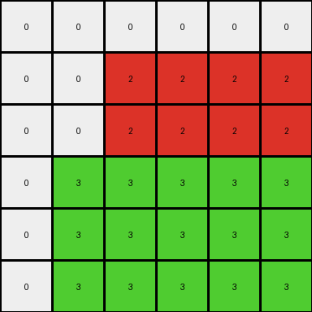
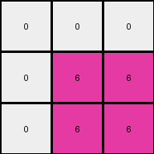
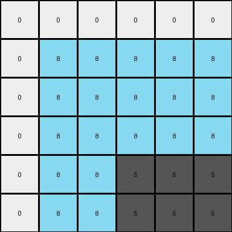
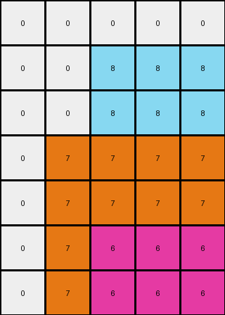

# 99fa7670 • 005 • refine_dreamer

---


Previous Code:
```python
"""
Identifies non-white pixels in the input grid and expands them to the right and down, filling their respective rows and columns in the output grid.
"""

import numpy as np

def get_non_white_pixels(grid):
    """Finds coordinates of all non-white pixels in the grid."""
    non_white_pixels = []
    for row_index, row in enumerate(grid):
        for col_index, pixel_value in enumerate(row):
            if pixel_value != 0:
                non_white_pixels.append((row_index, col_index, pixel_value))
    return non_white_pixels

def transform(input_grid):
    """Transforms the input grid by expanding non-white pixels to the right and down."""
    # Initialize output_grid as all white with the same dimensions as input
    output_grid = np.zeros_like(input_grid)
    
    # Get non-white pixels and their locations
    non_white_pixels = get_non_white_pixels(input_grid)
    
    # Iterate through the non-white pixels
    for row, col, value in non_white_pixels:
        # Fill the row to the right with the pixel's value
        output_grid[row, col:] = value
        # Fill the columns down with the pixel's value
        output_grid[row:, col:] = value
    
    return output_grid
```

Train Set Results:

## Example 1:

Input:
```
0 0 0 0 0 0
0 0 2 0 0 0
0 0 0 0 0 0
0 3 0 0 0 0
0 0 0 0 0 0
0 0 0 0 0 0
```
Expected Output:
```
0 0 0 0 0 0
0 0 2 2 2 2
0 0 0 0 0 2
0 3 3 3 3 3
0 0 0 0 0 3
0 0 0 0 0 3
```
Transformed Output:
```
0 0 0 0 0 0
0 0 2 2 2 2
0 0 2 2 2 2
0 3 3 3 3 3
0 3 3 3 3 3
0 3 3 3 3 3
```

match: False
pixels_off: 11
size_correct: True
color_palette_correct: True
correct_pixel_counts: False

## Example 2:

Input:
```
0 0 0
0 6 0
0 0 0
```
Expected Output:
```
0 0 0
0 6 6
0 0 6
```
Transformed Output:
```
0 0 0
0 6 6
0 6 6
```

match: False
pixels_off: 1
size_correct: True
color_palette_correct: True
correct_pixel_counts: False

## Example 3:

Input:
```
0 0 0 0 0 0
0 8 0 0 0 0
0 0 0 0 0 0
0 0 0 0 0 0
0 0 0 5 0 0
0 0 0 0 0 0
```
Expected Output:
```
0 0 0 0 0 0
0 8 8 8 8 8
0 0 0 0 0 8
0 0 0 0 0 8
0 0 0 5 5 5
0 0 0 0 0 5
```
Transformed Output:
```
0 0 0 0 0 0
0 8 8 8 8 8
0 8 8 8 8 8
0 8 8 8 8 8
0 8 8 5 5 5
0 8 8 5 5 5
```

match: False
pixels_off: 14
size_correct: True
color_palette_correct: True
correct_pixel_counts: False

## Example 4:

Input:
```
0 0 0 0 0
0 0 8 0 0
0 0 0 0 0
0 7 0 0 0
0 0 0 0 0
0 0 6 0 0
0 0 0 0 0
```
Expected Output:
```
0 0 0 0 0
0 0 8 8 8
0 0 0 0 8
0 7 7 7 7
0 0 0 0 7
0 0 6 6 6
0 0 0 0 6
```
Transformed Output:
```
0 0 0 0 0
0 0 8 8 8
0 0 8 8 8
0 7 7 7 7
0 7 7 7 7
0 7 6 6 6
0 7 6 6 6
```

match: False
pixels_off: 9
size_correct: True
color_palette_correct: True
correct_pixel_counts: False

**INSTRUCTIONS**

The code above was generated based on observations from the first training
example

we have tested the transform function on each of the task example inputs and
compared with the expected output

review each of the examples provided and the results and consider how the
natural language program should be updated to accommodate this new knowledge

respond with the following deliverables:

- general assessment of the information provided and strategy for resolving the
  errors
- gather metrics about each of the examples and results - use code_execution to
  develop accurate reports on your assumptions
- a YAML block documenting facts - Focus on identifying objects, their properties, and the actions performed on them.
- a natural language program - Be as clear and concise as possible, providing a complete description of the transformation rule.


your responses should be considered as information in a report - not a
conversation
