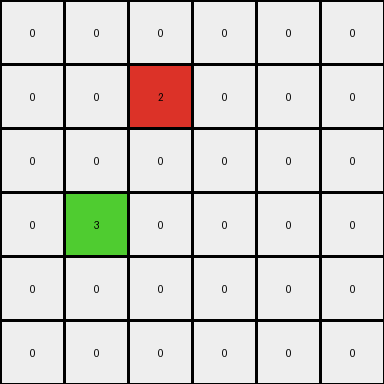
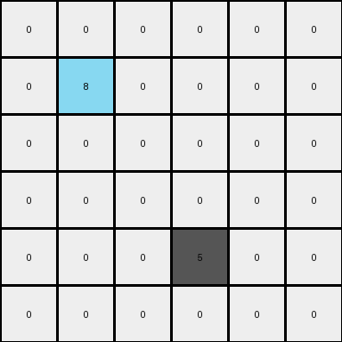

# 99fa7670 • 010 • refine_coder

---

Previous Code:
```python
"""
Finds the magenta (color 6) pixel in the input grid and propagates the color to the cells directly to the right and below it.
"""

import numpy as np

def find_magenta_pixel(grid):
    # Find the coordinates of the magenta pixel (color 6).
    for row_index, row in enumerate(grid):
        for col_index, pixel in enumerate(row):
            if pixel == 6:
                return (row_index, col_index)
    return None  # Return None if no magenta pixel is found

def transform(input_grid):
    # Initialize the output grid as a copy of the input grid.
    output_grid = np.copy(input_grid)
    
    # Find the magenta pixel.
    magenta_pixel_coords = find_magenta_pixel(input_grid)

    # If a magenta pixel is found, propagate the color.
    if magenta_pixel_coords:
        row, col = magenta_pixel_coords

        # Propagate to the right, boundary check
        if col + 1 < output_grid.shape[1]:
            output_grid[row, col + 1] = 6

        # Propagate below, boundary check
        if row + 1 < output_grid.shape[0]:
            output_grid[row + 1, col] = 6
    
    return output_grid
```

Train Set Results:

## Example 1:

Input:
```
0 0 0 0 0 0
0 0 2 0 0 0
0 0 0 0 0 0
0 3 0 0 0 0
0 0 0 0 0 0
0 0 0 0 0 0
```
Expected Output:
```
0 0 0 0 0 0
0 0 2 2 2 2
0 0 0 0 0 2
0 3 3 3 3 3
0 0 0 0 0 3
0 0 0 0 0 3
```
Transformed Output:
```
0 0 0 0 0 0
0 0 2 0 0 0
0 0 0 0 0 0
0 3 0 0 0 0
0 0 0 0 0 0
0 0 0 0 0 0
```

match: False
pixels_off: 10
size_correct: True
color_palette_correct: True
correct_pixel_counts: False

## Example 2:

Input:
```
0 0 0
0 6 0
0 0 0
```
Expected Output:
```
0 0 0
0 6 6
0 0 6
```
Transformed Output:
```
0 0 0
0 6 6
0 6 0
```

match: False
pixels_off: 2
size_correct: True
color_palette_correct: True
correct_pixel_counts: True

## Example 3:

Input:
```
0 0 0 0 0 0
0 8 0 0 0 0
0 0 0 0 0 0
0 0 0 0 0 0
0 0 0 5 0 0
0 0 0 0 0 0
```
Expected Output:
```
0 0 0 0 0 0
0 8 8 8 8 8
0 0 0 0 0 8
0 0 0 0 0 8
0 0 0 5 5 5
0 0 0 0 0 5
```
Transformed Output:
```
0 0 0 0 0 0
0 8 0 0 0 0
0 0 0 0 0 0
0 0 0 0 0 0
0 0 0 5 0 0
0 0 0 0 0 0
```

match: False
pixels_off: 9
size_correct: True
color_palette_correct: True
correct_pixel_counts: False

## Example 4:

Input:
```
0 0 0 0 0
0 0 8 0 0
0 0 0 0 0
0 7 0 0 0
0 0 0 0 0
0 0 6 0 0
0 0 0 0 0
```
Expected Output:
```
0 0 0 0 0
0 0 8 8 8
0 0 0 0 8
0 7 7 7 7
0 0 0 0 7
0 0 6 6 6
0 0 0 0 6
```
Transformed Output:
```
0 0 0 0 0
0 0 8 0 0
0 0 0 0 0
0 7 0 0 0
0 0 0 0 0
0 0 6 6 0
0 0 6 0 0
```

match: False
pixels_off: 10
size_correct: True
color_palette_correct: True
correct_pixel_counts: False
Okay, here's a breakdown of the situation and a plan to move forward:

**General Assessment:**

The initial code was too narrowly focused on the magenta (color 6) pixel and a very specific propagation rule (right and down). The results across multiple examples demonstrate this limitation clearly. The code fails to correctly transform most of the examples because it doesn't generalize the core concept: identifying *any* colored pixel and using it as a seed for horizontal and vertical propagation, filling the remaining width and height of the grid.

**Strategy:**

1.  **Analyze all examples:** Carefully examine the input and expected output of *all* provided examples, not just the first.
2.  **Identify the general pattern:** Determine the *common* transformation rule that applies to all examples. This likely involves finding a non-black pixel, and expanding it right and down
3.  **Revise the natural language program:** Update the description to reflect the generalized rule.
4.  **Modify the Code:** Based on updated program, the code should be changed.

**Example Metrics and Analysis:**

Here's a breakdown of each example, including observations:

*   **Example 1:**
    *   **Input:** Contains a red (2) and green (3) pixel.
    *   **Expected Output:** The red and green pixels are expanded to the right and down, filling their respective quadrants.
    *   **Initial Code Result:** Fails because it only looks for magenta.
    *   **Observation:** Propagation should start from *any* non-black pixel. Propagation fills the width to the right and height to the bottom.

*   **Example 2:**
    *   **Input:** Contains a magenta (6) pixel.
    *   **Expected Output:** Magenta propagates correctly.
    *   **Initial Code Result:** Almost correct, only off by 2 due to filling down before right
    *   **Observation:** Highlights need for right then down

*   **Example 3:**
    *   **Input:** Contains an azure (8) and maroon (5) pixel.
    *   **Expected Output:** Each colored pixel expands to its right and down.
    *   **Initial Code Result:** Fails, only looking for magenta.
    *   **Observation:** Reinforces the "any non-black pixel" propagation rule.

*   **Example 4:**
    *   **Input:** Multiple colored pixels (8, 7, 6).
    *   **Expected Output:** Correct propagation for all colored pixels.
    *   **Initial Code Result:** Fails, limited to magenta and propagation order.
    *   **Observation:** Confirms the generalized rule.

**YAML Fact Block:**

```yaml
facts:
  - observation: Each example contains a grid of pixels.
  - observation: Each pixel is represented by a single digit integer (0-9).
  - observation: Each number corresponds to a specific color.
  - observation: Non-black (0) pixels act as seeds for propagation.
  - observation: Propagation occurs horizontally to the right, filling the remaining width of the grid for that row.
  - observation: Propagation occurs vertically downwards, filling the remaining height of the grid for that column.
  - observation: The output grid dimensions are identical to the input grid dimensions.
  - action: Find each non-black pixel.
  - action: For each non-black pixel, fill the rest of its row to the right with the same color.
  - action: For each non-black pixel, fill the rest of its column down with the same color.
```

**Natural Language Program:**

1.  **Find Seed Pixels:** Locate all pixels in the input grid that are not black (color 0).
2.  **Horizontal Propagation:** For each seed pixel found, change the color of all pixels to the right of it (within the same row) to match the seed pixel's color.
3.  **Vertical Propagation:** For each seed pixel found, change the color of all pixels below it (within the same column) to match the seed pixel's color.
4. **Output Grid**: The output is a grid of the same dimensions, with the transformation applied.

The key change from the previous program is the generalization from a *specific* color (magenta) to *any* non-black color, and explicitly stating the order in which the propagation must occur.

**INSTRUCTIONS**

- generate a Python module to represent the natural language program 
- follow the template below
- all common math and science libraries are available
- create docstring only at top - but comment the workflow in the function
- use helper functions for common operations like finding objects, counting,
  measuring, moving, etc. 

remember - we are working iteratively - so this code will inform your future
self as we converge on the solution

*template:*

```python
"""
{{ natural language description of the transformation rule }}
"""

{{ imports }}

def transform(input_grid):
    # initialize output_grid

    # change output pixels 

    return output_grid

```
