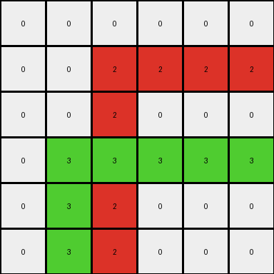
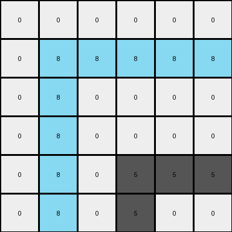
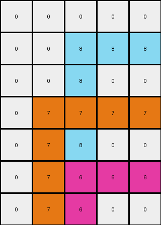

# 99fa7670 • 012 • refine_coder

---

Previous Code:
```python
"""
Finds all non-black (non-zero) pixels in the input grid and propagates their color to the cells to the right and below them, effectively filling rectangles.
"""

import numpy as np

def find_seed_pixels(grid):
    # Find the coordinates of all non-black pixels.
    seed_pixels = []
    for row_index, row in enumerate(grid):
        for col_index, pixel in enumerate(row):
            if pixel != 0:
                seed_pixels.append((row_index, col_index))
    return seed_pixels

def transform(input_grid):
    # Initialize the output grid as a copy of the input grid.
    output_grid = np.copy(input_grid)
    
    # Find all non-black seed pixels.
    seed_pixels = find_seed_pixels(input_grid)

    # Iterate through each seed pixel and propagate its color.
    for row, col in seed_pixels:
        color = input_grid[row, col]

        # Propagate to the right.
        output_grid[row, col:] = color

        # Propagate below.
        output_grid[row:, col] = color
    
    return output_grid
```

Train Set Results:

## Example 1:

Input:
```
0 0 0 0 0 0
0 0 2 0 0 0
0 0 0 0 0 0
0 3 0 0 0 0
0 0 0 0 0 0
0 0 0 0 0 0
```
Expected Output:
```
0 0 0 0 0 0
0 0 2 2 2 2
0 0 0 0 0 2
0 3 3 3 3 3
0 0 0 0 0 3
0 0 0 0 0 3
```
Transformed Output:
```
0 0 0 0 0 0
0 0 2 2 2 2
0 0 2 0 0 0
0 3 3 3 3 3
0 3 2 0 0 0
0 3 2 0 0 0
```

match: False
pixels_off: 8
size_correct: True
color_palette_correct: True
correct_pixel_counts: False

## Example 2:

Input:
```
0 0 0
0 6 0
0 0 0
```
Expected Output:
```
0 0 0
0 6 6
0 0 6
```
Transformed Output:
```
0 0 0
0 6 6
0 6 0
```

match: False
pixels_off: 2
size_correct: True
color_palette_correct: True
correct_pixel_counts: True

## Example 3:

Input:
```
0 0 0 0 0 0
0 8 0 0 0 0
0 0 0 0 0 0
0 0 0 0 0 0
0 0 0 5 0 0
0 0 0 0 0 0
```
Expected Output:
```
0 0 0 0 0 0
0 8 8 8 8 8
0 0 0 0 0 8
0 0 0 0 0 8
0 0 0 5 5 5
0 0 0 0 0 5
```
Transformed Output:
```
0 0 0 0 0 0
0 8 8 8 8 8
0 8 0 0 0 0
0 8 0 0 0 0
0 8 0 5 5 5
0 8 0 5 0 0
```

match: False
pixels_off: 8
size_correct: True
color_palette_correct: True
correct_pixel_counts: False

## Example 4:

Input:
```
0 0 0 0 0
0 0 8 0 0
0 0 0 0 0
0 7 0 0 0
0 0 0 0 0
0 0 6 0 0
0 0 0 0 0
```
Expected Output:
```
0 0 0 0 0
0 0 8 8 8
0 0 0 0 8
0 7 7 7 7
0 0 0 0 7
0 0 6 6 6
0 0 0 0 6
```
Transformed Output:
```
0 0 0 0 0
0 0 8 8 8
0 0 8 0 0
0 7 7 7 7
0 7 8 0 0
0 7 6 6 6
0 7 6 0 0
```

match: False
pixels_off: 9
size_correct: True
color_palette_correct: True
correct_pixel_counts: False
Here's a breakdown of the results, an assessment of the strategy, and the requested deliverables:

**General Assessment:**

The initial strategy of propagating color to the right and below from non-black seed pixels is partially correct but incomplete. It correctly identifies the "seed" pixels (non-black pixels) and attempts to extend their color. However, it incorrectly propagates colors *both* to the right *and* below *independently*, leading to an overlapping effect that doesn't match the expected outputs. The core issue is that the propagation should stop when it encounters the next seed pixel. It seems the propagation should create some form of rectangles defined by upper-left corners.

**Strategy for Resolving Errors:**

1.  **Refine Propagation Logic:** Instead of propagating indefinitely to the right and below, we need to define the boundaries of the propagation. The propagation from a seed pixel should only extend to the right until the next seed pixel or the edge of the input and should extent down until the next seed pixel is encountered.
2.  **Consider Diagonals (Not needed):** In an earlier iteration, it was hypothesized diagonal seeding could be the case, it is not, ignore.

**Example Metrics and Analysis:**

Here's an analysis, focusing on the objects and transformations:

*   **Example 1:**
    *   **Objects:** Two seed pixels: (1,2) color red (2), and (3,1) color green (3).
    *   **Transformation:**  The red seed extends to create rectangle of size (2x4), and the green a rectangle of size (4x4). The function's propagation goes both right and down *at the same time* and overlaps.
    *   **Error:** Overlapping propagation, creating the wrong filled rectangles.
*   **Example 2:**
    *   **Objects:** One seed pixel: (1, 1) color magenta (6)
    *   **Transformation:** Forms a rectangle of size (2x2).
    *    **Error:** Propagation error similar to example 1, down and right.
*   **Example 3:**
    *   **Objects:** Two seed pixels: (1, 1) color azure (8), and (4, 3) color gray (5).
    *   **Transformation:** Forms rectangle size (4x5) for azure, and (2,3) for gray.
    *   **Error:** Similar issue to example 1 - overlap and propagation.
*   **Example 4:**
    *   **Objects:** Three seed pixels: (1,2) color azure(8), (3,1) color orange(7), and (5,2) color magenta(6).
    *    **Transformation:** Forms rectangle sizes of (2x3) for azure, (4x4) for orange, and (2x3) for magenta.
    *   **Error:** Overlap and incorrect propagation.

**YAML Fact Block:**

```yaml
task: 010
observations:
  - type: object_identification
    description: Non-black pixels act as seed points for rectangles.
    seed_pixels:
      - example_1: [(1, 2), (3, 1)]
        colors: [2, 3]
      - example_2: [(1, 1)]
        colors: [6]
      - example_3: [(1, 1), (4, 3)]
        colors: [8, 5]
      - example_4: [(1, 2), (3, 1), (5, 2)]
        colors: [8, 7, 6]

  - type: transformation_rule
    description: Each seed pixel's color defines the color of an upper-left defined rectangle.
    details:
      - The rectangle extends to the right until it encounters another seed pixel or the image boundary.
      - The rectangle extends downwards until it encounters the another seed pixel or the image boundary.
      - If a pixel is part of more than one rectangle, the upper-left most seed pixel determines the final color.

  - type: error_analysis
    description: Current code propagates color down and right simultaneously, creating incorrectly sized shapes.

```

**Natural Language Program:**

1.  **Identify Seed Pixels:** Find all pixels in the input grid that are not black (value 0). These are the "seed" pixels.
2.  **Iterate Through Seeds:** For each seed pixel:
    *   Determine the color of the seed pixel.
    *    Iterate through the pixels to the right starting from the current seed and fill in the current seed color, until the next non-zero pixel or boundary is hit.
    *    Iterate through the pixels below starting from the current seed and fill in the current seed color, until the next non-zero pixel or boundary is hit.

This program describes the "upper-left rectangle" filling behavior observed in the examples. The key improvement is explicitly stopping at the next non-zero pixel or boundary, rather than propagating infinitely.

**INSTRUCTIONS**

- generate a Python module to represent the natural language program 
- follow the template below
- all common math and science libraries are available
- create docstring only at top - but comment the workflow in the function
- use helper functions for common operations like finding objects, counting,
  measuring, moving, etc. 

remember - we are working iteratively - so this code will inform your future
self as we converge on the solution

*template:*

```python
"""
{{ natural language description of the transformation rule }}
"""

{{ imports }}

def transform(input_grid):
    # initialize output_grid

    # change output pixels 

    return output_grid

```
