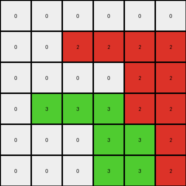
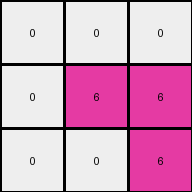
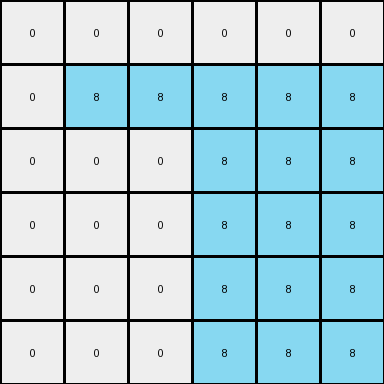
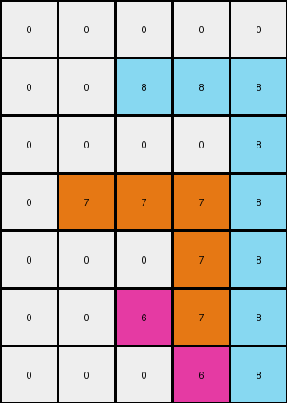

# 99fa7670 • 024 • refine_coder

---

Previous Code:
```python
"""
1.  **Identify Non-White Pixels:** Iterate through each pixel in the input grid. If a pixel is not white (color code 0), proceed to the next step.
2.  **Expand to the Right:** For each non-white pixel, change the color of the pixels to its right, in the same row, to be the same color, until the end of the row is reached or another non-white pixel is encountered.
3.  **Drop Down:** The last pixel filled during step two should then be used as the color for all cells below it, within its column, until the last row is reached.
4.  **Output:** The resulting grid after applying steps 1-3 is the final output.
"""

import numpy as np

def transform(input_grid):
    # initialize output_grid
    output_grid = np.copy(input_grid)
    rows, cols = output_grid.shape

    # iterate through each pixel in the grid
    for r in range(rows):
        for c in range(cols):
            # Identify Non-White Pixels
            if output_grid[r, c] != 0:
                # Expand to the Right
                current_color = output_grid[r, c]
                c2_end = cols # init end column
                for c2 in range(c + 1, cols):
                    if output_grid[r, c2] == 0:
                        output_grid[r, c2] = current_color
                    else:
                        c2_end = c2
                        break  # Stop expansion if a non-white pixel is encountered
                # Drop Down
                if c2_end == cols:
                    c2_end -= 1
                
                for r2 in range(r + 1, rows):
                  output_grid[r2,c2_end] = current_color

    return output_grid
```

Train Set Results:

## Example 1:

Input:
```
0 0 0 0 0 0
0 0 2 0 0 0
0 0 0 0 0 0
0 3 0 0 0 0
0 0 0 0 0 0
0 0 0 0 0 0
```
Expected Output:
```
0 0 0 0 0 0
0 0 2 2 2 2
0 0 0 0 0 2
0 3 3 3 3 3
0 0 0 0 0 3
0 0 0 0 0 3
```
Transformed Output:
```
0 0 0 0 0 0
0 0 2 2 2 2
0 0 0 0 2 2
0 3 3 3 2 2
0 0 0 3 3 2
0 0 0 3 3 2
```

match: False
pixels_off: 9
size_correct: True
color_palette_correct: True
correct_pixel_counts: False

## Example 2:

Input:
```
0 0 0
0 6 0
0 0 0
```
Expected Output:
```
0 0 0
0 6 6
0 0 6
```
Transformed Output:
```
0 0 0
0 6 6
0 0 6
```

match: True
pixels_off: 0
size_correct: True
color_palette_correct: True
correct_pixel_counts: True

## Example 3:

Input:
```
0 0 0 0 0 0
0 8 0 0 0 0
0 0 0 0 0 0
0 0 0 0 0 0
0 0 0 5 0 0
0 0 0 0 0 0
```
Expected Output:
```
0 0 0 0 0 0
0 8 8 8 8 8
0 0 0 0 0 8
0 0 0 0 0 8
0 0 0 5 5 5
0 0 0 0 0 5
```
Transformed Output:
```
0 0 0 0 0 0
0 8 8 8 8 8
0 0 0 8 8 8
0 0 0 8 8 8
0 0 0 8 8 8
0 0 0 8 8 8
```

match: False
pixels_off: 10
size_correct: True
color_palette_correct: True
correct_pixel_counts: False

## Example 4:

Input:
```
0 0 0 0 0
0 0 8 0 0
0 0 0 0 0
0 7 0 0 0
0 0 0 0 0
0 0 6 0 0
0 0 0 0 0
```
Expected Output:
```
0 0 0 0 0
0 0 8 8 8
0 0 0 0 8
0 7 7 7 7
0 0 0 0 7
0 0 6 6 6
0 0 0 0 6
```
Transformed Output:
```
0 0 0 0 0
0 0 8 8 8
0 0 0 0 8
0 7 7 7 8
0 0 0 7 8
0 0 6 7 8
0 0 0 6 8
```

match: False
pixels_off: 7
size_correct: True
color_palette_correct: True
correct_pixel_counts: False
Okay, here's a breakdown of the situation, the results, and the updated natural language program:

**General Assessment:**

The initial natural language program and the generated code were on the right track, implementing a "right-fill" and "drop-down" logic. However, the "drop-down" component isn't working quite correctly. It appears to be filling down *from the last filled cell during right-filling*, rather than stopping the drop at the next non-zero element below. Example 1, 3 and 4 clearly shows this error, with colors continuing to propagate downwards incorrectly.

**Strategy for Resolving Errors:**

1.  **Refine Drop-Down Logic:** The core issue is in the "drop-down" part of the algorithm. The current implementation doesn't correctly handle the presence of existing colored pixels *below* the horizontally filled section, it should stop when it finds a non-zero.

**Example Metrics and Observations:**

Here's a more detailed breakdown of what happened in each example:

*   **Example 1:**
    *   **Observation:** The red (2) expands correctly to the right. However, the drop-down fills all the way to the bottom, crossing over the green section. The same error applies to green.

*   **Example 2:**
    *   **Observation:** This example works perfectly because there are no other colors below the magenta (6).

*   **Example 3:**
    *   **Observation:** Azure expands to the right correctly, however, it drops down to the bottom of the grid instead of stopping at the row above yellow. Similar issue on the yellow line.

*   **Example 4:**
    *   **Observation:** The cascading errors are apparent, drop stops at the next color only by chance.

**YAML Fact Block:**

```yaml
facts:
  - description: "Non-white pixels initiate a horizontal fill to the right."
    type: "object_behavior"
  - description: "Horizontal fill stops at the edge of the grid or another non-white pixel."
    type: "constraint"
  - description: "The last filled pixel of the horizontal fill then fills vertically downwards."
    type: "object_behavior"
  - description: "Vertical filling stops when it encounter a non-white pixel"
    type: "constraint"
  - description: "The input grid contains multiple colored pixels."
    type: "grid_property"
  - description: The output grid dimensions are the same as the input grid.
    type: "grid_property"
```

**Natural Language Program:**

1.  **Identify Non-White Pixels:** Examine each pixel in the input grid. If a pixel is *not* white (color 0), it triggers a fill operation.

2.  **Horizontal Fill (Right):** Starting from the non-white pixel, change the color of the pixels to its *right*, within the *same row*, to the same color. Stop this horizontal fill when either:
    *   The edge of the grid is reached.
    *   Another non-white pixel is encountered.

3.  **Vertical Fill (Down):** Using the *last pixel filled* during the horizontal fill, change the color of the pixels directly *below* it, in the *same column*, to be the same color. Stop the vertical fill when either:
    * The edge of the grid (last row) is reached
    * A non-white cell is encountered.

4.  **Output:** The resulting grid after applying steps 1-3 is the final output.

**INSTRUCTIONS**

- generate a Python module to represent the natural language program 
- follow the template below
- all common math and science libraries are available
- create docstring only at top - but comment the workflow in the function
- use helper functions for common operations like finding objects, counting,
  measuring, moving, etc. 

remember - we are working iteratively - so this code will inform your future
self as we converge on the solution

*template:*

```python
"""
{{ natural language description of the transformation rule }}
"""

{{ imports }}

def transform(input_grid):
    # initialize output_grid

    # change output pixels 

    return output_grid

```
