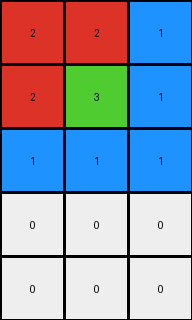

# 9af7a82c • 005 • refine_dreamer

---


Previous Code:
```python
"""
1.  **Determine Output Dimensions:** The output grid has the same number of columns as the input grid. The number of rows in the output grid is equal to the number of rows in the input grid plus 2.

2.  **Column-wise Transformation:**  For each column in the input grid, perform the following steps to create the corresponding column in the output grid:

    a. **Extract Input Column:** Get all values from the current column of the input grid.

    b. **Reorder Values:** Treat the non zero values in the input column as the ordering.

    c. **Pad with Zeros:** Fill any remaining cells in the output column (after placing the reordered values) with the value 0 (representing the color white).

3.  **Assemble Output:** Combine the transformed columns to form the complete output grid.
"""

import numpy as np

def transform(input_grid):
    # initialize output_grid
    input_grid = np.array(input_grid)
    output_height =  input_grid.shape[0] + 2
    output_width = input_grid.shape[1]
    output_grid = np.zeros((output_height, output_width), dtype=int)

    # change output pixels
    for j in range(input_grid.shape[1]):
        # Get the values from the input column
        input_column_values = input_grid[:, j]

        # Get non-zero values and their original indices.
        non_zero_values = input_column_values[input_column_values != 0]

        # build output col
        output_col = np.concatenate([non_zero_values, np.zeros(output_height - len(non_zero_values), dtype=int)])

        # write col to output
        output_grid[:, j] = output_col


    return output_grid.tolist()
```

Train Set Results:

## Example 1:

Input:
```
2 2 1
2 3 1
1 1 1
```
Expected Output:
```
1 2 3
1 2 0
1 2 0
1 0 0
1 0 0
```
Transformed Output:
```
2 2 1
2 3 1
1 1 1
0 0 0
0 0 0
```

match: False
pixels_off: 9
size_correct: True
color_palette_correct: True
correct_pixel_counts: True

## Example 2:

Input:
```
3 1 1 4
2 2 2 4
4 4 4 4
```
Expected Output:
```
4 2 1 3
4 2 1 0
4 2 0 0
4 0 0 0
4 0 0 0
4 0 0 0
```
Transformed Output:
```
3 1 1 4
2 2 2 4
4 4 4 4
0 0 0 0
0 0 0 0
```

match: False
pixels_off: None
size_correct: False
color_palette_correct: True
correct_pixel_counts: False

## Example 3:

Input:
```
8 8 2
3 8 8
3 3 4
3 3 4
```
Expected Output:
```
3 8 4 2
3 8 4 0
3 8 0 0
3 8 0 0
3 0 0 0
```
Transformed Output:
```
8 8 2
3 8 8
3 3 4
3 3 4
0 0 0
0 0 0
```

match: False
pixels_off: None
size_correct: False
color_palette_correct: True
correct_pixel_counts: False

## Example 4:

Input:
```
1 1 1
2 2 1
2 8 1
2 8 1
```
Expected Output:
```
1 2 8
1 2 8
1 2 0
1 2 0
1 0 0
1 0 0
```
Transformed Output:
```
1 1 1
2 2 1
2 8 1
2 8 1
0 0 0
0 0 0
```

match: False
pixels_off: 12
size_correct: True
color_palette_correct: True
correct_pixel_counts: True

**INSTRUCTIONS**

The code above was generated based on observations from the first training
example

we have tested the transform function on each of the task example inputs and
compared with the expected output

review each of the examples provided and the results and consider how the
natural language program should be updated to accommodate this new knowledge

respond with the following deliverables:

- general assessment of the information provided and strategy for resolving the
  errors
- gather metrics about each of the examples and results - use code_execution to
  develop accurate reports on your assumptions
- a YAML block documenting facts - Focus on identifying objects, their properties, and the actions performed on them.
- a natural language program - Be as clear and concise as possible, providing a complete description of the transformation rule.


your responses should be considered as information in a report - not a
conversation
