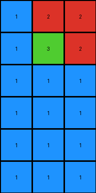
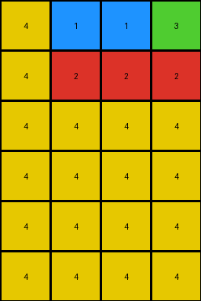
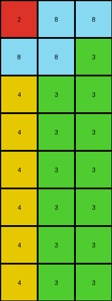
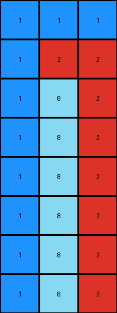

# 9af7a82c • 009 • refine_dreamer

---


Previous Code:
```python
"""
The transformation reverses the order of columns, expands to left with repeats of the input row, and fills the remaining space with 0.
"""

import numpy as np

def transform(input_grid):
    # initialize output_grid
    input_height, input_width = input_grid.shape
    output_grid = np.zeros((input_height * 2, input_width), dtype=int)

    # Reverse Column Order and Column-wise Transformation
    for i in range(input_width):
        # reversed column index
        rev_col_index = input_width - 1 - i
        
        # copy input column into the expanded output grid
        for row in range(input_height):
            output_grid[row, rev_col_index] = input_grid[row, i]
            for j in range(input_height*2):
                # find left-most non zero column
                left_most_non_zero = 0
                for col_to_fill in range(input_width):
                    if output_grid[row,col_to_fill] != 0:
                        left_most_non_zero = col_to_fill
                        break

                if j >= row and j < input_height*2 and rev_col_index < input_width:
                  output_grid[j,left_most_non_zero] = input_grid[row,i]


    return output_grid
```

Train Set Results:

## Example 1:

Input:
```
2 2 1
2 3 1
1 1 1
```
Expected Output:
```
1 2 3
1 2 0
1 2 0
1 0 0
1 0 0
```
Transformed Output:
```
1 2 2
1 3 2
1 1 1
1 1 1
1 1 1
1 1 1
```

match: False
pixels_off: None
size_correct: False
color_palette_correct: True
correct_pixel_counts: False

## Example 2:

Input:
```
3 1 1 4
2 2 2 4
4 4 4 4
```
Expected Output:
```
4 2 1 3
4 2 1 0
4 2 0 0
4 0 0 0
4 0 0 0
4 0 0 0
```
Transformed Output:
```
4 1 1 3
4 2 2 2
4 4 4 4
4 4 4 4
4 4 4 4
4 4 4 4
```

match: False
pixels_off: 15
size_correct: True
color_palette_correct: True
correct_pixel_counts: False

## Example 3:

Input:
```
8 8 2
3 8 8
3 3 4
3 3 4
```
Expected Output:
```
3 8 4 2
3 8 4 0
3 8 0 0
3 8 0 0
3 0 0 0
```
Transformed Output:
```
2 8 8
8 8 3
4 3 3
4 3 3
4 3 3
4 3 3
4 3 3
4 3 3
```

match: False
pixels_off: None
size_correct: False
color_palette_correct: True
correct_pixel_counts: False

## Example 4:

Input:
```
1 1 1
2 2 1
2 8 1
2 8 1
```
Expected Output:
```
1 2 8
1 2 8
1 2 0
1 2 0
1 0 0
1 0 0
```
Transformed Output:
```
1 1 1
1 2 2
1 8 2
1 8 2
1 8 2
1 8 2
1 8 2
1 8 2
```

match: False
pixels_off: None
size_correct: False
color_palette_correct: True
correct_pixel_counts: False

**INSTRUCTIONS**

The code above was generated based on observations from the first training
example

we have tested the transform function on each of the task example inputs and
compared with the expected output

review each of the examples provided and the results and consider how the
natural language program should be updated to accommodate this new knowledge

respond with the following deliverables:

- general assessment of the information provided and strategy for resolving the
  errors
- gather metrics about each of the examples and results - use code_execution to
  develop accurate reports on your assumptions
- a YAML block documenting facts - Focus on identifying objects, their properties, and the actions performed on them.
- a natural language program - Be as clear and concise as possible, providing a complete description of the transformation rule.


your responses should be considered as information in a report - not a
conversation
