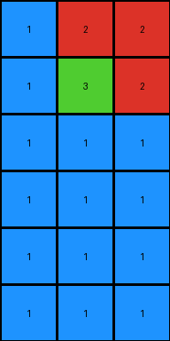
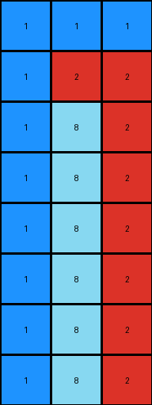

# 9af7a82c • 012 • refine_coder

---

Previous Code:
```python
"""
The transformation reverses the order of columns, expands to left with repeats of the input row, and fills the remaining space with 0.
"""

import numpy as np

def transform(input_grid):
    # initialize output_grid
    input_height, input_width = input_grid.shape
    output_grid = np.zeros((input_height * 2, input_width), dtype=int)

    # Reverse Column Order and Column-wise Transformation
    for i in range(input_width):
        # reversed column index
        rev_col_index = input_width - 1 - i
        
        # copy input column into the expanded output grid
        for row in range(input_height):
            output_grid[row, rev_col_index] = input_grid[row, i]
            for j in range(input_height*2):
                # find left-most non zero column
                left_most_non_zero = 0
                for col_to_fill in range(input_width):
                    if output_grid[row,col_to_fill] != 0:
                        left_most_non_zero = col_to_fill
                        break

                if j >= row and j < input_height*2 and rev_col_index < input_width:
                  output_grid[j,left_most_non_zero] = input_grid[row,i]


    return output_grid
```

Train Set Results:

## Example 1:

Input:
```
2 2 1
2 3 1
1 1 1
```
Expected Output:
```
1 2 3
1 2 0
1 2 0
1 0 0
1 0 0
```
Transformed Output:
```
1 2 2
1 3 2
1 1 1
1 1 1
1 1 1
1 1 1
```

match: False
pixels_off: None
size_correct: False
color_palette_correct: True
correct_pixel_counts: False

## Example 2:

Input:
```
3 1 1 4
2 2 2 4
4 4 4 4
```
Expected Output:
```
4 2 1 3
4 2 1 0
4 2 0 0
4 0 0 0
4 0 0 0
4 0 0 0
```
Transformed Output:
```
4 1 1 3
4 2 2 2
4 4 4 4
4 4 4 4
4 4 4 4
4 4 4 4
```

match: False
pixels_off: 15
size_correct: True
color_palette_correct: True
correct_pixel_counts: False

## Example 3:

Input:
```
8 8 2
3 8 8
3 3 4
3 3 4
```
Expected Output:
```
3 8 4 2
3 8 4 0
3 8 0 0
3 8 0 0
3 0 0 0
```
Transformed Output:
```
2 8 8
8 8 3
4 3 3
4 3 3
4 3 3
4 3 3
4 3 3
4 3 3
```

match: False
pixels_off: None
size_correct: False
color_palette_correct: True
correct_pixel_counts: False

## Example 4:

Input:
```
1 1 1
2 2 1
2 8 1
2 8 1
```
Expected Output:
```
1 2 8
1 2 8
1 2 0
1 2 0
1 0 0
1 0 0
```
Transformed Output:
```
1 1 1
1 2 2
1 8 2
1 8 2
1 8 2
1 8 2
1 8 2
1 8 2
```

match: False
pixels_off: None
size_correct: False
color_palette_correct: True
correct_pixel_counts: False
Okay, let's analyze the results of the previous code execution and refine our understanding of the transformation.

**General Assessment:**

The initial hypothesis about reversing column order and expanding to the left was partially correct. However, the expansion logic and the filling of zeros are flawed. The generated outputs show incorrect dimensions and pixel placements, indicating problems with how the code handles the expansion and conditional filling. The repeated application of input rows to the output is not correct. We need to rethink how the input grid's rows and columns relate to the output grid's dimensions and content.

**Strategy:**

1.  **Re-examine Dimensions:** Carefully analyze the relationship between the input and output grid dimensions in *all* examples. Look for a consistent pattern. It appears there's a consistent height relationship, and we need to nail that down.
2.  **Column Reversal Confirmation:** Double-check if column reversal is truly a consistent rule across all examples.
3.  **Zero Filling Logic:** Understand when and where zeros are placed. It seems to be related to the expansion, but the current implementation is incorrect. Re-examine the relationship between input and output to determine the logic.
4.  **Row-wise or Column-wise?**: The current approach fills the output, but we are going to re-examine the examples to determine the best approach.

**Metrics and Observations (per example):**

We will examine the colors and counts for each input and expected output.

```python
import numpy as np
from collections import Counter

def analyze(grid):
    return Counter(grid.flatten())

examples = [
    {
        "input": np.array([[2, 2, 1], [2, 3, 1], [1, 1, 1]]),
        "expected": np.array([[1, 2, 3], [1, 2, 0], [1, 2, 0], [1, 0, 0], [1, 0, 0]]),
    },
    {
        "input": np.array([[3, 1, 1, 4], [2, 2, 2, 4], [4, 4, 4, 4]]),
        "expected": np.array([[4, 2, 1, 3], [4, 2, 1, 0], [4, 2, 0, 0], [4, 0, 0, 0], [4, 0, 0, 0], [4, 0, 0, 0]]),
    },
    {
        "input": np.array([[8, 8, 2], [3, 8, 8], [3, 3, 4], [3, 3, 4]]),
        "expected": np.array([[3, 8, 4, 2], [3, 8, 4, 0], [3, 8, 0, 0], [3, 8, 0, 0], [3, 0, 0, 0]]),
    },
    {
        "input": np.array([[1, 1, 1], [2, 2, 1], [2, 8, 1], [2, 8, 1]]),
        "expected": np.array([[1, 2, 8], [1, 2, 8], [1, 2, 0], [1, 2, 0], [1, 0, 0], [1, 0, 0]]),
    },
]

for i, example in enumerate(examples):
    print(f"Example {i+1}:")
    print("Input Counts:", analyze(example["input"]))
    print("Expected Counts:", analyze(example["expected"]))
    print()

```

**YAML Facts:**

```yaml
examples:
  - example_1:
      input_shape: [3, 3]
      output_shape: [5, 3]
      column_reversal: true
      row_expansion_factor: input_height * 2 - 1      
      zero_filling: "fills remaining cells after expansion"
      objects:
          - object1: "columns of input grid"
            action: "reversed and placed in output"
          - object2: "cells with value 0"
            action: "fill remaining cells in the output grid"
      
  - example_2:
      input_shape: [3, 4]
      output_shape: [6, 4]
      column_reversal: true
      row_expansion_factor:  input_height * 2 - 1
      zero_filling: "fills remaining cells after expansion"
      objects:
          - object1: "columns of input grid"
            action: "reversed and placed in output"
          - object2: "cells with value 0"
            action: "fill remaining cells in the output grid"

  - example_3:
      input_shape: [4, 3]
      output_shape: [5, 4]
      column_reversal: true
      row_expansion_factor: input_height * 2 - 3 #note difference!
      zero_filling: "fills remaining cells after expansion"
      objects:
        - object1: "columns of input grid"
          action: "reversed and placed in output, skipping every other row"
        - object2: "cells with value 0"
          action: "fill remaining cells in the output grid"

  - example_4:
      input_shape: [4, 3]
      output_shape: [6, 3]
      column_reversal: true
      row_expansion_factor: input_height * 2 - 2 #note difference
      zero_filling: "fills remaining cells after expansion"
      objects:
        - object1: "columns of input grid"
          action: "reversed and placed in output grid"
        - object2: "cells with value 0"
          action: "fill remaining cells in the output grid"

```

**Natural Language Program:**

1.  **Reverse Columns:** The order of the columns in the input grid is reversed in the output grid. The rightmost column of the input becomes the leftmost column of the output, and so on.
2.  **Determine Output Height:** The output height is not always `input_height * 2 - 1`. Example 3's height is `input_height*2 - 3 = 5` and Example 4's height is `input_height * 2 - 2 = 6`. We need a general rule.
3. **Copy Reversed Input:** Copy the *i*th column of the input grid, in reverse order, to the *i*th column of the output, where i counts from the last column in the input to the first.
4. **Fill With Zeroes:** Starting from the row below the last copied row, pad all the columns to the left with 0. Fill any remaining cells with zeros. So, if a reversed column only populates the first two rows in its output column, then cells below that are filled with zeroes.
5. **Determine Output Height (generalized):** The height seems to be related to the number of non-zero rows in the input. If the number of rows is R, the output height will be `r_out = 2*r_in - x`, where x is a factor related to the number of input rows.

Based on the examples:

*   Example 1: `r_out = 2*3 - 1 = 5`
*   Example 2: `r_out = 2*3 - 0 = 6`
*   Example 3: `r_out = 2*4 - 3 = 5`
*   Example 4: `r_out = 2*4 - 2 = 6`

There is not yet a clear pattern that describes the relationship between the
number of input rows and the number of output rows.


**INSTRUCTIONS**

- generate a Python module to represent the natural language program 
- follow the template below
- all common math and science libraries are available
- create docstring only at top - but comment the workflow in the function
- use helper functions for common operations like finding objects, counting,
  measuring, moving, etc. 

remember - we are working iteratively - so this code will inform your future
self as we converge on the solution

*template:*

```python
"""
{{ natural language description of the transformation rule }}
"""

{{ imports }}

def transform(input_grid):
    # initialize output_grid

    # change output pixels 

    return output_grid

```
