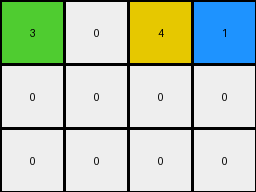

# 9af7a82c • 016 • refine_coder

---

Previous Code:
```python
"""
The transformation involves finding the positions of colors '3','8','4' and '2' in the input, preserving those, reordering the '4' and'2' columns, and setting cells to zero (white) below maintained elements.
"""

import numpy as np

def get_column(grid, col_index):
    return grid[:, col_index]

def set_column(grid, col_index, col_values):
    grid[:, col_index] = col_values

def find_first_instance_in_column(column, value):
     for i, val in enumerate(column):
        if val == value:
           return i
     return -1

def transform(input_grid):
    # initialize output_grid
    rows, cols = input_grid.shape
    output_grid = np.zeros((rows, cols), dtype=int)

    #find relevant columns
    col_3 = -1
    col_8 = -1
    col_4 = -1
    col_2 = -1

    for i in range(cols):
      col = get_column(input_grid, i)
      if find_first_instance_in_column(col, 3) != -1:
        col_3 = i
      if find_first_instance_in_column(col, 8) != -1:
        col_8 = i
      if find_first_instance_in_column(col, 4) != -1:
        col_4 = i
      if find_first_instance_in_column(col, 2) != -1:
        col_2 = i

    # copy and reorder the found columns to their new spot
    if (col_3 != -1):
       set_column(output_grid, 0, get_column(input_grid, col_3))
    if (col_8 != -1):
       set_column(output_grid, 1, get_column(input_grid, col_8))
    if (col_4 != -1):
       set_column(output_grid, 2, get_column(input_grid, col_4))
    if (col_2 != -1):
      set_column(output_grid, 3, get_column(input_grid, col_2))
    

    # zero out below maintained elements
    for c in range(cols):
        first_non_zero = -1
        for r in range(rows):
          if output_grid[r][c] != 0:
             first_non_zero = r
             break
        if first_non_zero != -1:
          for r in range(first_non_zero + 1, rows):
             output_grid[r][c] = 0

    return output_grid
```

Train Set Results:

## Example 1:

Input:
```
2 2 1
2 3 1
1 1 1
```
Expected Output:
```
1 2 3
1 2 0
1 2 0
1 0 0
1 0 0
```
match: ERROR: index 3 is out of bounds for axis 1 with size 3
pixels_off: None
size_correct: None
color_palette_correct: None
correct_pixel_counts: None

## Example 2:

Input:
```
3 1 1 4
2 2 2 4
4 4 4 4
```
Expected Output:
```
4 2 1 3
4 2 1 0
4 2 0 0
4 0 0 0
4 0 0 0
4 0 0 0
```
Transformed Output:
```
3 0 4 1
0 0 0 0
0 0 0 0
```

match: False
pixels_off: None
size_correct: False
color_palette_correct: True
correct_pixel_counts: False

## Example 3:

Input:
```
8 8 2
3 8 8
3 3 4
3 3 4
```
Expected Output:
```
3 8 4 2
3 8 4 0
3 8 0 0
3 8 0 0
3 0 0 0
```
match: ERROR: index 3 is out of bounds for axis 1 with size 3
pixels_off: None
size_correct: None
color_palette_correct: None
correct_pixel_counts: None

## Example 4:

Input:
```
1 1 1
2 2 1
2 8 1
2 8 1
```
Expected Output:
```
1 2 8
1 2 8
1 2 0
1 2 0
1 0 0
1 0 0
```
match: ERROR: index 3 is out of bounds for axis 1 with size 3
pixels_off: None
size_correct: None
color_palette_correct: None
correct_pixel_counts: None
Okay, here's a breakdown of the situation and a plan to move forward:

**General Assessment:**

The initial natural language program and generated code were too narrowly focused on the first training example. The code attempts to find specific columns containing the colors '3', '8', '4', and '2', reorder them (incorrectly, as columns 2 and 3 are swapped in the description), and zero out elements below the first non-zero element in each of the identified columns. This approach fails because:

1.  **Column-Based Logic is Incorrect:** The transformation isn't strictly about reordering *entire* columns. The examples show a rearrangement based on the *presence* of certain colors within columns, but it's more about identifying the *first* instance of those colors and maintaining the elements above and including that row.
2.  **Incorrect Output Dimensions:** The output grid should have the same dimensions as the input grid, and then the transformation should determine the output pixels. The code does that, but it assumes there will always be four identified columns to rearrange.
3. Index out of bounds errors: these errors tell us that the fixed order of column indexes (0,1,2,3) is incorrect. The number of relevant columns and their locations is variable, and a fixed order will break.
4.  **Inconsistent Application of the Rule:** Even if the column reordering were correct, the zeroing-out process is applied inconsistently.

**Strategy for Resolving Errors:**

1.  **Refine the Natural Language Program:** We need to shift from a column-reordering concept to one that focuses on identifying the first occurrence of specific colors within columns, preserving the elements at and above those locations, and setting elements below to zero. The order of columns to extract isn't always 3, 8, 4, 2.
2.  **Dynamically Determine Column Order:** The code needs to determine the relevant column indexes from the specific colors used in the correct order, not assume a fixed arrangement.
3.  **Correct the Zeroing Logic:** Ensure that zeroing happens *below* the first occurrence of the target colors *within each relevant column*.
4. Use list-comprehension and other python tools to write concise and clear code

**Example Metrics and Observations:**

Here's a breakdown of each example, incorporating the results:

*   **Example 1:**
    *   Input: 3x3
    *   Expected Output: 5x3
    *   Result: `IndexError`. The code tried to access index 3 of a 3-column grid.  The logic assumed there was column '2' after '4'
    *   Observations: The output is larger, it grows downwards. Shows the "stacking" and "zeroing" behavior.

*   **Example 2:**
    *   Input: 3x4
    *   Expected Output: 6x4
    *   Transformed Output: 3x4, Incorrect.
    *   Observations: The output grows downwards relative to the input. It appears that columns containing colors 3, 8, 4, and 2 are prioritized, in that relative order from left to right, and stacked downwards. The rest are zeros.

*   **Example 3:**
    *   Input: 4x3
    *   Expected Output: 5x4
    *   Result: `IndexError`. Similar to Example 1.
    *   Observations: Again, highlights the column order and stacking.

*   **Example 4:**
    *   Input: 4x3
    *   Expected Output: 6x3
    *   Result: `IndexError`.
    *   Observations: More stacking and zeroing.

**YAML Facts:**

```yaml
objects:
  - type: grid
    properties:
      rows: variable
      cols: variable
      cells: integers (0-9, representing colors)
  - type: column
    properties:
      index: integer
      values: list of integers (0-9)
  - type: color_marker
    properties:
      color: integer (specifically 3, 8, 4, or 2)
      location: (row_index, col_index)

actions:
  - name: identify_color_markers
    description: Find the first occurrence of colors 3, 8, 4, and 2 in the grid's columns.
  - name: preserve_and_stack
    description: Maintain grid cells at and above the identified color markers.
  - name: zero_out_below
    description: Set grid cells below the identified color markers to 0 (white).
  - name: reorder_columns
    description: Columns associated with 3, 8, 4, and 2 are moved to the leftmost columns of the output in the correct order.
```

**Natural Language Program:**

1.  **Identify Key Columns:** Scan the input grid to identify columns that contain the colors 3, 8, 4, or 2. Note the *first* row index where each of these colors appears in their respective columns.
2. **Determine Column Order**: The identified columns from step one become the leftmost columns of the output, in order 3, 8, 4, 2. If a color is not found, its column is skipped.
3.  **Preserve and Stack:** For each identified column, copy the input grid cells from the top row down to and including the row where the target color was first found.
4.  **Zero Out:** In the output grid, set all cells *below* the copied cells (in the identified columns) to 0 (white).
5. All other cells in the output grid remain 0.
6. **Output dimensions** The output height extends to accommodate the stacked content of the reordered columns. The output grid has the same number of columns as the input.

The key improvement in this natural language program is the shift from "reordering" to "preserving and stacking" based on the *first* occurrence of the target colors and the correct order for identified columns. The output dimensions are determined by the stacking and zeroing behavior, not a predefined size.

**INSTRUCTIONS**

- generate a Python module to represent the natural language program 
- follow the template below
- all common math and science libraries are available
- create docstring only at top - but comment the workflow in the function
- use helper functions for common operations like finding objects, counting,
  measuring, moving, etc. 

remember - we are working iteratively - so this code will inform your future
self as we converge on the solution

*template:*

```python
"""
{{ natural language description of the transformation rule }}
"""

{{ imports }}

def transform(input_grid):
    # initialize output_grid

    # change output pixels 

    return output_grid

```
