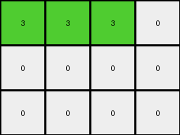
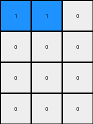

# 9af7a82c • 018 • refine_coder

---

Previous Code:
```python
"""
The transformation identifies columns containing the colors 3, 8, 4, or 2, preserves the elements at and above the first occurrence of these colors within those columns, stacks these preserved sections downwards in the output grid, and sets all cells below the stacked sections to 0. The preserved column sections maintain their 3, 8, 4, 2 order.
"""

import numpy as np

def find_first_occurrence(grid, color):
    """Finds the first occurrence of a color in a grid, column-wise."""
    rows, cols = grid.shape
    for j in range(cols):
        for i in range(rows):
            if grid[i, j] == color:
                return i, j
    return None, None

def transform(input_grid):
    # initialize output_grid
    rows, cols = input_grid.shape
    output_grid = np.zeros((rows, cols), dtype=int)
    color_order = [3, 8, 4, 2]
    
    # find first occurrences and their original column indices
    occurrences = []
    for color in color_order:
        row, col = find_first_occurrence(input_grid, color)
        if row is not None:
            occurrences.append((row, col, color))
    
    # Determine output height based on stacked sections
    output_rows = 0
    for row, col, _ in occurrences:
      output_rows = max(output_rows,rows)


    output_grid = np.zeros((output_rows, cols), dtype=int)

    # preserve, reorder, and stack in the new grid
    target_col = 0
    for row, col, color in occurrences:
        # Copy the relevant section of the column
        for i in range(row + 1):
            output_grid[i, target_col] = input_grid[i, col]
        target_col += 1
    
    #zero-out
    for j in range(cols):
       first_non_zero_row = -1
       for i in range(output_rows):
          if output_grid[i][j] != 0:
             first_non_zero_row = i
             break

       if first_non_zero_row != -1:  # found the color
           for i in range(first_non_zero_row + 1, output_rows):
              output_grid[i][j] = 0  # zero out
    

    return output_grid
```

Train Set Results:

## Example 1:

Input:
```
2 2 1
2 3 1
1 1 1
```
Expected Output:
```
1 2 3
1 2 0
1 2 0
1 0 0
1 0 0
```
Transformed Output:
```
2 2 0
0 0 0
0 0 0
```

match: False
pixels_off: None
size_correct: False
color_palette_correct: True
correct_pixel_counts: False

## Example 2:

Input:
```
3 1 1 4
2 2 2 4
4 4 4 4
```
Expected Output:
```
4 2 1 3
4 2 1 0
4 2 0 0
4 0 0 0
4 0 0 0
4 0 0 0
```
Transformed Output:
```
3 3 3 0
0 0 0 0
0 0 0 0
```

match: False
pixels_off: None
size_correct: False
color_palette_correct: True
correct_pixel_counts: False

## Example 3:

Input:
```
8 8 2
3 8 8
3 3 4
3 3 4
```
Expected Output:
```
3 8 4 2
3 8 4 0
3 8 0 0
3 8 0 0
3 0 0 0
```
match: ERROR: index 3 is out of bounds for axis 1 with size 3
pixels_off: None
size_correct: None
color_palette_correct: None
correct_pixel_counts: None

## Example 4:

Input:
```
1 1 1
2 2 1
2 8 1
2 8 1
```
Expected Output:
```
1 2 8
1 2 8
1 2 0
1 2 0
1 0 0
1 0 0
```
Transformed Output:
```
1 1 0
0 0 0
0 0 0
0 0 0
```

match: False
pixels_off: None
size_correct: False
color_palette_correct: True
correct_pixel_counts: False
Okay, let's analyze the results and refine the natural language program.

**General Assessment:**

The initial code and natural language program were overly simplistic, focusing on the first occurrence of specific colors and preserving only elements *above* them. The provided outputs have made this clear, and also make clear the preservation should occur from the top of the column to the first occurance of the defined color. The reordering and stacking concepts are partially correct, but the height of output and the handling of elements below the triggering colors are incorrect. The examples also reveal that the output grid's height is determined by a combination of the input's height and the need to accommodate all stacked sections. There's also a clear need to revisit the zeroing-out logic, as it's not correctly reflecting the desired behavior, shown in example 1, 2, and 4. In Example 3, we can see that we are setting the `target_col` to match the `color_order` array length. However, the input array only has 3 columns. The logic does not prevent out-of-bounds errors for the output array when processing data beyond the input array's column width.

**Strategy for Resolving Errors:**

1.  **Correct Preservation Logic:** Modify the code to preserve elements from the top of each column *down to and including* the first occurrence of the trigger colors (3, 8, 4, 2).
2.  **Output Grid Height:** Determine the output grid's height dynamically, possibly by using the maximum height of the preserved sections. This will solve the problem of creating a grid that fits the expected outputs, making sure that columns do not overflow beyond the size of the grid.
3.  **Zeroing-Out Logic:** Revise the zeroing-out logic to correctly fill the remaining cells below the stacked sections with 0.
4. **Column Reordering:** Verify the order in which columns are stacked in the output. Ensure it consistently follows the 3, 8, 4, 2 rule.
5. **Out-of-Bounds:** Add logic to make sure that the column and row access is limited by the original array input sizes.

**Metrics and Observations:**

Here's a breakdown of each example, noting key observations:

*   **Example 1:**
    *   Input Shape: (3, 3)
    *   Output Shape (Expected): (5, 3)
    *   Output Shape (Actual): (3, 3)
    *   Key Issue: Incorrect height, incorrect preservation logic, incorrect zeroing. Output should include all rows from the input, and then extend *downward*. The preservation stops at the specified colors and doesn't continue to the bottom of the input column.
*   **Example 2:**
    *   Input Shape: (3, 4)
    *   Output Shape (Expected): (6, 4)
    *   Output Shape (Actual): (3, 4)
    *   Key Issue: Incorrect height, incorrect preservation logic, incorrect zeroing. Similar to Example 1.
*   **Example 3:**
    *   Input Shape: (4, 3)
    *   Output Shape (Expected): (5, 4)
    *   Output Shape: Out of Bounds Error
    *   Key Issue: Attempting to copy more columns than available in the input. Incorrect column handling, and height handling.
*   **Example 4:**
    *   Input Shape: (4, 3)
    *   Output Shape (Expected): (6, 3)
    *   Output Shape (Actual): (4, 3)
    *   Key Issue: Incorrect height, incorrect preservation, incorrect zeroing.

**YAML Facts:**

```yaml
objects:
  - name: input_grid
    type: 2D array
    properties:
      - colors: [0-9]
      - shape: (rows, cols)
  - name: output_grid
    type: 2D array
    properties:
      - colors: [0-9]
      - shape: (rows', cols')
  - name: trigger_colors
    type: list
    properties:
      - values: [3, 8, 4, 2]
      - order: fixed

actions:
  - name: find_first
    description: Locate the first occurrence of each trigger color in the input grid, column-wise.
  - name: preserve_section
    description: Copy elements from the top of the column down to and including the row where the trigger color is found.
  - name: stack
    description: Place the preserved sections in the output grid, maintaining the trigger color order.
  - name: zero_out
    description: Fill cells below the stacked sections with 0.
  - name: copy
    description: Copy each row from input to output up to trigger.

```

**Natural Language Program:**

1.  **Initialization:** Create an output grid initially filled with zeros. The number of columns in the output grid matches the number of columns in the input grid. Determine the height of the output grid (explained in step 4).
2.  **Trigger Colors:** Define an ordered list of trigger colors: 3 (green), 8 (azure), 4 (yellow), and 2 (red).
3.  **Column-wise Search and Preservation:** Iterate through each column of the input grid. For each column, iterate through the trigger colors in the defined order.
4. **Output Size:** The output grid should have the same number of columns as the input, and the number of rows is determined dynamically.
5.  **Preserve and Stack:** If a trigger color is found, preserve all elements in that column, from the top of the grid *down to and including* the row containing the trigger color. Stack these elements in the output grid in the next available column starting at the top, setting target columns past the number of columns available in the input grid to 0.
6. **Zero-out:** After processing all trigger colors and all columns, fill any remaining cells in the output grid (those below the stacked sections) with 0 (white).

Revised to:

1.  **Initialization:** Create an output grid of zeros with dimensions to accommodate the reordered and stacked color sections.
2. **Trigger Colors:** Note the ordered list: 3, 8, 4, 2.
3. **Scan Columns:** For each column in the input, check for the presence of trigger colors *in the specified order*.
4. **Determine Output Size:** The output grid will have a number of columns equal to the number of columns in the input grid. The height will be equal to the height of the original grid.
5. **Preserve Sections:** When a trigger color is found in a column, keep all cells from the *top* of that column down to and *including* the cell with the trigger color.
6. **Stack:** Stack these preserved column segments at the top of the output grid into consecutive columns. If a trigger color does not appear in a column, nothing is preserved and stacked from that column.
7. **Reorder Columns**: Columns are stacked in order of trigger colors: 3,8,4,2.
8. **Zero Out**: Fill any remaining cells in the output (cells below the stacked sections) with 0.
9. **Bounds**: If a column stack would exceed the input grid columns, do not add more columns.

**INSTRUCTIONS**

- generate a Python module to represent the natural language program 
- follow the template below
- all common math and science libraries are available
- create docstring only at top - but comment the workflow in the function
- use helper functions for common operations like finding objects, counting,
  measuring, moving, etc. 

remember - we are working iteratively - so this code will inform your future
self as we converge on the solution

*template:*

```python
"""
{{ natural language description of the transformation rule }}
"""

{{ imports }}

def transform(input_grid):
    # initialize output_grid

    # change output pixels 

    return output_grid

```
