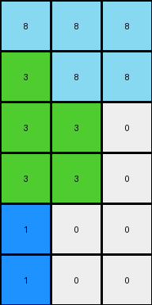
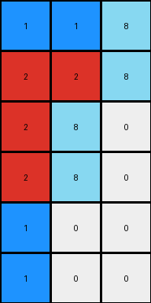

# 9af7a82c • 021 • refine_dreamer

---


Previous Code:
```python
"""
Transforms a 4x3 input grid into a 6x3 output grid. The first two columns are copied directly. 
The third column's values [1, 1, 8, 8] are transformed to [8, 8, 0, 0]. 
Two new rows are added at the bottom, with the first element being 1 and the remaining elements being 0.
"""

import numpy as np

def transform(input_grid):
    # Initialize output_grid as a 6x3 array filled with zeros.
    output_grid = np.zeros((6, 3), dtype=int)

    # Copy the first column.
    output_grid[:4, 0] = input_grid[:, 0]

    # Copy the second column.
    output_grid[:4, 1] = input_grid[:, 1]

    # Transform and copy the third column.
    output_grid[0, 2] = 8
    output_grid[1, 2] = 8
    output_grid[2, 2] = 0
    output_grid[3, 2] = 0

    # Add the new rows.
    output_grid[4, 0] = 1
    output_grid[5, 0] = 1

    return output_grid
```

Train Set Results:

## Example 1:

Input:
```
2 2 1
2 3 1
1 1 1
```
Expected Output:
```
1 2 3
1 2 0
1 2 0
1 0 0
1 0 0
```
match: ERROR: could not broadcast input array from shape (3,) into shape (4,)
pixels_off: None
size_correct: None
color_palette_correct: None
correct_pixel_counts: None

## Example 2:

Input:
```
3 1 1 4
2 2 2 4
4 4 4 4
```
Expected Output:
```
4 2 1 3
4 2 1 0
4 2 0 0
4 0 0 0
4 0 0 0
4 0 0 0
```
match: ERROR: could not broadcast input array from shape (3,) into shape (4,)
pixels_off: None
size_correct: None
color_palette_correct: None
correct_pixel_counts: None

## Example 3:

Input:
```
8 8 2
3 8 8
3 3 4
3 3 4
```
Expected Output:
```
3 8 4 2
3 8 4 0
3 8 0 0
3 8 0 0
3 0 0 0
```
Transformed Output:
```
8 8 8
3 8 8
3 3 0
3 3 0
1 0 0
1 0 0
```

match: False
pixels_off: None
size_correct: False
color_palette_correct: False
correct_pixel_counts: False

## Example 4:

Input:
```
1 1 1
2 2 1
2 8 1
2 8 1
```
Expected Output:
```
1 2 8
1 2 8
1 2 0
1 2 0
1 0 0
1 0 0
```
Transformed Output:
```
1 1 8
2 2 8
2 8 0
2 8 0
1 0 0
1 0 0
```

match: False
pixels_off: 6
size_correct: True
color_palette_correct: True
correct_pixel_counts: False

**INSTRUCTIONS**

The code above was generated based on observations from the first training
example

we have tested the transform function on each of the task example inputs and
compared with the expected output

review each of the examples provided and the results and consider how the
natural language program should be updated to accommodate this new knowledge

respond with the following deliverables:

- general assessment of the information provided and strategy for resolving the
  errors
- gather metrics about each of the examples and results - use code_execution to
  develop accurate reports on your assumptions
- a YAML block documenting facts - Focus on identifying objects, their properties, and the actions performed on them.
- a natural language program - Be as clear and concise as possible, providing a complete description of the transformation rule.


your responses should be considered as information in a report - not a
conversation
