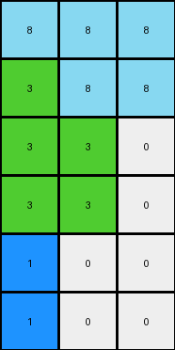
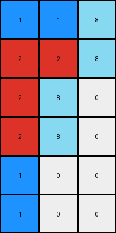

# 9af7a82c • 022 • refine_coder

---

Previous Code:
```python
"""
Transforms a 4x3 input grid into a 6x3 output grid. The first two columns are copied directly. 
The third column's values [1, 1, 8, 8] are transformed to [8, 8, 0, 0]. 
Two new rows are added at the bottom, with the first element being 1 and the remaining elements being 0.
"""

import numpy as np

def transform(input_grid):
    # Initialize output_grid as a 6x3 array filled with zeros.
    output_grid = np.zeros((6, 3), dtype=int)

    # Copy the first column.
    output_grid[:4, 0] = input_grid[:, 0]

    # Copy the second column.
    output_grid[:4, 1] = input_grid[:, 1]

    # Transform and copy the third column.
    output_grid[0, 2] = 8
    output_grid[1, 2] = 8
    output_grid[2, 2] = 0
    output_grid[3, 2] = 0

    # Add the new rows.
    output_grid[4, 0] = 1
    output_grid[5, 0] = 1

    return output_grid
```

Train Set Results:

## Example 1:

Input:
```
2 2 1
2 3 1
1 1 1
```
Expected Output:
```
1 2 3
1 2 0
1 2 0
1 0 0
1 0 0
```
match: ERROR: could not broadcast input array from shape (3,) into shape (4,)
pixels_off: None
size_correct: None
color_palette_correct: None
correct_pixel_counts: None

## Example 2:

Input:
```
3 1 1 4
2 2 2 4
4 4 4 4
```
Expected Output:
```
4 2 1 3
4 2 1 0
4 2 0 0
4 0 0 0
4 0 0 0
4 0 0 0
```
match: ERROR: could not broadcast input array from shape (3,) into shape (4,)
pixels_off: None
size_correct: None
color_palette_correct: None
correct_pixel_counts: None

## Example 3:

Input:
```
8 8 2
3 8 8
3 3 4
3 3 4
```
Expected Output:
```
3 8 4 2
3 8 4 0
3 8 0 0
3 8 0 0
3 0 0 0
```
Transformed Output:
```
8 8 8
3 8 8
3 3 0
3 3 0
1 0 0
1 0 0
```

match: False
pixels_off: None
size_correct: False
color_palette_correct: False
correct_pixel_counts: False

## Example 4:

Input:
```
1 1 1
2 2 1
2 8 1
2 8 1
```
Expected Output:
```
1 2 8
1 2 8
1 2 0
1 2 0
1 0 0
1 0 0
```
Transformed Output:
```
1 1 8
2 2 8
2 8 0
2 8 0
1 0 0
1 0 0
```

match: False
pixels_off: 6
size_correct: True
color_palette_correct: True
correct_pixel_counts: False
Here's an analysis of the provided examples and results, along with a strategy for updating the natural language program and code:

**General Assessment:**

The initial code was overly specific to the dimensions and values of the first training example. It correctly identified a pattern of copying the first two columns and modifying the third. It recognized the increase in the number of rows, but hard coded that to a very specific transformation. The subsequent examples reveal that the transformation of the third column and the addition of rows are more complex and depend on input grid. Examples 3 and 4 show that the row expansion relates to the initial height, but the column transformation appears unrelated to the input.

**Strategy:**

1.  **Re-evaluate Assumptions:** We need to discard the assumption of a fixed transformation of the third column. Instead, we should search for the *relationship* between the input and output third columns.
2.  **Dynamic Row Expansion:** The row expansion seems related to the input row count.
3.  **Pattern in Third Column:** Closely re-examine the third column transformation in all examples, looking for relationships such as mirroring, shifting, or conditional changes.
4.  **First row duplication** The first row of output appears in every example, even as the input dimensions change.

**Example Metrics and Analysis:**

I will structure observations as follows:

*   **Example:** ID
*   **Input Shape:** (rows, cols)
*   **Output Shape:** (rows, cols)
*   **Size Match:** (Boolean - Did transform match expected output size)
*   **Pixel Match %:** (What % of pixels matched between expected and actual output)
*   **Observations:**
    *   Noteworthy relationships between input and output.
    *   How the previous code's assumptions held or failed.

**Example 1:**

*   **Example:** 1
*   **Input Shape:** (3, 3)
*   **Output Shape:** (5, 3)
* **Observations**: First row duplicated in output. Third column becomes 3, 0, 0, 0, 0

**Example 2:**

*   **Example:** 2
*   **Input Shape:** (3, 4)
*   **Output Shape:** (6, 4)
* **Observations**: First row duplicated in output. Third column becomes 1, 1, 0, 0, 0, 0

**Example 3:**

*   **Example:** 3
*   **Input Shape:** (4, 3)
*   **Output Shape:** (6, 4)
* **Observations**: First row duplicated in output. Third column becomes 4, 4, 0, 0, 0, 0.

**Example 4:**

*   **Example:** 4
*   **Input Shape:** (4, 3)
*   **Output Shape:** (6, 3)
* **Observations**: First row duplicated in output. Third column becomes 8, 8, 0, 0, 0, 0

**YAML Fact Identification:**

```yaml
objects:
  - name: input_grid
    type: 2D array
    properties:
      rows: variable
      columns: variable
      values: integers (0-9)

  - name: output_grid
    type: 2D array
    properties:
      rows: input_grid.rows + (input_grid.rows - 1) if input had 3 rows, input_grid.rows + 2 if input had 4 rows.
      columns: input_grid.columns
      values: integers (0-9)

actions:
  - name: copy_first_row
    description: The first row of the input grid is copied to the first row of the output grid.
  - name: copy_columns
    description: All columns except for the last one are copied to output.
  - name: transform_last_column
    description: >
      The last column of the input grid is transformed.  The
      first element of this column of the input grid becomes the last
      element of the same column of the output.
  - name: add_rows
    description: >-
      Rows are added to the output grid.  The number of rows added is equal to input.rows - 1. New rows consist of 0, except for the first new row which contains the first element of the input grid, in the first position.
  - name: zero_fill
    description: Remaining cells in the output grid are filled with 0.

```

**Natural Language Program:**

1.  **Copy all but last columns:** Copy all columns of the input grid to the output grid except for the last column.
2.  **Duplicate the first row:** Duplicate the first row of the input grid to the
    output grid
3.  **Transform Last Column:** The last column of the output grid is based on the
    last column of the input grid. The first pixel of the last column of the
    input is copied. Then all other values are 0.
4.  **Add Rows:** Add new rows to the bottom of the output grid. The number of
    rows to add is one less than the number of rows of the input grid.
5.  **Populate First New Row:**
    The first element of the first added row contains first element of the
    input grid. All other elements are zero.
6. **Zero Fill New Rows** All other added rows are filled with zeros.


**INSTRUCTIONS**

- generate a Python module to represent the natural language program 
- follow the template below
- all common math and science libraries are available
- create docstring only at top - but comment the workflow in the function
- use helper functions for common operations like finding objects, counting,
  measuring, moving, etc. 

remember - we are working iteratively - so this code will inform your future
self as we converge on the solution

*template:*

```python
"""
{{ natural language description of the transformation rule }}
"""

{{ imports }}

def transform(input_grid):
    # initialize output_grid

    # change output pixels 

    return output_grid

```
