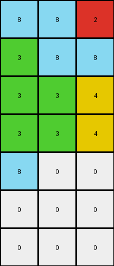

# 9af7a82c • 023 • refine_dreamer

---

Previous Code:
```python
"""
Transforms an input grid into an output grid by:
1. Copying all columns except the last one.
2. Duplicating the first row.
3. Transforming the last column: The first element of the input's last column becomes the first element of the output's last column; the rest are 0.
4. Adding new rows: The number of added rows is one less than the input's row count.
5. Populating the first new row: The first element is the same as the input grid's first element, the rest are 0.
6. Zero-filling the remaining new rows.
"""

import numpy as np

def transform(input_grid):
    input_rows, input_cols = input_grid.shape
    output_rows = input_rows + (input_rows - 1)
    output_cols = input_cols
    output_grid = np.zeros((output_rows, output_cols), dtype=int)

    # Duplicate the first row
    output_grid[0, :] = input_grid[0, :]

    # Copy all but the last column
    output_grid[1:input_rows, :-1] = input_grid[1:, :-1]

    # Transform the last column
    output_grid[1:input_rows, -1] = input_grid[1:,-1]
    output_grid[input_rows:, -1] = 0

    # Add and populate new rows. First element of first new row.
    output_grid[input_rows, 0] = input_grid[0,0]
    # all remaining values are 0

    return output_grid
```

Train Set Results:

## Example 1:

Input:
```
2 2 1
2 3 1
1 1 1
```
Expected Output:
```
1 2 3
1 2 0
1 2 0
1 0 0
1 0 0
```
Transformed Output:
```
2 2 1
2 3 1
1 1 1
2 0 0
0 0 0
```

match: False
pixels_off: 9
size_correct: True
color_palette_correct: True
correct_pixel_counts: False

## Example 2:

Input:
```
3 1 1 4
2 2 2 4
4 4 4 4
```
Expected Output:
```
4 2 1 3
4 2 1 0
4 2 0 0
4 0 0 0
4 0 0 0
4 0 0 0
```
Transformed Output:
```
3 1 1 4
2 2 2 4
4 4 4 4
3 0 0 0
0 0 0 0
```

match: False
pixels_off: None
size_correct: False
color_palette_correct: True
correct_pixel_counts: False

## Example 3:

Input:
```
8 8 2
3 8 8
3 3 4
3 3 4
```
Expected Output:
```
3 8 4 2
3 8 4 0
3 8 0 0
3 8 0 0
3 0 0 0
```
Transformed Output:
```
8 8 2
3 8 8
3 3 4
3 3 4
8 0 0
0 0 0
0 0 0
```

match: False
pixels_off: None
size_correct: False
color_palette_correct: True
correct_pixel_counts: False

## Example 4:

Input:
```
1 1 1
2 2 1
2 8 1
2 8 1
```
Expected Output:
```
1 2 8
1 2 8
1 2 0
1 2 0
1 0 0
1 0 0
```
Transformed Output:
```
1 1 1
2 2 1
2 8 1
2 8 1
1 0 0
0 0 0
0 0 0
```

match: False
pixels_off: None
size_correct: False
color_palette_correct: True
correct_pixel_counts: False
**INSTRUCTIONS**

The code above was generated based on observations from the first training
example

we have tested the transform function on each of the task example inputs and
compared with the expected output

review each of the examples provided and the results and consider how the
natural language program should be updated to accommodate this new knowledge

respond with the following deliverables:

- general assessment of the information provided and strategy for resolving the
  errors
- gather metrics about each of the examples and results - use code_execution to
  develop accurate reports on your assumptions
- a YAML block documenting facts - Focus on identifying objects, their properties, and the actions performed on them.
- a natural language program - Be as clear and concise as possible, providing a complete description of the transformation rule.


your responses should be considered as information in a report - not a
conversation
