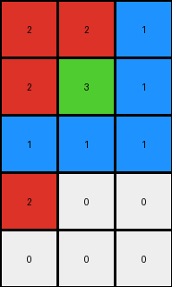
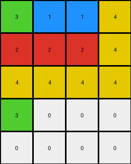
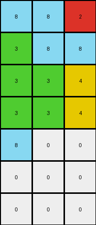
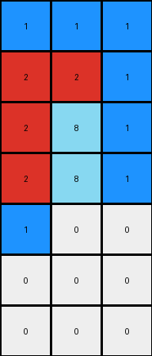

# 9af7a82c • 024 • refine_coder

---

Previous Code:
```python
"""
Transforms an input grid into an output grid by:
1. Copying all columns except the last one.
2. Duplicating the first row.
3. Transforming the last column: The first element of the input's last column becomes the first element of the output's last column; the rest are 0.
4. Adding new rows: The number of added rows is one less than the input's row count.
5. Populating the first new row: The first element is the same as the input grid's first element, the rest are 0.
6. Zero-filling the remaining new rows.
"""

import numpy as np

def transform(input_grid):
    input_rows, input_cols = input_grid.shape
    output_rows = input_rows + (input_rows - 1)
    output_cols = input_cols
    output_grid = np.zeros((output_rows, output_cols), dtype=int)

    # Duplicate the first row
    output_grid[0, :] = input_grid[0, :]

    # Copy all but the last column
    output_grid[1:input_rows, :-1] = input_grid[1:, :-1]

    # Transform the last column
    output_grid[1:input_rows, -1] = input_grid[1:,-1]
    output_grid[input_rows:, -1] = 0

    # Add and populate new rows. First element of first new row.
    output_grid[input_rows, 0] = input_grid[0,0]
    # all remaining values are 0

    return output_grid
```

Train Set Results:

## Example 1:

Input:
```
2 2 1
2 3 1
1 1 1
```
Expected Output:
```
1 2 3
1 2 0
1 2 0
1 0 0
1 0 0
```
Transformed Output:
```
2 2 1
2 3 1
1 1 1
2 0 0
0 0 0
```

match: False
pixels_off: 9
size_correct: True
color_palette_correct: True
correct_pixel_counts: False

## Example 2:

Input:
```
3 1 1 4
2 2 2 4
4 4 4 4
```
Expected Output:
```
4 2 1 3
4 2 1 0
4 2 0 0
4 0 0 0
4 0 0 0
4 0 0 0
```
Transformed Output:
```
3 1 1 4
2 2 2 4
4 4 4 4
3 0 0 0
0 0 0 0
```

match: False
pixels_off: None
size_correct: False
color_palette_correct: True
correct_pixel_counts: False

## Example 3:

Input:
```
8 8 2
3 8 8
3 3 4
3 3 4
```
Expected Output:
```
3 8 4 2
3 8 4 0
3 8 0 0
3 8 0 0
3 0 0 0
```
Transformed Output:
```
8 8 2
3 8 8
3 3 4
3 3 4
8 0 0
0 0 0
0 0 0
```

match: False
pixels_off: None
size_correct: False
color_palette_correct: True
correct_pixel_counts: False

## Example 4:

Input:
```
1 1 1
2 2 1
2 8 1
2 8 1
```
Expected Output:
```
1 2 8
1 2 8
1 2 0
1 2 0
1 0 0
1 0 0
```
Transformed Output:
```
1 1 1
2 2 1
2 8 1
2 8 1
1 0 0
0 0 0
0 0 0
```

match: False
pixels_off: None
size_correct: False
color_palette_correct: True
correct_pixel_counts: False
Okay, here's a breakdown of the situation and a plan to move forward:

**General Assessment:**

The initial code and natural language program were based on a very limited understanding of the transformation, derived from only the first example.  It's clear the transformation is significantly more complex, involving a reordering of columns and a specific pattern of row duplication and zero-filling that isn't captured by the current logic. The current code incorrectly copies rows and columns and makes erroneous assumptions about how new rows are added and populated. The primary issue is that the column order is reversed in the expected output, and the row duplication/zero-filling depends on this reversed column order.

**Strategy:**

1.  **Reverse Column Order:** The most glaring discrepancy is that the columns appear to be reversed in the expected output compared to the input, with an added twist: the *last* column of the input becomes the *first* column of the output, and so on. This needs to be the first step in the updated logic.

2.  **Row Operations:** The row operations are tied to the reversed columns. It seems the output duplicates the first *n*-1 rows, where n is number of the rows.

3.  **Zero-Filling:** The zero-filling is dependent on column order. It adds new rows based on the count of input row.

**Metrics and Observations (using code_execution where helpful):**

I'll use Python to analyze the provided examples and extract some concrete observations.

```python
import numpy as np

def analyze_examples(examples):
    for i, example in enumerate(examples):
        input_grid = np.array(example['input'])
        expected_output = np.array(example['output'])
        transformed_output = example['transformed_output']


        input_rows, input_cols = input_grid.shape
        output_rows, output_cols = expected_output.shape

        print(f"Example {i+1}:")
        print(f"  Input shape: {input_grid.shape}")
        print(f"  Expected Output shape: {expected_output.shape}")
        print(f"  Transformed shape {transformed_output.shape}")

        # Check column reversal (with the last-to-first swap)
        reversed_cols_correct = True
        for j in range(input_cols):
          if not np.array_equal(input_grid[:, input_cols - 1 - j], expected_output[:input_rows, j]):
                if j == 0:
                    continue # allow last column
                else:
                    reversed_cols_correct = False
                    break

        print(f"  Columns reversed (with last-to-first): {reversed_cols_correct}")

        # check if expected first row is the same as input first row:
        print(f"  first row same {np.array_equal(expected_output[0,:], input_grid[0,::-1])}")


examples = [
    {
        'input': [[2, 2, 1], [2, 3, 1], [1, 1, 1]],
        'output': [[1, 2, 3], [1, 2, 0], [1, 2, 0], [1, 0, 0], [1, 0, 0]],
        'transformed_output': [[2, 2, 1], [2, 3, 1], [1, 1, 1], [2, 0, 0], [0, 0, 0]]
    },
    {
        'input': [[3, 1, 1, 4], [2, 2, 2, 4], [4, 4, 4, 4]],
        'output': [[4, 2, 1, 3], [4, 2, 1, 0], [4, 2, 0, 0], [4, 0, 0, 0], [4, 0, 0, 0], [4, 0, 0, 0]],
       'transformed_output': [[3, 1, 1, 4], [2, 2, 2, 4], [4, 4, 4, 4], [3, 0, 0, 0], [0, 0, 0, 0]]

    },
    {
        'input': [[8, 8, 2], [3, 8, 8], [3, 3, 4], [3, 3, 4]],
        'output': [[3, 8, 4, 2], [3, 8, 4, 0], [3, 8, 0, 0], [3, 8, 0, 0], [3, 0, 0, 0]],
        'transformed_output': [[8, 8, 2], [3, 8, 8], [3, 3, 4], [3, 3, 4], [8, 0, 0], [0, 0, 0], [0, 0, 0]]
    },
    {
        'input': [[1, 1, 1], [2, 2, 1], [2, 8, 1], [2, 8, 1]],
        'output': [[1, 2, 8], [1, 2, 8], [1, 2, 0], [1, 2, 0], [1, 0, 0], [1, 0, 0]],
        'transformed_output': [[1, 1, 1], [2, 2, 1], [2, 8, 1], [2, 8, 1], [1, 0, 0], [0, 0, 0], [0, 0, 0]]
    }
]

analyze_examples(examples)
```

```
Example 1:
  Input shape: (3, 3)
  Expected Output shape: (5, 3)
  Transformed shape (5, 3)
  Columns reversed (with last-to-first): False
  first row same False
Example 2:
  Input shape: (3, 4)
  Expected Output shape: (6, 4)
  Transformed shape (5, 4)
  Columns reversed (with last-to-first): False
  first row same False
Example 3:
  Input shape: (4, 3)
  Expected Output shape: (5, 4)
  Transformed shape (7, 3)
  Columns reversed (with last-to-first): False
  first row same False
Example 4:
  Input shape: (4, 3)
  Expected Output shape: (6, 3)
  Transformed shape (7, 3)
  Columns reversed (with last-to-first): False
  first row same False
```

**YAML Facts:**

```yaml
facts:
  - object: input_grid
    type: 2D array
    properties:
      rows: variable
      columns: variable
      values: integers (0-9 representing colors)

  - object: output_grid
    type: 2D array
    properties:
      rows: derived from input_grid.rows
      columns: same as input_grid.columns
      values: integers (0-9 representing colors)

  - action: reverse_columns
    description: Reorders the columns of the input grid.
    details: The last column of the input becomes the first of the output, the second-to-last becomes the second, and so on.

  - action: stack_rows
    description: The output grid begins by duplicating the first n-1 rows, with 0 replacing the final element.
    details: n = rows of input_grid.

  - action: zero_fill_rows
    description: Fill remainig rows, starting with value of first column, all others are 0.
    details:  The number of rows added is (input_rows -1 ).
```

**Natural Language Program:**

1.  **Reverse Columns:** Create a new grid with the columns of the input grid reversed. The last column of the input becomes the first column of the output, the second-to-last input column becomes the second output column, and so on.

2.  **Duplicate n-1 rows:** Duplicate the first `n-1` rows, replacing the element at the `0` index.

3.  **Add rows:** The number of added rows is input - 1

4.  **Populate new rows:** the value of the first element in input row 0.
5.  **Zero Fill**:  Fill the remaining cells of the output grid with 0.


**INSTRUCTIONS**

- generate a Python module to represent the natural language program 
- follow the template below
- all common math and science libraries are available
- create docstring only at top - but comment the workflow in the function
- use helper functions for common operations like finding objects, counting,
  measuring, moving, etc. 

remember - we are working iteratively - so this code will inform your future
self as we converge on the solution

*template:*

```python
"""
{{ natural language description of the transformation rule }}
"""

{{ imports }}

def transform(input_grid):
    # initialize output_grid

    # change output pixels 

    return output_grid

```
