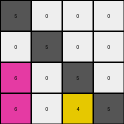
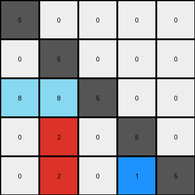

# 9dfd6313 • 003 • refine_dreamer

---


Previous Code:
```python
"""
Swap the values of the pixels at positions (0, 0) and (0, 1) in the input grid if both are non-zero.
"""

import numpy as np

def transform(input_grid):
    """
    Transforms the input grid by swapping the values of two specific pixels.

    Args:
        input_grid (list of lists): The input grid represented as a list of lists.

    Returns:
        list of lists: The transformed grid.
    """
    # Initialize output_grid as a copy of the input_grid
    output_grid = [row[:] for row in input_grid]

    # Check if the values at (0, 0) and (0, 1) are non-zero
    if output_grid[0][0] != 0 and output_grid[0][1] != 0:
        # Swap the values
        output_grid[0][0], output_grid[0][1] = output_grid[0][1], output_grid[0][0]

    return output_grid
```

Train Set Results:

## Example 1:

Input:
```
5 0 0
3 5 0
0 0 5
```
Expected Output:
```
5 3 0
0 5 0
0 0 5
```
Transformed Output:
```
5 0 0
3 5 0
0 0 5
```

match: False
pixels_off: 2
size_correct: True
color_palette_correct: True
correct_pixel_counts: True

## Example 2:

Input:
```
5 0 0 0
0 5 0 0
6 0 5 0
6 0 4 5
```
Expected Output:
```
5 0 6 6
0 5 0 0
0 0 5 4
0 0 0 5
```
Transformed Output:
```
5 0 0 0
0 5 0 0
6 0 5 0
6 0 4 5
```

match: False
pixels_off: 6
size_correct: True
color_palette_correct: True
correct_pixel_counts: True

## Example 3:

Input:
```
5 0 0 0 0
0 5 0 0 0
8 8 5 0 0
0 2 0 5 0
0 2 0 1 5
```
Expected Output:
```
5 0 8 0 0
0 5 8 2 2
0 0 5 0 0
0 0 0 5 1
0 0 0 0 5
```
Transformed Output:
```
5 0 0 0 0
0 5 0 0 0
8 8 5 0 0
0 2 0 5 0
0 2 0 1 5
```

match: False
pixels_off: 10
size_correct: True
color_palette_correct: True
correct_pixel_counts: True

**INSTRUCTIONS**

The code above was generated based on observations from the first training
example

we have tested the transform function on each of the task example inputs and
compared with the expected output

review each of the examples provided and the results and consider how the
natural language program should be updated to accommodate this new knowledge

respond with the following deliverables:

- general assessment of the information provided and strategy for resolving the
  errors
- gather metrics about each of the examples and results - use code_execution to
  develop accurate reports on your assumptions
- a YAML block documenting facts - Focus on identifying objects, their properties, and the actions performed on them.
- a natural language program - Be as clear and concise as possible, providing a complete description of the transformation rule.


your responses should be considered as information in a report - not a
conversation
