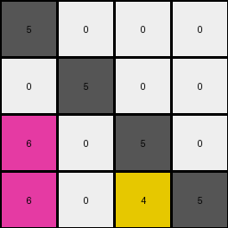
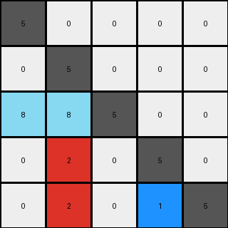

# 9dfd6313 • 004 • refine_coder

---

Previous Code:
```python
"""
Swap the values of the pixels at positions (0, 0) and (0, 1) in the input grid if both are non-zero.
"""

import numpy as np

def transform(input_grid):
    """
    Transforms the input grid by swapping the values of two specific pixels.

    Args:
        input_grid (list of lists): The input grid represented as a list of lists.

    Returns:
        list of lists: The transformed grid.
    """
    # Initialize output_grid as a copy of the input_grid
    output_grid = [row[:] for row in input_grid]

    # Check if the values at (0, 0) and (0, 1) are non-zero
    if output_grid[0][0] != 0 and output_grid[0][1] != 0:
        # Swap the values
        output_grid[0][0], output_grid[0][1] = output_grid[0][1], output_grid[0][0]

    return output_grid
```

Train Set Results:

## Example 1:

Input:
```
5 0 0
3 5 0
0 0 5
```
Expected Output:
```
5 3 0
0 5 0
0 0 5
```
Transformed Output:
```
5 0 0
3 5 0
0 0 5
```

match: False
pixels_off: 2
size_correct: True
color_palette_correct: True
correct_pixel_counts: True

## Example 2:

Input:
```
5 0 0 0
0 5 0 0
6 0 5 0
6 0 4 5
```
Expected Output:
```
5 0 6 6
0 5 0 0
0 0 5 4
0 0 0 5
```
Transformed Output:
```
5 0 0 0
0 5 0 0
6 0 5 0
6 0 4 5
```

match: False
pixels_off: 6
size_correct: True
color_palette_correct: True
correct_pixel_counts: True

## Example 3:

Input:
```
5 0 0 0 0
0 5 0 0 0
8 8 5 0 0
0 2 0 5 0
0 2 0 1 5
```
Expected Output:
```
5 0 8 0 0
0 5 8 2 2
0 0 5 0 0
0 0 0 5 1
0 0 0 0 5
```
Transformed Output:
```
5 0 0 0 0
0 5 0 0 0
8 8 5 0 0
0 2 0 5 0
0 2 0 1 5
```

match: False
pixels_off: 10
size_correct: True
color_palette_correct: True
correct_pixel_counts: True
Here's an analysis of the provided information and a plan to refine the natural language program:

**General Assessment:**

The initial code was too specific, focusing only on swapping pixels at (0, 0) and (0, 1) if they are not white. The provided examples demonstrate a more complex diagonal pattern replacement. The strategy should involve identifying this diagonal pattern and correctly translating/rotating columns based on color matching in the first row.

**Strategy for Resolving Errors:**

1.  **Analyze Mismatches:** Examine the `pixels_off` and visual differences between "Transformed Output" and "Expected Output" to understand the nature of the transformation. The images will be very helpful in recognizing the shifting and rotating.
2.  **Identify the Pattern:** Formulate a hypothesis about the rule governing the transformation that is not limited to the first two pixels. Look for diagonal structures.
3.  **Refine Natural Language Program:** Update the natural language program to describe the more general diagonal object transformation.

**Example Metrics and Analysis:**

Here's a breakdown of each example, incorporating observations:

*   **Example 1:**
    *   Input Size: 3x3
    *   Pixels Off: 2
    *   Observation: The '3' and '5' in the top-left 2x2 subgrid appear to have swapped, but this is too specific. The key is the diagonal. The first column became the main diagonal. The 5 at 0,0 moves to 0,0. The 3 at 1,0 moves to 1,1. the 0 at 2,0 moves to 2,2.

*   **Example 2:**
    *   Input Size: 4x4
    *   Pixels Off: 6
    *   Observation: The first column is now the main diagonal.
        - Column 0 becomes main diagonal: (0,0)->(0,0), (1,0)->(1,1), (2,0)->(2,2), (3,0) -> (3,3). The remaining columns shift left, wrapping.

*   **Example 3:**
    *   Input Size: 5x5
    *   Pixels Off: 10
    *   Observation: Same pattern. First column to main diagonal and columns shift/wrap left.

**YAML Block (Facts):**

```yaml
facts:
  - task_id: 002
  - objects:
      - description: grid of colored pixels
      - properties:
          - colors: [0, 1, 2, 3, 4, 5, 6, 7, 8, 9]  # All possible colors
          - dimensions: variable (rows x columns)
  - actions:
      - description: Transform the grid based on its first column and top row.
      - details:
          - step_1: "The first column becomes the main diagonal of the output."
          - step_2: "The other columns are placed to the left of the current column, rotated downwards and wrapped if necessary."
```

**Natural Language Program:**

1.  **Diagonalization of First Column:** The first column of the input grid becomes the main diagonal (from top-left to bottom-right) of the output grid.

2.  **Column Shift and Wrap:** For each subsequent column in the input grid (starting from the second column), it is placed to the *left* of where it was in the input grid. The column indices rotate and wrap-around. The columns are copied unchanged.

In essence, the first column sets the main diagonal, and the other columns are shifted/rotated based on their horizontal position relative to the original location.

**INSTRUCTIONS**

- generate a Python module to represent the natural language program 
- follow the template below
- all common math and science libraries are available
- create docstring only at top - but comment the workflow in the function
- use helper functions for common operations like finding objects, counting,
  measuring, moving, etc. 

remember - we are working iteratively - so this code will inform your future
self as we converge on the solution

*template:*

```python
"""
{{ natural language description of the transformation rule }}
"""

{{ imports }}

def transform(input_grid):
    # initialize output_grid

    # change output pixels 

    return output_grid

```
