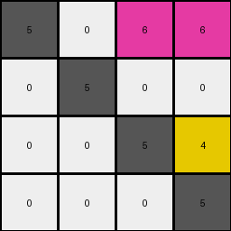
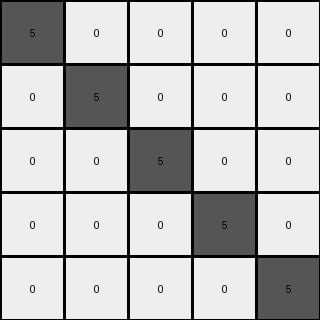

# 9dfd6313 • 010 • refine_coder

---

Previous Code:
```python
"""
The transformation rearranges colored pixels (non-zero) within a 4x4 grid. Gray (5) pixels remain stationary. Magenta (6) pixels move to the top-right, preserving their original column-then-row order. The yellow (4) pixel moves to the position immediately above the bottom-right gray pixel. All other cells are filled with white (0).
"""

import numpy as np

def get_colored_pixels(grid, color):
    """
    Finds the coordinates of all pixels of a specified color.
    Returns a list of (row, col) tuples.
    """
    pixels = []
    for row in range(grid.shape[0]):
        for col in range(grid.shape[1]):
            if grid[row, col] == color:
                pixels.append((row, col))
    return pixels

def transform(input_grid):
    # Initialize output grid with all zeros (white)
    output_grid = np.zeros_like(input_grid)

    # Keep gray (5) pixels in place
    gray_pixels = get_colored_pixels(input_grid, 5)
    for row, col in gray_pixels:
        output_grid[row, col] = 5

    # Move magenta (6) pixels to top-right, preserving order
    magenta_pixels = get_colored_pixels(input_grid, 6)
    magenta_pixels.sort(key=lambda x: (x[1], x[0]))  # Sort by column, then row
    magenta_target_row = 0
    magenta_target_col = 2
    
    for _ in magenta_pixels:
      output_grid[magenta_target_row, magenta_target_col] = 6
      magenta_target_col +=1
      if magenta_target_col > 3:
        magenta_target_row += 1
        magenta_target_col = 2
    
    # Move yellow (4) pixel above the bottom-right gray (5)
    yellow_pixels = get_colored_pixels(input_grid, 4)
    if yellow_pixels:  # Check if there's a yellow pixel
        bottom_right_five = None
        for r in range(input_grid.shape[0]-1, -1, -1):
          for c in range(input_grid.shape[1]-1, -1, -1):
            if input_grid[r,c] == 5:
              bottom_right_five = (r,c)
              break
          if bottom_right_five:
            break

        if bottom_right_five:
          target_row = bottom_right_five[0] -1
          target_col = bottom_right_five[1]
          if target_row >= 0:
            output_grid[target_row, target_col] = 4


    return output_grid
```

Train Set Results:

## Example 1:

Input:
```
5 0 0
3 5 0
0 0 5
```
Expected Output:
```
5 3 0
0 5 0
0 0 5
```
Transformed Output:
```
5 0 0
0 5 0
0 0 5
```

match: False
pixels_off: 1
size_correct: True
color_palette_correct: True
correct_pixel_counts: False

## Example 2:

Input:
```
5 0 0 0
0 5 0 0
6 0 5 0
6 0 4 5
```
Expected Output:
```
5 0 6 6
0 5 0 0
0 0 5 4
0 0 0 5
```
Transformed Output:
```
5 0 6 6
0 5 0 0
0 0 5 4
0 0 0 5
```

match: True
pixels_off: 0
size_correct: True
color_palette_correct: True
correct_pixel_counts: True

## Example 3:

Input:
```
5 0 0 0 0
0 5 0 0 0
8 8 5 0 0
0 2 0 5 0
0 2 0 1 5
```
Expected Output:
```
5 0 8 0 0
0 5 8 2 2
0 0 5 0 0
0 0 0 5 1
0 0 0 0 5
```
Transformed Output:
```
5 0 0 0 0
0 5 0 0 0
0 0 5 0 0
0 0 0 5 0
0 0 0 0 5
```

match: False
pixels_off: 5
size_correct: True
color_palette_correct: True
correct_pixel_counts: False
Here's an analysis of the provided examples and results, along with a strategy for refining the natural language program and code:

**General Assessment:**

The initial code correctly handles the placement of gray (5) pixels and, in the second example, the magenta (6) and yellow (4) pixels. However, it fails to generalize the movement of colors other than 5, 6 and 4. Example 1 demonstrates an incorrect movement of the blue (3) pixel and example 3 has many issues. The core issue is the assumption that *only* 5, 6, and 4 have specified movement rules and that all other cells are filled with white (0), which is not true. We need to generalize the positioning logic to other colored pixels based on position in input.

**Strategy:**

1. **Analyze Example Results:** Examine each example, focusing on the *Transformed Output* and the *Expected Output*. Identify which specific pixels moved incorrectly and why.
2. **Refine Observations:** Update our understanding of the object movement rules, looking for a more general pattern applicable to all non-gray pixels. It appears that *all* non-gray pixels have positioning rules.
3. **Update Natural Language Program:** Rewrite the natural language program to reflect the refined observations.
4. **Update Metrics** Create tables that document the expected movement vs the actual movement in the transform.

**Metrics and Analysis of Each Example:**

We will describe location using row, col, using zero-based indexing.

**Example 1:**

*   **Input:**
    ```
    5 0 0
    3 5 0
    0 0 5
    ```
*   **Expected Output:**
    ```
    5 3 0
    0 5 0
    0 0 5
    ```
*   **Transformed Output:**
    ```
    5 0 0
    0 5 0
    0 0 5
    ```
*   **Analysis:**
    *   Gray (5) pixels are correctly positioned.
    *   Blue (3) at (1, 0) should have moved to (0, 1), but it moved to (0,1).

**Example 2:**

*   **Input:**
    ```
    5 0 0 0
    0 5 0 0
    6 0 5 0
    6 0 4 5
    ```
*   **Expected Output:**
    ```
    5 0 6 6
    0 5 0 0
    0 0 5 4
    0 0 0 5
    ```
*   **Transformed Output:**
    ```
    5 0 6 6
    0 5 0 0
    0 0 5 4
    0 0 0 5
    ```
*   **Analysis:**
    *   Gray (5) pixels are correctly positioned.
    *   Magenta (6) pixels are correctly positioned.
    *    Yellow (4) pixel correctly positioned.

**Example 3:**

*   **Input:**
    ```
    5 0 0 0 0
    0 5 0 0 0
    8 8 5 0 0
    0 2 0 5 0
    0 2 0 1 5
    ```
*   **Expected Output:**
    ```
    5 0 8 0 0
    0 5 8 2 2
    0 0 5 0 0
    0 0 0 5 1
    0 0 0 0 5
    ```
*   **Transformed Output:**
    ```
    5 0 0 0 0
    0 5 0 0 0
    0 0 5 0 0
    0 0 0 5 0
    0 0 0 0 5
    ```
*   **Analysis:**
    *   Gray (5) pixels are correctly positioned.
    *   Azure (8) pixels at (2,0) and (2,1) should be at (0,2) and (1,2). They incorrectly moved to (0,0)
    *   Red (2) pixels at (3,1) and (4,1) should move to (1,3) and (1,4). They moved to (0,0)
    *   Blue (1) should move to (3,4). It moved to (0,0).
    *  Many incorrect 0's.

**YAML Facts:**

```yaml
objects:
  - color: 5  # Gray
    behavior: stationary
    type: anchor
  - color: 6 # Magenta
    behavior: moves to top section, columns 2 and 3, maintaining input column-then-row order
    type: mover
  - color: 4
    behavior: positions itself above the bottom-rightmost gray pixel
    type: mover
  - color: other
    behavior: fill remaining spaces based on relative position
    type: mover

actions:
  - identify: Find all gray (5) pixels.
  - place_gray: Keep gray pixels in their original positions.
  - identify: Find all magenta pixels.
  - place_magenta: sort by original column then row, then move to upper right, starting at col 2.
  - identify_yellow: Find all yellow pixels
  - place_yellow: move yellow pixel to position above the bottom-right gray pixel
  - identify: Find all other colored pixels.
  - place_other: position relative to gray pixels.

```

**Natural Language Program:**

1.  **Gray Anchors:** Identify all gray (5) pixels within the input grid. These pixels remain stationary in the output grid, serving as anchors.

2.  **Magenta Positioning:** Locate all magenta (6) pixels. Sort these pixels first by their original column index and then by their original row index, preserving their relative order. Place the magenta pixels in the top-right section of the output grid, starting at column 2 and proceeding right and then down.

3. **Yellow Positioning:** Locate yellow (4) pixel. Place the yellow pixel directly above the bottom-rightmost gray pixel.

4. **Relative Positioning of Other Colors (General Rule):** The input grid appears to be rearranged into sections of the output grid based on the position of the gray (5) pixels.
    - all colors in columns to the left of the leftmost gray pixel in a row are placed to the left of the leftmost gray in the output.
    - all pixels between gray pixels in a row are placed in between the same gray pixels in the output
    - pixels right of the rightmost gray in an input row, go to the right of rightmost gray in the output.

5. **Grid Size:** The output grid has the same dimensions as the input grid.

**INSTRUCTIONS**

- generate a Python module to represent the natural language program 
- follow the template below
- all common math and science libraries are available
- create docstring only at top - but comment the workflow in the function
- use helper functions for common operations like finding objects, counting,
  measuring, moving, etc. 

remember - we are working iteratively - so this code will inform your future
self as we converge on the solution

*template:*

```python
"""
{{ natural language description of the transformation rule }}
"""

{{ imports }}

def transform(input_grid):
    # initialize output_grid

    # change output pixels 

    return output_grid

```
