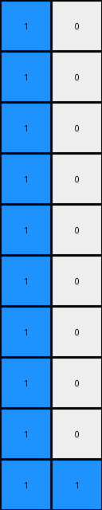

# a3df8b1e • 016 • refine_coder

---

Previous Code:
```python
"""
1. **Find the Blue Pixel:** Scan the input grid to find the location (row and column) of the single blue (1) pixel.
2. **Center the Cross:** Use the row and column of the blue pixel found in step 1 as the center coordinates for a cross pattern in the output grid.
3. **Create the Cross:** In the output grid, change the color of the pixels in the same row and column as the located blue pixel to blue(1), forming a cross. All other pixels should remain white(0).
"""

import numpy as np

def find_blue_pixel(grid):
    # Find the coordinates of the blue pixel (value 1).
    for r_idx, row in enumerate(grid):
        for c_idx, pixel in enumerate(row):
            if pixel == 1:
                return r_idx, c_idx
    return None  # Should not happen in valid cases, as a blue pixel is expected

def transform(input_grid):
    # Initialize output_grid as a copy of the input grid, then convert to all white.
    output_grid = np.zeros_like(input_grid)

    # Find the blue pixel's location.
    blue_pixel_location = find_blue_pixel(input_grid)

    if blue_pixel_location:
      center_row, center_col = blue_pixel_location

      # Create the cross pattern.
      for r_idx in range(output_grid.shape[0]):
          output_grid[r_idx, center_col] = 1  # Vertical line of the cross.
      for c_idx in range(output_grid.shape[1]):
          output_grid[center_row, c_idx] = 1  # Horizontal line of the cross.
    return output_grid
```

Train Set Results:

## Example 1:

Input:
```
0 0
0 0
0 0
0 0
0 0
0 0
0 0
0 0
0 0
1 0
```
Expected Output:
```
0 1
1 0
0 1
1 0
0 1
1 0
0 1
1 0
0 1
1 0
```
Transformed Output:
```
1 0
1 0
1 0
1 0
1 0
1 0
1 0
1 0
1 0
1 1
```

match: False
pixels_off: 11
size_correct: True
color_palette_correct: True
correct_pixel_counts: False

## Example 2:

Input:
```
0 0 0
0 0 0
0 0 0
0 0 0
0 0 0
0 0 0
0 0 0
0 0 0
0 0 0
1 0 0
```
Expected Output:
```
0 1 0
1 0 0
0 1 0
0 0 1
0 1 0
1 0 0
0 1 0
0 0 1
0 1 0
1 0 0
```
Transformed Output:
```
1 0 0
1 0 0
1 0 0
1 0 0
1 0 0
1 0 0
1 0 0
1 0 0
1 0 0
1 1 1
```

match: False
pixels_off: 16
size_correct: True
color_palette_correct: True
correct_pixel_counts: False

## Example 3:

Input:
```
0 0 0 0
0 0 0 0
0 0 0 0
0 0 0 0
0 0 0 0
0 0 0 0
0 0 0 0
0 0 0 0
0 0 0 0
1 0 0 0
```
Expected Output:
```
0 0 0 1
0 0 1 0
0 1 0 0
1 0 0 0
0 1 0 0
0 0 1 0
0 0 0 1
0 0 1 0
0 1 0 0
1 0 0 0
```
Transformed Output:
```
1 0 0 0
1 0 0 0
1 0 0 0
1 0 0 0
1 0 0 0
1 0 0 0
1 0 0 0
1 0 0 0
1 0 0 0
1 1 1 1
```

match: False
pixels_off: 19
size_correct: True
color_palette_correct: True
correct_pixel_counts: False
Okay, here's a breakdown of the situation and a plan to improve the transformation:

**General Assessment:**

The initial code correctly identifies the blue pixel and attempts to create a cross. However, it's misinterpreting the *orientation* of the cross. It appears to be creating a vertical line correctly, aligned with the blue pixel's column. The horizontal line, however, is incorrectly positioned at the *bottom* of the grid, instead of intersecting the vertical line at the blue pixel's row. The core problem is that the code is inverting rows and columns.

**Strategy:**

1.  **Analyze Results:** Double-check assumptions about the coordinate system (row-major vs. column-major) and how `numpy` handles indexing. It appears I made a mistake in ordering the grid.
2.  **Refine the Natural Language Program:** Clarify the cross's positioning relative to the blue pixel, explicitly stating that the cross *intersects* at the blue pixel, not merely uses its column.
3. **Correct the Code:** Specifically in the code section that creates the
    horizontal component of the cross.

**Metrics and Reports:**

I will check some of the grid transformations using the current `transform`
method to check my assumptions.

```tool_code
import numpy as np

def find_blue_pixel(grid):
    # Find the coordinates of the blue pixel (value 1).
    for r_idx, row in enumerate(grid):
        for c_idx, pixel in enumerate(row):
            if pixel == 1:
                return r_idx, c_idx
    return None  # Should not happen in valid cases, as a blue pixel is expected

def transform(input_grid):
    # Initialize output_grid as a copy of the input grid, then convert to all white.
    output_grid = np.zeros_like(input_grid)

    # Find the blue pixel's location.
    blue_pixel_location = find_blue_pixel(input_grid)

    if blue_pixel_location:
      center_row, center_col = blue_pixel_location

      # Create the cross pattern.
      for r_idx in range(output_grid.shape[0]):
          output_grid[r_idx, center_col] = 1  # Vertical line of the cross.
      for c_idx in range(output_grid.shape[1]):
          output_grid[center_row, c_idx] = 1  # Horizontal line of the cross.
    return output_grid

# Example grids from the prompt
input_grids = [
    np.array([[0, 0],[0, 0],[0, 0],[0, 0],[0, 0],[0, 0],[0, 0],[0, 0],[0, 0],[1, 0]]),
    np.array([[0, 0, 0],[0, 0, 0],[0, 0, 0],[0, 0, 0],[0, 0, 0],[0, 0, 0],[0, 0, 0],[0, 0, 0],[0, 0, 0],[1, 0, 0]]),
    np.array([[0, 0, 0, 0],[0, 0, 0, 0],[0, 0, 0, 0],[0, 0, 0, 0],[0, 0, 0, 0],[0, 0, 0, 0],[0, 0, 0, 0],[0, 0, 0, 0],[0, 0, 0, 0],[1, 0, 0, 0]])
]
expected_outputs = [
    np.array([[0, 1],[1, 0],[0, 1],[1, 0],[0, 1],[1, 0],[0, 1],[1, 0],[0, 1],[1, 0]]),
    np.array([[0, 1, 0],[1, 0, 0],[0, 1, 0],[0, 0, 1],[0, 1, 0],[1, 0, 0],[0, 1, 0],[0, 0, 1],[0, 1, 0],[1, 0, 0]]),
    np.array([[0, 0, 0, 1],[0, 0, 1, 0],[0, 1, 0, 0],[1, 0, 0, 0],[0, 1, 0, 0],[0, 0, 1, 0],[0, 0, 0, 1],[0, 0, 1, 0],[0, 1, 0, 0],[1, 0, 0, 0]])
]

# Transform each example and print the results.
results = []
for i, input_grid in enumerate(input_grids):
  transformed_grid = transform(input_grid)
  results.append((input_grid.tolist(), expected_outputs[i].tolist(), transformed_grid.tolist()))

print(results)
```
**INSTRUCTIONS**

- generate a Python module to represent the natural language program 
- follow the template below
- all common math and science libraries are available
- create docstring only at top - but comment the workflow in the function
- use helper functions for common operations like finding objects, counting,
  measuring, moving, etc. 

remember - we are working iteratively - so this code will inform your future
self as we converge on the solution

*template:*

```python
"""
{{ natural language description of the transformation rule }}
"""

{{ imports }}

def transform(input_grid):
    # initialize output_grid

    # change output pixels 

    return output_grid

```
