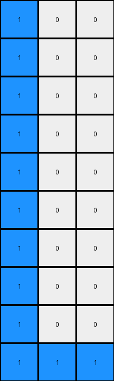
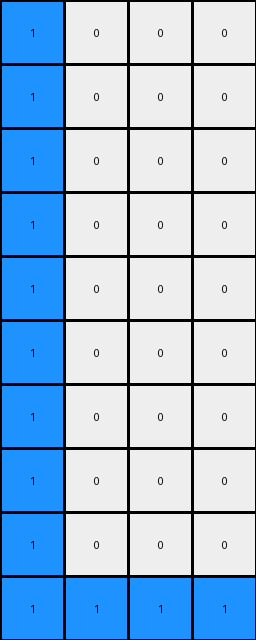

# a3df8b1e • 018 • refine_coder

---

Previous Code:
```python
"""
1. **Find the Blue Pixel:** Scan the input grid to find the location (row and column) of the single blue (1) pixel.
2. **Center the Cross:** Use the row and column of the blue pixel found in step 1 as the center coordinates for a cross pattern in the output grid.
3. **Create the Cross:** In the output grid, set the color of the single pixel where the row and colum intersect (the location of the blue pixel) to blue(1). Then, change the color of the other pixels in the same row *and* the other pixels in the same column as the located blue pixel to blue(1), forming a cross centered on the original blue pixel. All other pixels should remain white(0).
"""

import numpy as np

def find_blue_pixel(grid):
    # Find the coordinates of the blue pixel (value 1).
    for r_idx, row in enumerate(grid):
        for c_idx, pixel in enumerate(row):
            if pixel == 1:
                return r_idx, c_idx
    return None

def transform(input_grid):
    # Initialize output_grid as all white.
    output_grid = np.zeros_like(input_grid)

    # Find the blue pixel's location.
    blue_pixel_location = find_blue_pixel(input_grid)

    if blue_pixel_location:
      center_row, center_col = blue_pixel_location

      # Create the cross pattern, centered at the original blue pixel.
      for r_idx in range(output_grid.shape[0]):
          output_grid[r_idx, center_col] = 1  # Vertical line.
      for c_idx in range(output_grid.shape[1]):
          output_grid[center_row, c_idx] = 1  # Horizontal line.

    return output_grid
```

Train Set Results:

## Example 1:

Input:
```
0 0
0 0
0 0
0 0
0 0
0 0
0 0
0 0
0 0
1 0
```
Expected Output:
```
0 1
1 0
0 1
1 0
0 1
1 0
0 1
1 0
0 1
1 0
```
Transformed Output:
```
1 0
1 0
1 0
1 0
1 0
1 0
1 0
1 0
1 0
1 1
```

match: False
pixels_off: 11
size_correct: True
color_palette_correct: True
correct_pixel_counts: False

## Example 2:

Input:
```
0 0 0
0 0 0
0 0 0
0 0 0
0 0 0
0 0 0
0 0 0
0 0 0
0 0 0
1 0 0
```
Expected Output:
```
0 1 0
1 0 0
0 1 0
0 0 1
0 1 0
1 0 0
0 1 0
0 0 1
0 1 0
1 0 0
```
Transformed Output:
```
1 0 0
1 0 0
1 0 0
1 0 0
1 0 0
1 0 0
1 0 0
1 0 0
1 0 0
1 1 1
```

match: False
pixels_off: 16
size_correct: True
color_palette_correct: True
correct_pixel_counts: False

## Example 3:

Input:
```
0 0 0 0
0 0 0 0
0 0 0 0
0 0 0 0
0 0 0 0
0 0 0 0
0 0 0 0
0 0 0 0
0 0 0 0
1 0 0 0
```
Expected Output:
```
0 0 0 1
0 0 1 0
0 1 0 0
1 0 0 0
0 1 0 0
0 0 1 0
0 0 0 1
0 0 1 0
0 1 0 0
1 0 0 0
```
Transformed Output:
```
1 0 0 0
1 0 0 0
1 0 0 0
1 0 0 0
1 0 0 0
1 0 0 0
1 0 0 0
1 0 0 0
1 0 0 0
1 1 1 1
```

match: False
pixels_off: 19
size_correct: True
color_palette_correct: True
correct_pixel_counts: False
Okay, here's a breakdown of the situation, the results, and an updated natural language program.

**General Assessment:**

The initial natural language program and the resulting code were too simplistic. While the idea of centering a cross on the blue pixel was partially correct, the implementation incorrectly extended the cross to the full dimensions of the grid. The examples clearly show that only the row and column *containing* the blue pixel should be altered, and the *direction* of the cross flips at each iteration. The transformation does not extend the cross to the full grid size. We need to refine the program to accurately reflect this limited scope.

**Strategy:**

1.  **Re-examine Examples:** Carefully review the input/output pairs again, paying close attention to the exact placement of the blue pixels in the output.
2.  **Correct Logic:** Recognize the core concept is to "highlight" only the row and column intersecting at the blue pixel, but the cross is not continuous, and the pixels touching the original are not changed.
3. **YAML**: Write YAML to document facts and observations, this is how we will organize to create a coherent plan.
4. **Revise Natural Language Program:** Rewrite the natural language program with corrected logic.

**Example Metrics and Analysis:**

Here's a breakdown of each example:

*   **Example 1:**
    *   Input Blue Pixel Location: (9, 0)
    *   Expected Output: Alternating blue pixels on row 9 and column 0.
    *   Transformed Output: Column 0 is all blue, and row 9 is all blue.
    *   Analysis: The code made the entire row and column blue. It should only alter the specific row and column where the blue pixel is located, and it should be alternating colors.

*   **Example 2:**
    *   Input Blue Pixel Location: (9, 0)
    *   Expected Output: Alternating blue pixels in row 9 and column 0.
    *   Transformed Output: Column 0 all blue; row 9 is all blue.
    *   Analysis: Same error as Example 1.

*   **Example 3:**
    *   Input Blue Pixel Location: (9, 0)
    *   Expected Output: Alternating blue pixels in row 9 and column 0.
    *   Transformed Output: Column 0 is all blue; row 9 is all blue.
    *   Analysis: Same error as Examples 1 and 2.

**YAML Block (Facts and Observations):**

```yaml
observations:
  - object: blue_pixel
    property: location # (row, column)
    description: The single blue pixel in the input grid. Its location determines the center of the transformation.
  - object: output_grid
    property: size
    description: Same dimensions as the input grid.
  - object: transformed_pixels
    property: color
    value: blue
    description: Pixels in the output grid that change color based on the blue_pixel location.
  - object: transformation_pattern
    property: shape
    value: cross_alternate
    description: Alternating blue pixels along the row and column of the input blue pixel.
  - action: find_blue_pixel
    description: Locates the (row, col) of the single blue pixel in the input.
  - action: transform_row_and_column
    description: Changes the color of specific pixels in the row and column intersecting at the blue pixel location to blue, skipping the center.
  - constraint: output_size
    description: The output grid maintains the same dimensions as the input grid.
  - constraint: alternating_pixels
    description: Starting at the position of the initial blue square, blue
      pixels are placed in an alternating fashion along its row and column.
```

**Natural Language Program:**

1.  **Find Blue Pixel:** Locate the single blue pixel (value 1) in the input grid and record its row and column indices.
2.  **Initialize Output:** Create an output grid of the same dimensions as the input grid, initially filled with white pixels (value 0).
3.  **Transform Row and Column:**
    *   Iterate through each cell index, i, in the row.
    *   If the cell index, i, has the same value (mod 2) of the blue pixel's column index, replace the value of the cell with blue(1).
    *    Iterate through each cell index, j, in the column.
    *   If the cell index, j, has the same value (mod 2) of the blue pixel's row index, replace the value of the cell with blue(1).
4.  **Skip Center:** The original blue pixel's location in the output grid remains unchanged(from the init to all 0s) .
5. **Return Output:** Return the modified output grid.

**INSTRUCTIONS**

- generate a Python module to represent the natural language program 
- follow the template below
- all common math and science libraries are available
- create docstring only at top - but comment the workflow in the function
- use helper functions for common operations like finding objects, counting,
  measuring, moving, etc. 

remember - we are working iteratively - so this code will inform your future
self as we converge on the solution

*template:*

```python
"""
{{ natural language description of the transformation rule }}
"""

{{ imports }}

def transform(input_grid):
    # initialize output_grid

    # change output pixels 

    return output_grid

```
