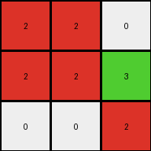

# a740d043 • 003 • refine_dreamer

---

Previous Code:
```python
"""
1.  **Identify Non-Blue Elements:** Focus on the non-blue (non-1) colored pixels in the input grid.
2.  **Extract Sub-grid:** From the top-left corner of the first identified non-blue pixel (reading row first) extract non-blue pixels to a 3 x 3 output grid.
3.  **Handle edges:** If there are not enough pixels to fill a row or column use 0s.
"""

import numpy as np

def get_non_blue_pixels(grid):
    """
    returns an array of (r,c) tuples of indexes of all non-blue pixels
    """
    coords = []
    rows, cols = np.shape(grid)
    for r in range(rows):
        for c in range(cols):
            if grid[r][c]!=1:
                coords.append((r,c))
    return coords

def transform(input_grid):
    # initialize output_grid
    output_grid = np.zeros((3, 3), dtype=int)

    # find non-blue pixels
    non_blue_pixels = get_non_blue_pixels(input_grid)
    
    # check we have some
    if len(non_blue_pixels)==0:
        return output_grid # blank

    # start populating the output grid
    start_row, start_col = non_blue_pixels[0]
    
    for out_row in range(3):
        for out_col in range(3):
            in_row = start_row + out_row
            in_col = start_col + out_col
            
            # bounds check - could use a try-except as alternative
            if in_row < len(input_grid) and in_col < len(input_grid[0]):
                if input_grid[in_row][in_col]!=1:
                    output_grid[out_row][out_col]= input_grid[in_row][in_col]
                # else 0 already there

    return output_grid
```

Train Set Results:

## Example 1:

Input:
```
1 1 1 1 1 1 1
1 2 2 1 1 1 1
1 2 2 3 1 1 1
1 1 1 2 1 1 1
1 1 1 1 1 1 1
```
Expected Output:
```
2 2 0
2 2 3
0 0 2
```
Transformed Output:
```
2 2 0
2 2 3
0 0 2
```

match: True
pixels_off: 0
size_correct: True
color_palette_correct: True
correct_pixel_counts: True

## Example 2:

Input:
```
1 1 1 1 1 1 1
1 1 3 1 2 1 1
1 1 3 1 2 1 1
1 1 1 1 1 1 1
1 1 1 1 1 1 1
1 1 1 1 1 1 1
1 1 1 1 1 1 1
```
Expected Output:
```
3 0 2
3 0 2
```
Transformed Output:
```
3 0 2
3 0 2
0 0 0
```

match: False
pixels_off: None
size_correct: False
color_palette_correct: True
correct_pixel_counts: False

## Example 3:

Input:
```
1 1 1 1 1 1
1 1 1 1 1 1
1 5 5 1 1 1
1 5 5 1 1 1
1 6 6 1 1 1
1 1 1 1 1 1
1 1 1 1 1 1
```
Expected Output:
```
5 5
5 5
6 6
```
Transformed Output:
```
5 5 0
5 5 0
6 6 0
```

match: False
pixels_off: None
size_correct: False
color_palette_correct: False
correct_pixel_counts: False
**INSTRUCTIONS**

The code above was generated based on observations from the first training
example

we have tested the transform function on each of the task example inputs and
compared with the expected output

review each of the examples provided and the results and consider how the
natural language program should be updated to accommodate this new knowledge

respond with the following deliverables:

- general assessment of the information provided and strategy for resolving the
  errors
- gather metrics about each of the examples and results - use code_execution to
  develop accurate reports on your assumptions
- a YAML block documenting facts - Focus on identifying objects, their properties, and the actions performed on them.
- a natural language program - Be as clear and concise as possible, providing a complete description of the transformation rule.


your responses should be considered as information in a report - not a
conversation
