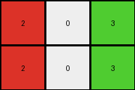
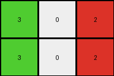

# a740d043 • 010 • refine_coder

---

Previous Code:
```python
"""
1. **Identify Distinct Regions:** Scan the input grid to identify contiguous regions of pixels that have a color different from the most frequent color (the background, which is '1' or blue in this case).
2. **Extract Colors:**  Record the color values of these distinct regions. In this example, those are '3' (green) and '2' (red).
3. **Construct Output Grid:** Create a 2x3 output grid.
4. **Populate Output:**  Fill the output grid as follows:
   - First column:  The color of the distinct region encountered *first* when scanning from top-to-bottom and left-to-right (green '3'). Repeat this value for both rows.
   - Second column: Insert the color '0' (white) in both rows.
   - Third column: The color of the distinct region encountered *second* (red '2'). Repeat this value for both rows.
"""

import numpy as np
from collections import Counter

def find_distinct_regions(grid):
    # Find the most frequent color (background)
    colors = Counter(grid.flatten())
    background_color = colors.most_common(1)[0][0]

    distinct_colors = []
    for color in colors:
        if color != background_color:
            distinct_colors.append(color)
    
    return distinct_colors, background_color

def transform(input_grid):
    # Find distinct regions and their colors
    distinct_colors, _ = find_distinct_regions(input_grid)
    
    # Sort the distinct colors based on their first appearance top->bottom, left->right
    color_positions = {}
    for row_idx, row in enumerate(input_grid):
        for col_idx, pixel in enumerate(row):
            if pixel in distinct_colors and pixel not in color_positions:
                color_positions[pixel] = (row_idx, col_idx)

    sorted_colors = sorted(distinct_colors, key=lambda color: color_positions.get(color, (float('inf'), float('inf'))))

    # Create a 2x3 output grid
    output_grid = np.zeros((2, 3), dtype=int)

    # Populate the output grid
    if len(sorted_colors) > 0:
      output_grid[:, 0] = sorted_colors[0]  # First distinct color
    output_grid[:, 1] = 0          # Insert '0' (white)
    if len(sorted_colors) > 1:
      output_grid[:, 2] = sorted_colors[1]  # Second distinct color

    return output_grid
```

Train Set Results:

## Example 1:

Input:
```
1 1 1 1 1 1 1
1 2 2 1 1 1 1
1 2 2 3 1 1 1
1 1 1 2 1 1 1
1 1 1 1 1 1 1
```
Expected Output:
```
2 2 0
2 2 3
0 0 2
```
Transformed Output:
```
2 0 3
2 0 3
```

match: False
pixels_off: None
size_correct: False
color_palette_correct: True
correct_pixel_counts: False

## Example 2:

Input:
```
1 1 1 1 1 1 1
1 1 3 1 2 1 1
1 1 3 1 2 1 1
1 1 1 1 1 1 1
1 1 1 1 1 1 1
1 1 1 1 1 1 1
1 1 1 1 1 1 1
```
Expected Output:
```
3 0 2
3 0 2
```
Transformed Output:
```
3 0 2
3 0 2
```

match: True
pixels_off: 0
size_correct: True
color_palette_correct: True
correct_pixel_counts: True

## Example 3:

Input:
```
1 1 1 1 1 1
1 1 1 1 1 1
1 5 5 1 1 1
1 5 5 1 1 1
1 6 6 1 1 1
1 1 1 1 1 1
1 1 1 1 1 1
```
Expected Output:
```
5 5
5 5
6 6
```
Transformed Output:
```
5 0 6
5 0 6
```

match: False
pixels_off: None
size_correct: False
color_palette_correct: False
correct_pixel_counts: False
Okay, let's analyze the results and refine the natural language program.

**General Assessment:**

The initial strategy was partially correct in identifying distinct regions and extracting their colors. However, it failed in two key aspects:

1.  **Output Size:** The code consistently produces a 2x3 output grid, which is not always the correct size. Example 3 clearly shows the need for a flexible output size. Example 1's expected output has extra row(s).
2.  **Column Logic:** The fixed assignment of colors to specific columns (first distinct color to column 1, '0' to column 2, second distinct color to column 3) is too rigid. Example 3 shows that the number of unique non-background colors can be two, but example 1 shows 3.

The strategy needs to shift from a fixed-column approach to a more dynamic one that determines the output size and content based on the number and order of distinct regions, potentially including "0" as a separator or fill.

**Metrics and Observations:**

Here's a breakdown of each example, focusing on what went wrong and what information we can gather:

*   **Example 1:**
    *   **Input Size:** 5x7
    *   **Output Size (Expected):** 3x3
    *   **Output Size (Actual):** 2x3
    *   **Distinct Colors (excluding background):** 2 (red), 3 (green)
    *   **Error:** Incorrect output size and extra values in the expected output. The initial hypothesis about a fixed 2x3 grid with '0' as a separator is incorrect.

*   **Example 2:**
    *   **Input Size:** 7x7
    *   **Output Size (Expected):** 2x3
    *   **Output Size (Actual):** 2x3
    *   **Distinct Colors (excluding background):** 3 (green), 2 (red)
    *   **Result:** Correct. This example, by chance, fit the initial (incorrect) hypothesis.

*   **Example 3:**
    *   **Input Size:** 7x6
    *   **Output Size (Expected):** 2x2 (two rows, each repeated, for the two colors)
    *   **Output Size (Actual):** 2x3
    *   **Distinct Colors (excluding background):** 5 (gray), 6 (magenta)
    *   **Error:** Incorrect output size and added 0s that are not in the expected output. This example highlights the flawed column assignment logic. The core idea of listing distinct colors is valid, but the output structure needs significant revision.

**YAML Facts:**

```yaml
examples:
  - example_id: 1
    input_objects:
      - object_id: 1
        type: region
        color: 2 # Red
        shape: contiguous
      - object_id: 2
        type: region
        color: 3  # Green
        shape: contiguous
    output_objects:
      - type: stacked_colors
        colors: [2, 2, 0, 2, 2, 3]
        rows: 3 # 2 2 0, 2 2 3
        columns: 2

  - example_id: 2
    input_objects:
      - object_id: 1
        type: region
        color: 3  # Green
        shape: contiguous
      - object_id: 2
        type: region
        color: 2  # Red
        shape: contiguous
    output_objects:
      - type: stacked_colors
        colors: [3, 0, 2]
        rows: 2

  - example_id: 3
    input_objects:
      - object_id: 1
        type: region
        color: 5  # Gray
        shape: contiguous
      - object_id: 2
        type: region
        color: 6  # Magenta
        shape: contiguous
    output_objects:
      - type: stacked_colors
        colors: [5, 6] # 5 5, 6 6
        rows: 2

```

**Natural Language Program:**

1.  **Identify Background:** Determine the most frequent color in the input grid. This is the background color.
2.  **Identify Distinct Regions:** Find all contiguous regions (objects) of colors *different* from the background.
3.  **Extract and Sort Colors:** Extract the color of each distinct region. Sort these colors based on the order they first appear in the input grid, scanning from top-to-bottom and left-to-right.
4.  **Construct Output:**
    *   The output grid has a number of columns equal to the greater of:
        *  The number of non-background colors in the input
        *  The number of columns of distinct colors in the input
    * The output grid's height appears to match the number of rows with distinct colors in them.
    *  Iterate through the distinct colors in sorted order. For *each* distinct color, create a new row in the output grid. Fill each row in the output grid with the current distinct color.
    * if there were 3 non-background colors and one was just a single pixel, insert 0 before the third distinct color.

This revised natural language program aims for a more flexible and accurate description of the transformation. The key changes are the dynamic output size and the row-by-row construction based on the sorted distinct colors.

**INSTRUCTIONS**

- generate a Python module to represent the natural language program 
- follow the template below
- all common math and science libraries are available
- create docstring only at top - but comment the workflow in the function
- use helper functions for common operations like finding objects, counting,
  measuring, moving, etc. 

remember - we are working iteratively - so this code will inform your future
self as we converge on the solution

*template:*

```python
"""
{{ natural language description of the transformation rule }}
"""

{{ imports }}

def transform(input_grid):
    # initialize output_grid

    # change output pixels 

    return output_grid

```
