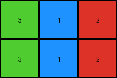

# a740d043 • 015 • refine_dreamer

---


Previous Code:
```python
"""
The transformation rule is to "crop" the input grid by removing the outer "frame" of the dominant color, and outputting the remaining internal region.
"""

import numpy as np

def find_internal_region(grid):
    """Finds the bounding box of the non-dominant color region."""
    rows, cols = grid.shape
    
    # Find dominant color (most frequent color on the border)
    border_pixels = np.concatenate([
        grid[0, :], grid[-1, :], grid[:, 0], grid[:, -1]
    ])
    unique, counts = np.unique(border_pixels, return_counts=True)
    dominant_color = unique[np.argmax(counts)]

    # Find rows and cols that contain non-dominant colors
    non_dominant_rows = []
    non_dominant_cols = []
    for r in range(rows):
        for c in range(cols):
            if grid[r, c] != dominant_color:
                non_dominant_rows.append(r)
                non_dominant_cols.append(c)
    
    if not non_dominant_rows: # Handle the edge case of a uniform grid
        return (0, 0, rows-1, cols-1)

    min_row, max_row = min(non_dominant_rows), max(non_dominant_rows)
    min_col, max_col = min(non_dominant_cols), max(non_dominant_cols)
    
    return (min_row, max_row, min_col, max_col)

def transform(input_grid):
    """
    Extracts the internal region of the input grid by removing the border of the dominant color.
    """
    # Convert input_grid to numpy array
    grid = np.array(input_grid)

    # Find the bounding box of the internal region
    min_row, max_row, min_col, max_col = find_internal_region(grid)

    # Extract the internal region
    output_grid = grid[min_row:max_row+1, min_col:max_col+1]

    return output_grid.tolist()
```

Train Set Results:

## Example 1:

Input:
```
1 1 1 1 1 1 1
1 2 2 1 1 1 1
1 2 2 3 1 1 1
1 1 1 2 1 1 1
1 1 1 1 1 1 1
```
Expected Output:
```
2 2 0
2 2 3
0 0 2
```
Transformed Output:
```
2 2 1
2 2 3
1 1 2
```

match: False
pixels_off: 3
size_correct: True
color_palette_correct: False
correct_pixel_counts: False

## Example 2:

Input:
```
1 1 1 1 1 1 1
1 1 3 1 2 1 1
1 1 3 1 2 1 1
1 1 1 1 1 1 1
1 1 1 1 1 1 1
1 1 1 1 1 1 1
1 1 1 1 1 1 1
```
Expected Output:
```
3 0 2
3 0 2
```
Transformed Output:
```
3 1 2
3 1 2
```

match: False
pixels_off: 2
size_correct: True
color_palette_correct: False
correct_pixel_counts: False

## Example 3:

Input:
```
1 1 1 1 1 1
1 1 1 1 1 1
1 5 5 1 1 1
1 5 5 1 1 1
1 6 6 1 1 1
1 1 1 1 1 1
1 1 1 1 1 1
```
Expected Output:
```
5 5
5 5
6 6
```
Transformed Output:
```
5 5
5 5
6 6
```

match: True
pixels_off: 0
size_correct: True
color_palette_correct: True
correct_pixel_counts: True

**INSTRUCTIONS**

The code above was generated based on observations from the first training
example

we have tested the transform function on each of the task example inputs and
compared with the expected output

review each of the examples provided and the results and consider how the
natural language program should be updated to accommodate this new knowledge

respond with the following deliverables:

- general assessment of the information provided and strategy for resolving the
  errors
- gather metrics about each of the examples and results - use code_execution to
  develop accurate reports on your assumptions
- a YAML block documenting facts - Focus on identifying objects, their properties, and the actions performed on them.
- a natural language program - Be as clear and concise as possible, providing a complete description of the transformation rule.


your responses should be considered as information in a report - not a
conversation
