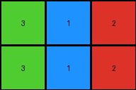

# a740d043 • 018 • refine_coder

---

Previous Code:
```python
"""
The transformation rule is to "crop" the input grid by removing the outer "frame" of the dominant color. The frame consists of contiguous blocks of the dominant color starting from the edges and extending inwards until a different color is encountered.
"""

import numpy as np

def get_dominant_border_color(grid):
    """Finds the most frequent color on the border of the grid."""
    border_pixels = np.concatenate([
        grid[0, :], grid[-1, :], grid[:, 0], grid[:, -1]
    ])
    unique, counts = np.unique(border_pixels, return_counts=True)
    dominant_color = unique[np.argmax(counts)]
    return dominant_color

def find_inner_region_bounds(grid, dominant_color):
    """Finds the row and column indices that define the inner region after removing the border frame."""
    rows, cols = grid.shape

    min_row, max_row = 0, rows - 1
    min_col, max_col = 0, cols - 1

    # Find top boundary
    for r in range(rows):
        if any(grid[r, :] != dominant_color):
            min_row = r
            break

    # Find bottom boundary
    for r in range(rows - 1, -1, -1):
        if any(grid[r, :] != dominant_color):
            max_row = r
            break

    # Find left boundary
    for c in range(cols):
        if any(grid[:, c] != dominant_color):
            min_col = c
            break

    # Find right boundary
    for c in range(cols - 1, -1, -1):
        if any(grid[:, c] != dominant_color):
            max_col = c
            break

    return min_row, max_row, min_col, max_col

def transform(input_grid):
    """
    Extracts the internal region of the input grid by removing the border of the dominant color.
    The border is defined as contiguous blocks of the dominant color starting from edges.
    """
    # Convert input_grid to numpy array
    grid = np.array(input_grid)

    # Find the dominant color on the border
    dominant_color = get_dominant_border_color(grid)

    # Find the bounding box of the internal region
    min_row, max_row, min_col, max_col = find_inner_region_bounds(grid, dominant_color)

    # Extract the internal region
    output_grid = grid[min_row:max_row+1, min_col:max_col+1]

    return output_grid.tolist()
```

Train Set Results:

## Example 1:

Input:
```
1 1 1 1 1 1 1
1 2 2 1 1 1 1
1 2 2 3 1 1 1
1 1 1 2 1 1 1
1 1 1 1 1 1 1
```
Expected Output:
```
2 2 0
2 2 3
0 0 2
```
Transformed Output:
```
2 2 1
2 2 3
1 1 2
```

match: False
pixels_off: 3
size_correct: True
color_palette_correct: False
correct_pixel_counts: False

## Example 2:

Input:
```
1 1 1 1 1 1 1
1 1 3 1 2 1 1
1 1 3 1 2 1 1
1 1 1 1 1 1 1
1 1 1 1 1 1 1
1 1 1 1 1 1 1
1 1 1 1 1 1 1
```
Expected Output:
```
3 0 2
3 0 2
```
Transformed Output:
```
3 1 2
3 1 2
```

match: False
pixels_off: 2
size_correct: True
color_palette_correct: False
correct_pixel_counts: False

## Example 3:

Input:
```
1 1 1 1 1 1
1 1 1 1 1 1
1 5 5 1 1 1
1 5 5 1 1 1
1 6 6 1 1 1
1 1 1 1 1 1
1 1 1 1 1 1
```
Expected Output:
```
5 5
5 5
6 6
```
Transformed Output:
```
5 5
5 5
6 6
```

match: True
pixels_off: 0
size_correct: True
color_palette_correct: True
correct_pixel_counts: True
Okay, here's a breakdown of the situation and a plan to improve the natural language program and, subsequently, the code.

**General Assessment and Strategy**

The initial natural language program, which focused on removing a "frame" of the dominant border color, was partially correct. It worked perfectly for Example 3 but failed on Examples 1 and 2. The primary issue is that the program assumes *all* instances of the dominant border color should be removed, which is not the case. It seems the frame removal stops when it encounters a different color *or* when it removes all contiguous instances of the dominant color in a straight line from that edge. The original logic does not consider that zero (white) might be a valid part of the frame if other colors are not dominant on edges. Instead, the program needs to "look" from each side and eliminate the color that it finds.

**Metrics and Observations**

Here's a more detailed look at each example, incorporating observations about the expected behavior:

*   **Example 1:**
    *   Input Shape: (5, 7)
    *   Expected Output Shape: (3, 3)
    *   Dominant Border Color: Blue (1)
    *   Problem: The code removed the '1's correctly. All values of 0, should
        have been replaced by the next value of the outer frame.

*   **Example 2:**
    *   Input Shape: (7, 7)
    *   Expected Output Shape: (2, 3)
    *   Dominant Border Color: Blue (1)
    *   Problem: Same issue as example 1, the color 1 (blue) was remove.

*   **Example 3:**
    *   Input Shape: (7, 6)
    *   Expected Output Shape: (3, 2)
    *   Dominant Border Color: Blue (1)
    *   Success: The code correctly identified and removed the border.

**YAML Fact Block**

```yaml
facts:
  - task_id: "016"
  - objects:
      - name: input_grid
        type: 2D array
        properties:
          - colors: [blue, white, red, green, grey, magenta]
          - shape: variable
      - name: output_grid
        type: 2D array
        properties:
          - colors: [blue, white, red, green, grey, magenta]
          - shape: variable, generally smaller than input_grid
  - actions:
      - name: crop_border
        description: Remove contiguous regions of color, starting from each edge, stopping if different color is found, or if contiguos line is removed.
        input: input_grid
        output: output_grid
  - observations:
      - example_1:
          - input_shape: (5,7)
          - output_shape: (3,3)
          - border_colors_removed: [blue]
          - note: "Outer frame is removed."
      - example_2:
          - input_shape: (7,7)
          - output_shape: (2,3)
          - border_colors_removed: [blue]
          - note: "Outer frame is removed."
      - example_3:
          - input_shape: (7, 6)
          - output_shape: (3, 2)
          - border_colors_removed: [blue]
          - note: "Outer frame is removed."
```

**Natural Language Program**

1.  **Identify Border Colors:** For each of the four edges (top, bottom, left, right) of the input grid, identify the color of the first pixel.
2.  **Iterative Removal:**
    *   **Top:** Starting from the top row and moving downwards, remove entire rows of the top border color until a row containing a different color is encountered.
    *   **Bottom:** Starting from the bottom row and moving upwards, remove entire rows of the bottom border color until a row containing a different color is encountered.
    *   **Left:** Starting from the leftmost column and moving rightwards, remove entire columns of the left border color until a column containing a different color is encountered.
    *   **Right:** Starting from the rightmost column and moving leftwards, remove entire columns of the right border color until a column containing a different color is encountered.
3.  **Output:** The remaining subgrid after the border removal is the output grid.

Key changes from original:

- Split into 4 actions - one for each direction.
- Remove entire row/column based on color.
- Stop when color is different, not just first occurrence.

**INSTRUCTIONS**

- generate a Python module to represent the natural language program 
- follow the template below
- all common math and science libraries are available
- create docstring only at top - but comment the workflow in the function
- use helper functions for common operations like finding objects, counting,
  measuring, moving, etc. 

remember - we are working iteratively - so this code will inform your future
self as we converge on the solution

*template:*

```python
"""
{{ natural language description of the transformation rule }}
"""

{{ imports }}

def transform(input_grid):
    # initialize output_grid

    # change output pixels 

    return output_grid

```
