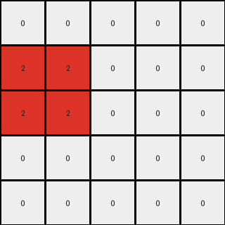

# a79310a0 • 003 • refine_dreamer

---


Previous Code:
```python
"""
1. Identify a 2x2 square of azure pixels in the input grid.
2. Change the color of this square from azure to red.
3. Move the now red square down by one row.
4. The rest of the grid remains unchanged (white).
"""

import numpy as np

def find_square(grid, color, size):
    """Finds a square of a given color and size in the grid."""
    height, width = grid.shape
    for i in range(height - size + 1):
        for j in range(width - size + 1):
            if np.all(grid[i:i+size, j:j+size] == color):
                return i, j
    return None

def transform(input_grid):
    """Transforms the input grid according to the described rule."""
    # Initialize output_grid as a copy of the input_grid
    output_grid = np.copy(input_grid)

    # Find the azure square
    square_pos = find_square(input_grid, 8, 2)

    if square_pos:
        row, col = square_pos

        # Clear the original square
        output_grid[row:row+2, col:col+2] = 0
        
        # Move the square down by one row and change color to red
        output_grid[row+1:row+3, col:col+2] = 2

    return output_grid
```

Train Set Results:

## Example 1:

Input:
```
8 8 0 0 0
8 8 0 0 0
0 0 0 0 0
0 0 0 0 0
0 0 0 0 0
```
Expected Output:
```
0 0 0 0 0
2 2 0 0 0
2 2 0 0 0
0 0 0 0 0
0 0 0 0 0
```
Transformed Output:
```
0 0 0 0 0
2 2 0 0 0
2 2 0 0 0
0 0 0 0 0
0 0 0 0 0
```

match: True
pixels_off: 0
size_correct: True
color_palette_correct: True
correct_pixel_counts: True

## Example 2:

Input:
```
0 8 0
0 0 0
0 0 0
```
Expected Output:
```
0 0 0
0 2 0
0 0 0
```
Transformed Output:
```
0 8 0
0 0 0
0 0 0
```

match: False
pixels_off: 2
size_correct: True
color_palette_correct: False
correct_pixel_counts: False

## Example 3:

Input:
```
0 0 0 0 0
0 8 8 8 0
0 0 0 0 0
0 0 0 0 0
0 0 0 0 0
```
Expected Output:
```
0 0 0 0 0
0 0 0 0 0
0 2 2 2 0
0 0 0 0 0
0 0 0 0 0
```
Transformed Output:
```
0 0 0 0 0
0 8 8 8 0
0 0 0 0 0
0 0 0 0 0
0 0 0 0 0
```

match: False
pixels_off: 6
size_correct: True
color_palette_correct: False
correct_pixel_counts: False

**INSTRUCTIONS**

The code above was generated based on observations from the first training
example

we have tested the transform function on each of the task example inputs and
compared with the expected output

review each of the examples provided and the results and consider how the
natural language program should be updated to accommodate this new knowledge

respond with the following deliverables:

- general assessment of the information provided and strategy for resolving the
  errors
- gather metrics about each of the examples and results - use code_execution to
  develop accurate reports on your assumptions
- a YAML block documenting facts - Focus on identifying objects, their properties, and the actions performed on them.
- a natural language program - Be as clear and concise as possible, providing a complete description of the transformation rule.


your responses should be considered as information in a report - not a
conversation
