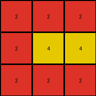

# a85d4709 • 017 • refine_dreamer

---


Previous Code:
```python
"""
Transforms a 3x3 input grid of gray (5) and white (0) pixels to an output grid of red (2) and yellow (4) pixels. 
The transformation depends on the row and column position of the pixels, as well as their initial color.
"""

import numpy as np

def transform(input_grid):
    # Initialize output grid
    output_grid = np.zeros_like(input_grid)

    # Iterate through each pixel in the input grid
    for i in range(input_grid.shape[0]):
        for j in range(input_grid.shape[1]):
            # Gray pixel (5) - Row Dependent
            if input_grid[i, j] == 5:
                if i == 1:  # Middle row
                    output_grid[i, j] = 4  # Yellow
                elif i == 0:  # Top row
                    output_grid[i,j] = 2 # red
                elif i == 2: # Bottom row
                    output_grid[i,j] = 2 # red

            # White pixel (0) - position dependent
            elif input_grid[i,j] == 0:
                if i == 1 and j == 1:
                    output_grid[i,j] = 4
                elif i == 0:
                    output_grid[i,j] = 2
                elif i == 1 and (j == 0 or j == 2):
                    output_grid[i,j] = 2
                elif i == 2:
                   output_grid[i,j] = 2
    return output_grid
```

Train Set Results:

## Example 1:

Input:
```
0 0 5
0 5 0
5 0 0
```
Expected Output:
```
3 3 3
4 4 4
2 2 2
```
Transformed Output:
```
2 2 2
2 4 2
2 2 2
```

match: False
pixels_off: 5
size_correct: True
color_palette_correct: True
correct_pixel_counts: False

## Example 2:

Input:
```
0 0 5
0 0 5
0 0 5
```
Expected Output:
```
3 3 3
3 3 3
3 3 3
```
Transformed Output:
```
2 2 2
2 4 4
2 2 2
```

match: False
pixels_off: 9
size_correct: True
color_palette_correct: False
correct_pixel_counts: False

## Example 3:

Input:
```
5 0 0
0 5 0
5 0 0
```
Expected Output:
```
2 2 2
4 4 4
2 2 2
```
Transformed Output:
```
2 2 2
2 4 2
2 2 2
```

match: False
pixels_off: 2
size_correct: True
color_palette_correct: True
correct_pixel_counts: False

## Example 4:

Input:
```
0 5 0
0 0 5
0 5 0
```
Expected Output:
```
4 4 4
3 3 3
4 4 4
```
Transformed Output:
```
2 2 2
2 4 4
2 2 2
```

match: False
pixels_off: 9
size_correct: True
color_palette_correct: False
correct_pixel_counts: False

**INSTRUCTIONS**

The code above was generated based on observations from the first training
example

we have tested the transform function on each of the task example inputs and
compared with the expected output

review each of the examples provided and the results and consider how the
natural language program should be updated to accommodate this new knowledge

respond with the following deliverables:

- general assessment of the information provided and strategy for resolving the
  errors
- gather metrics about each of the examples and results - use code_execution to
  develop accurate reports on your assumptions
- a YAML block documenting facts - Focus on identifying objects, their properties, and the actions performed on them.
- a natural language program - Be as clear and concise as possible, providing a complete description of the transformation rule.


your responses should be considered as information in a report - not a
conversation
